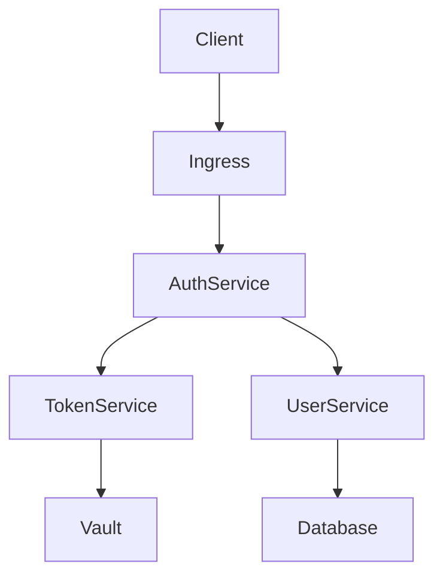

# Zero Trust Authentication MVP

Modern authentication system implementing Zero Trust principles with GitOps deployment model.

## Features

- Zero Trust Authentication
- GitOps-based deployment
- Comprehensive observability
- Progressive delivery
- High availability design
- Security-first approach

## Quick Start

```bash
# Development setup
make dev-setup
make dev-up

# GitOps local environment
make dev-gitops

# Run tests
make test-all
```

## Documentation

- [Development Guide](docs/development/README.md)
- [Architecture](docs/architecture/README.md)
- [API Reference](docs/api/README.md)
- [Deployment Guide](docs/deployment/README.md)
- [Security](docs/security/README.md)

## Requirements

- Go 1.22+
- Node.js 20+
- Docker
- Kubernetes 1.28+
- Helm 3.14+

## Architecture



## Security

[](https://sonarcloud.io/summary/new_code?id=your-org_zamaz)
[](https://snyk.io/test/github/your-org/zamaz)

## License

MIT License - see [LICENSE](LICENSE) for details
