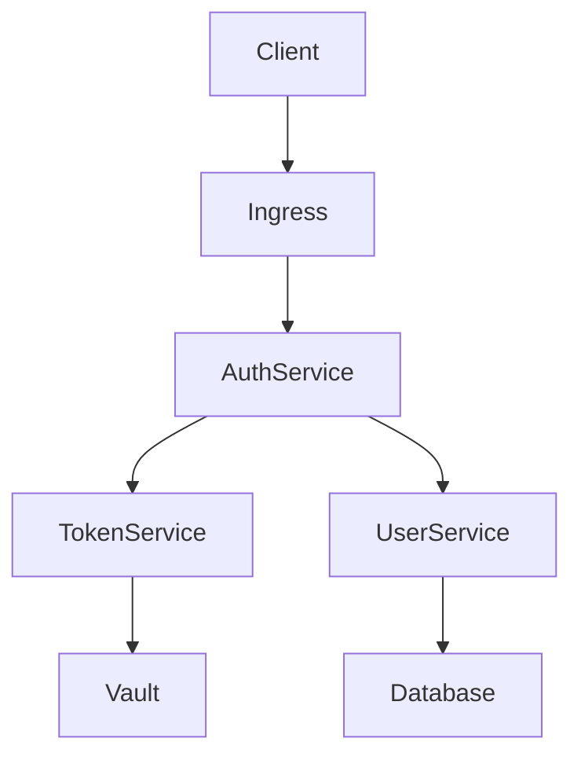

# Zero Trust Authentication MVP

Modern authentication system implementing Zero Trust principles with GitOps deployment model.

## Features

- Zero Trust Authentication
- GitOps-based deployment
- Comprehensive observability
- Progressive delivery
- High availability design
- Security-first approach

## Quick Start

```bash
# Development setup
make dev-setup
make dev-up

# GitOps local environment
make dev-gitops

# Run tests
make test-all
```

## Documentation

### 🌐 **Customer Documentation**
📚 **[Complete Documentation](https://zamaz.github.io/root-zamaz)** - Professional documentation site

- 🔐 [Database Schema](https://zamaz.github.io/root-zamaz/schema/) - Domain-driven schema with Mermaid diagrams
- 🛡️ [Security Architecture](https://zamaz.github.io/root-zamaz/architecture/security/) - Zero Trust implementation
- 🚀 [Getting Started](https://zamaz.github.io/root-zamaz/getting-started/quick-start/) - Integration guide
- 📊 [API Documentation](https://zamaz.github.io/root-zamaz/api/) - REST API reference

### 👥 **Team Documentation**
📖 **[GitHub Wiki](https://github.com/zamaz/root-zamaz/wiki)** - Internal collaboration space

- Quick edits and team discussions
- Live architecture diagrams
- Development procedures
- Incident response playbooks

### 💻 **Local Development**
🔧 **[Local Docs](http://127.0.0.1:8001)** - Development environment

### Documentation Commands
```bash
# Deploy to all platforms (MkDocs + Wiki)
make docs-deploy-all

# Individual platform commands
make docs-ci                # Generate documentation
make docs-mkdocs-serve      # Serve locally with live reload
make docs-wiki-sync-api     # Sync to GitHub Wiki
make docs-schema            # Generate schema docs only
```

### Local Documentation
- [Database Change Management](docs/database/bytebase.md)

- [Development Guide](docs/development/README.md)
- [Architecture](docs/architecture/README.md)
- [API Reference](docs/api/README.md)
- [Deployment Guide](docs/deployment/README.md)
- [Security](docs/security/README.md)

## Requirements

- Go 1.22+
- Node.js 20+
- Docker
- Kubernetes 1.28+
- Helm 3.14+

## Architecture



## Security

[](https://sonarcloud.io/summary/new_code?id=your-org_zamaz)
[](https://snyk.io/test/github/your-org/zamaz)

## License

MIT License - see [LICENSE](LICENSE) for details
