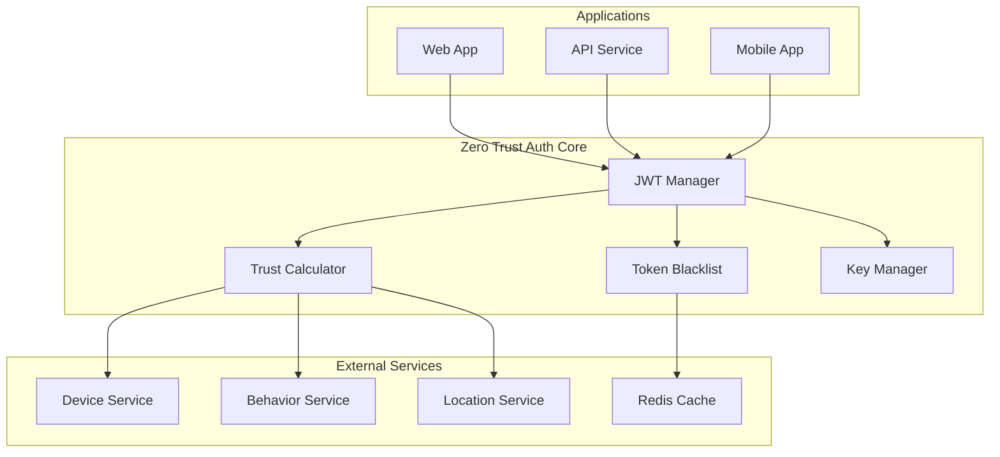
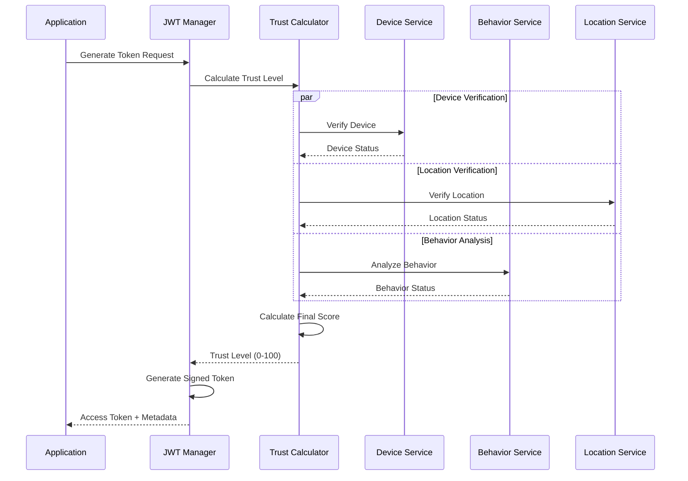

# Zero Trust Authentication Core Library - Comprehensive Documentation

> **Multi-language authentication library implementing Zero Trust security principles**  
> **Version**: 1.0.0  
> **Languages**: Go, TypeScript, Python, Java  
> **License**: MIT

## 📋 **Table of Contents**

1. [Overview](#overview)
2. [Architecture](#architecture)
3. [Installation & Setup](#installation--setup)
4. [Core Concepts](#core-concepts)
5. [API Reference](#api-reference)
6. [Usage Examples](#usage-examples)
7. [Security Model](#security-model)
8. [Performance Guide](#performance-guide)
9. [Testing Strategy](#testing-strategy)
10. [Deployment Guide](#deployment-guide)
11. [Troubleshooting](#troubleshooting)
12. [Migration Guide](#migration-guide)

## 🎯 **Overview**

The Zero Trust Authentication Core library provides consistent, secure authentication patterns across multiple programming languages. Built on the principle of "never trust, always verify," this library implements comprehensive JWT token management with dynamic trust level calculations, device attestation, and enterprise-grade security features.

### **Key Features**

- **🔐 JWT Token Management**: Generation, validation, refresh, and blacklisting with automatic key rotation
- **📊 Dynamic Trust Scoring**: 0-100 trust level calculation based on device, location, behavior, and biometric factors
- **🔄 Key Rotation**: Automatic JWT signing key rotation with zero-downtime transitions
- **🛡️ Device Attestation**: Hardware-based device verification with TPM and secure enclave support
- **⚡ High Performance**: Optimized for production workloads with configurable caching strategies
- **🌐 Cross-Language**: Consistent APIs across Go, TypeScript, Python, and Java implementations

### **Zero Trust Principles**

1. **Never Trust, Always Verify**: Every authentication request is fully validated regardless of location or previous access
2. **Continuous Verification**: Trust levels dynamically adjust based on real-time behavior and context
3. **Least Privilege Access**: Tokens contain only necessary permissions for specific operations
4. **Defense in Depth**: Multiple security layers including signing, blacklisting, trust scoring, and audit logging

## 🏗️ **Architecture**

### **System Components**



### **Trust Level Calculation Flow**



### **Package Structure**

```
zerotrust-auth-core/
├── packages/
│   ├── go/                     # Go implementation
│   │   ├── pkg/
│   │   │   ├── jwt/           # JWT management
│   │   │   ├── trust/         # Trust level calculation
│   │   │   ├── blacklist/     # Token blacklisting
│   │   │   └── security/      # Security utilities
│   │   └── examples/          # Usage examples
│   ├── typescript/            # TypeScript implementation
│   │   ├── src/
│   │   │   ├── jwt/          # JWT management
│   │   │   ├── trust/        # Trust calculation
│   │   │   └── blacklist/    # Blacklisting
│   │   └── examples/         # Integration examples
│   ├── python/               # Python implementation
│   │   ├── src/zerotrust_auth_core/
│   │   │   ├── jwt/         # JWT management
│   │   │   ├── trust/       # Trust calculation
│   │   │   └── blacklist/   # Blacklisting
│   │   └── examples/        # Usage examples
│   └── java/                # Java implementation
│       ├── src/main/java/com/zerotrust/authcore/
│       │   ├── jwt/        # JWT management
│       │   ├── trust/      # Trust calculation
│       │   └── blacklist/  # Blacklisting
│       └── examples/       # Integration examples
├── tests/                   # Cross-language tests
├── docs/                   # Documentation
└── examples/               # Multi-language examples
```

## 🚀 **Installation & Setup**

### **Go Installation**

```bash
go get github.com/zerotrust/auth-core-go/v1
```

```go
import (
    "github.com/zerotrust/auth-core-go/v1/pkg/jwt"
    "github.com/zerotrust/auth-core-go/v1/pkg/trust"
)
```

### **TypeScript/JavaScript Installation**

```bash
npm install @zerotrust/auth-core
# or
yarn add @zerotrust/auth-core
```

```typescript
import { JWTManager, TrustCalculator, TrustLevel } from '@zerotrust/auth-core';
```

### **Python Installation**

```bash
pip install zerotrust-auth-core
# or
poetry add zerotrust-auth-core
```

```python
from zerotrust_auth_core import JWTManager, TrustCalculator, TrustLevel
```

### **Java Installation**

Maven:
```xml
<dependency>
    <groupId>com.zerotrust</groupId>
    <artifactId>auth-core</artifactId>
    <version>1.0.0</version>
</dependency>
```

Gradle:
```gradle
implementation 'com.zerotrust:auth-core:1.0.0'
```

```java
import com.zerotrust.authcore.jwt.JWTManager;
import com.zerotrust.authcore.trust.TrustCalculator;
import com.zerotrust.authcore.trust.TrustLevel;
```

## 🧠 **Core Concepts**

### **Trust Levels**

The library implements a granular trust scoring system with five distinct levels:

| Level | Value | Description | Use Cases |
|-------|-------|-------------|-----------|
| **None** | 0 | Untrusted | Failed authentication, detected attacks |
| **Low** | 25 | Basic auth | New devices, public networks |
| **Medium** | 50 | Standard | Known devices, normal behavior |
| **High** | 75 | Verified | Trusted devices, secure networks |
| **Full** | 100 | Attested | Hardware attestation, biometrics |

### **Trust Factors**

Trust levels are calculated using multiple weighted factors:

#### **Device Factors (35% weight)**
- **Device Verification**: Known device fingerprint (25 points)
- **Hardware Attestation**: TPM/secure enclave verification (15 points)
- **Device History**: Previous login patterns and failure rates

#### **Location Factors (25% weight)**
- **Location Verification**: Geographic consistency (20 points)
- **Network Trust**: Corporate vs. public networks (5 points)
- **Geolocation**: IP-based location validation

#### **Behavioral Factors (15% weight)**
- **Behavior Analysis**: Normal vs. anomalous patterns
- **Temporal Patterns**: Typical login times and frequencies
- **Action Patterns**: Consistency with historical behavior

#### **Biometric Factors (10% weight)**
- **Biometric Verification**: Fingerprint, face, voice recognition
- **Liveness Detection**: Anti-spoofing measures

#### **Session Factors (15% weight)**
- **Recent Activity**: Active session indicators (10 points)
- **Session Age**: Time since session initiation
- **Activity Patterns**: Continuous vs. sporadic usage

### **JWT Token Structure**

All tokens include standardized claims for Zero Trust verification:

```json
{
  "user_id": "user123",
  "email": "user@example.com",
  "roles": ["user", "admin"],
  "permissions": ["read", "write", "delete"],
  "device_id": "device-fingerprint-123",
  "trust_level": 75,
  "iat": 1640995200,
  "exp": 1640998800,
  "iss": "zerotrust-service",
  "sub": "user123",
  "jti": "unique-token-id",
  "nbf": 1640995200
}
```

### **Token Blacklisting Strategies**

#### **Memory Blacklist**
- **Use Case**: Single-instance applications
- **Performance**: Fastest validation (< 1ms)
- **Scalability**: Limited to single process
- **Persistence**: Lost on restart

#### **Redis Blacklist**
- **Use Case**: Distributed applications
- **Performance**: Fast validation (< 5ms)
- **Scalability**: Horizontally scalable
- **Persistence**: Durable across restarts

#### **Hybrid Blacklist**
- **Use Case**: High-performance distributed systems
- **Performance**: Memory-speed with Redis fallback
- **Scalability**: Best of both approaches
- **Persistence**: Automatic synchronization

## 📚 **API Reference**

### **JWT Manager API**

#### **Configuration**
```typescript
interface JWTConfig {
  secret: string;              // Minimum 32 characters
  expiryDuration: Duration;    // Token lifetime
  refreshDuration: Duration;   // Refresh token lifetime
  issuer: string;             // Token issuer identifier
  rotationDuration?: Duration; // Key rotation interval
}
```

#### **Token Generation**
```typescript
interface TokenRequest {
  userId: string;
  email: string;
  roles: string[];
  permissions: string[];
  deviceId?: string;
  trustLevel: number;         // 0-100
}

interface Token {
  accessToken: string;
  refreshToken: string;
  tokenType: string;          // "Bearer"
  expiresAt: Date;
  trustLevel: number;
}
```

#### **Core Methods**

**Generate Token**
```typescript
async generateToken(request: TokenRequest): Promise<Token>
```

**Validate Token**
```typescript
async validateToken(tokenString: string): Promise<JWTClaims>
```

**Blacklist Token**
```typescript
async blacklistToken(tokenString: string, reason: string): Promise<void>
```

**Refresh Token**
```typescript
async refreshToken(refreshToken: string, request: TokenRequest): Promise<Token>
```

### **Trust Calculator API**

#### **Configuration**
```typescript
interface CalculatorConfig {
  baseScore: number;                    // Starting score (default: 10)
  deviceWeight: number;                 // Device verification weight (default: 25)
  locationWeight: number;               // Location verification weight (default: 20)
  behaviorWeight: number;               // Behavior analysis weight (default: 15)
  activityWeight: number;               // Recent activity weight (default: 10)
  hardwareWeight: number;               // Hardware attestation weight (default: 15)
  biometricWeight: number;              // Biometric verification weight (default: 10)
  networkWeight: number;                // Network trust weight (default: 5)
  maxInactivityDuration: Duration;      // Max inactive time (default: 30 min)
  suspiciousActivityPenalty: number;    // Suspicious behavior penalty (default: 50)
  newDevicePenalty: number;             // New device penalty (default: 15)
}
```

#### **Trust Factors**
```typescript
interface TrustFactors {
  deviceVerified: boolean;
  locationVerified: boolean;
  behaviorNormal: boolean;
  recentActivity: boolean;
  hardwareAttestation: boolean;
  biometricVerified: boolean;
  networkTrusted: boolean;
  sessionAge: Date;
  previousTrustLevel: TrustLevel;
}
```

#### **Core Methods**

**Calculate Trust Level**
```typescript
calculate(factors: TrustFactors): TrustLevel
```

**Comprehensive User Calculation**
```typescript
async calculateForUser(request: CalculationRequest): Promise<TrustLevel>
```

**Authentication-time Calculation**
```typescript
async calculateForAuthentication(userId: string, deviceId?: string, ipAddress?: string): Promise<TrustLevel>
```

**Operation Requirements**
```typescript
static getTrustLevelForOperation(operation: string): TrustLevel
```

### **Blacklist API**

#### **Core Interface**
```typescript
interface Blacklist {
  add(jti: string, reason: string, expiresAt: Date): Promise<void>;
  isBlacklisted(tokenString: string): Promise<boolean>;
  remove(jti: string): Promise<void>;
  cleanup(): Promise<void>;
  getStats(): Promise<BlacklistStats>;
}
```

#### **Implementation Options**
```typescript
// Memory-based (single instance)
const memoryBlacklist = new MemoryBlacklist();

// Redis-based (distributed)
const redisBlacklist = new RedisBlacklist(redisClient, 'jwt:blacklist');

// Hybrid (performance + persistence)
const hybridBlacklist = new HybridBlacklist(redisClient, 'jwt:blacklist');
```

## 💡 **Usage Examples**

### **Basic Authentication Flow**

#### **Go Example**
```go
package main

import (
    "context"
    "time"
    
    "github.com/zerotrust/auth-core-go/v1/pkg/jwt"
    "github.com/zerotrust/auth-core-go/v1/pkg/trust"
)

func main() {
    // Configure JWT manager
    config := &jwt.Config{
        Secret:           "your-secret-key-32-characters-long",
        ExpiryDuration:   30 * time.Minute,
        RefreshDuration:  7 * 24 * time.Hour,
        Issuer:           "my-service",
        RotationDuration: 24 * time.Hour,
    }
    
    manager, err := jwt.NewManager(config)
    if err != nil {
        panic(err)
    }
    
    // Generate token with trust level
    request := &jwt.TokenRequest{
        UserID:      "user123",
        Email:       "user@example.com",
        Roles:       []string{"user"},
        Permissions: []string{"read", "write"},
        TrustLevel:  trust.Medium.Value(),
        DeviceID:    "device-fingerprint-123",
    }
    
    token, err := manager.GenerateToken(context.Background(), request)
    if err != nil {
        panic(err)
    }
    
    // Validate token
    claims, err := manager.ValidateToken(context.Background(), token.AccessToken)
    if err != nil {
        panic(err)
    }
    
    // Check trust level for operation
    requiredLevel := trust.GetTrustLevelForOperation("delete_resource")
    if trust.Level(claims.TrustLevel).MeetsRequirement(requiredLevel) {
        // Proceed with high-trust operation
    }
}
```

#### **TypeScript Example**
```typescript
import { JWTManager, TrustCalculator, TrustLevel, createDefaultJWTConfig } from '@zerotrust/auth-core';

async function main() {
    // Configure JWT manager
    const config = createDefaultJWTConfig({
        secret: 'your-secret-key-32-characters-long',
        issuer: 'my-service'
    });
    
    const jwtManager = new JWTManager(config);
    const trustCalculator = new TrustCalculator();
    
    // Calculate trust level based on context
    const factors = {
        deviceVerified: true,
        locationVerified: true,
        behaviorNormal: true,
        recentActivity: true,
        hardwareAttestation: false,
        biometricVerified: false,
        networkTrusted: true,
        sessionAge: new Date(),
        previousTrustLevel: TrustLevel.Medium
    };
    
    const trustLevel = trustCalculator.calculate(factors);
    
    // Generate token
    const tokenRequest = {
        userId: 'user123',
        email: 'user@example.com',
        roles: ['user'],
        permissions: ['read', 'write'],
        trustLevel: trustLevel,
        deviceId: 'device-fingerprint-123'
    };
    
    const token = await jwtManager.generateToken(tokenRequest);
    
    // Validate and use token
    const claims = await jwtManager.validateToken(token.accessToken);
    
    // Check operation authorization
    const required = TrustCalculator.getTrustLevelForOperation('delete_resource');
    if (TrustLevel.fromValue(claims.trustLevel).meetsRequirement(required)) {
        // Proceed with operation
    }
}
```

### **Advanced Integration Examples**

#### **Express.js Middleware**
```typescript
import express from 'express';
import { JWTManager, TrustLevel } from '@zerotrust/auth-core';

const app = express();
const jwtManager = new JWTManager(createDefaultJWTConfig());

// Authentication middleware
const authenticateJWT = async (req, res, next) => {
    const authHeader = req.headers.authorization;
    const token = authHeader?.split(' ')[1];
    
    if (!token) {
        return res.sendStatus(401);
    }
    
    try {
        const claims = await jwtManager.validateToken(token);
        req.user = claims;
        next();
    } catch (error) {
        return res.sendStatus(403);
    }
};

// Trust level middleware
const requireTrustLevel = (minLevel: TrustLevel) => {
    return (req, res, next) => {
        if (req.user.trustLevel < minLevel) {
            return res.status(403).json({ 
                error: 'Insufficient trust level',
                required: minLevel,
                actual: req.user.trustLevel
            });
        }
        next();
    };
};

// Protected routes with trust requirements
app.get('/api/profile', authenticateJWT, (req, res) => {
    res.json({ user: req.user });
});

app.delete('/api/resource/:id', 
    authenticateJWT, 
    requireTrustLevel(TrustLevel.High), 
    (req, res) => {
        res.json({ message: 'Resource deleted', id: req.params.id });
    }
);
```

#### **Spring Boot Integration**
```java
@RestController
@RequestMapping("/api")
public class AuthController {
    
    @Autowired
    private JWTManager jwtManager;
    
    @Autowired
    private TrustCalculator trustCalculator;
    
    @PostMapping("/auth/login")
    public CompletableFuture<ResponseEntity<Token>> login(@RequestBody LoginRequest request) {
        // Validate credentials
        return validateCredentials(request.getEmail(), request.getPassword())
            .thenCompose(user -> {
                if (user == null) {
                    return CompletableFuture.completedFuture(ResponseEntity.status(401).build());
                }
                
                // Calculate trust level based on login context
                return trustCalculator.calculateForAuthentication(
                    user.getId(), 
                    request.getDeviceId(), 
                    request.getIpAddress()
                ).thenCompose(trustLevel -> {
                    TokenRequest tokenRequest = TokenRequest.builder()
                        .userId(user.getId())
                        .email(user.getEmail())
                        .roles(user.getRoles())
                        .permissions(user.getPermissions())
                        .trustLevel(trustLevel.getValue())
                        .deviceId(request.getDeviceId())
                        .build();
                    
                    return jwtManager.generateToken(tokenRequest);
                }).thenApply(token -> ResponseEntity.ok(token));
            });
    }
}

@Component
public class TrustLevelAspect {
    
    @Around("@annotation(requiresTrustLevel)")
    public Object checkTrustLevel(ProceedingJoinPoint joinPoint, RequiresTrustLevel requiresTrustLevel) throws Throwable {
        Authentication auth = SecurityContextHolder.getContext().getAuthentication();
        
        if (auth.getPrincipal() instanceof JWTClaims) {
            JWTClaims claims = (JWTClaims) auth.getPrincipal();
            TrustLevel actual = TrustLevel.fromValue(claims.getTrustLevel());
            
            if (!actual.meetsRequirement(requiresTrustLevel.value())) {
                throw new InsufficientTrustLevelException(
                    "Required: " + requiresTrustLevel.value() + ", Actual: " + actual
                );
            }
        }
        
        return joinPoint.proceed();
    }
}
```

### **Service Implementation Examples**

#### **Custom Device Service**
```typescript
class DeviceService implements DeviceServiceInterface {
    private deviceDatabase: DeviceDatabase;
    private attestationService: AttestationService;
    
    async verifyDevice(deviceId: string): Promise<boolean> {
        const device = await this.deviceDatabase.findByFingerprint(deviceId);
        
        if (!device) {
            // New device - requires additional verification
            return false;
        }
        
        // Check device status and risk score
        return device.isActive && device.riskScore < 50;
    }
    
    async checkHardwareAttestation(deviceId: string): Promise<boolean> {
        try {
            const attestationResult = await this.attestationService.verify(deviceId);
            return attestationResult.isValid && attestationResult.trustworthy;
        } catch (error) {
            console.error('Hardware attestation failed:', error);
            return false;
        }
    }
    
    async getDeviceHistory(deviceId: string): Promise<DeviceHistory | null> {
        const device = await this.deviceDatabase.findByFingerprint(deviceId);
        
        if (!device) {
            return null;
        }
        
        return {
            firstSeen: device.firstSeen,
            lastSeen: device.lastSeen,
            loginCount: device.loginCount,
            failureCount: device.failureCount,
            isTrusted: device.isTrusted,
            riskScore: device.riskScore,
            platform: device.platform,
            userAgent: device.userAgent,
            lastTrustLevel: TrustLevel.fromValue(device.lastTrustLevel)
        };
    }
}
```

#### **Behavior Analysis Service**
```python
class BehaviorService:
    def __init__(self, ml_model, user_database):
        self.ml_model = ml_model
        self.user_database = user_database
    
    async def is_action_suspicious(self, user_id: str, action: str) -> bool:
        # Get user's historical patterns
        user_patterns = await self.user_database.get_user_patterns(user_id)
        
        if not user_patterns:
            # New user - apply conservative approach
            return action in ['delete_resource', 'admin_action', 'financial_transaction']
        
        # Analyze current action against patterns
        features = self._extract_features(user_patterns, action)
        
        # Use ML model to detect anomalies
        anomaly_score = self.ml_model.predict_anomaly(features)
        
        # Return True if anomaly score exceeds threshold
        return anomaly_score > 0.7
    
    async def analyze_behavior(self, user_id: str, action: str) -> BehaviorAnalysis:
        patterns = await self.user_database.get_user_patterns(user_id)
        
        # Perform comprehensive analysis
        analysis = BehaviorAnalysis(
            is_suspicious=await self.is_action_suspicious(user_id, action),
            anomaly_score=self._calculate_anomaly_score(patterns, action),
            typical_login_times=self._get_typical_login_times(patterns),
            typical_locations=self._get_typical_locations(patterns),
            unusual_activity=self._detect_unusual_activity(patterns),
            last_analyzed=datetime.now(),
            confidence_score=self._calculate_confidence(patterns)
        )
        
        return analysis
```

## 🔒 **Security Model**

### **Threat Model**

The library is designed to defend against the following threats:

#### **Token-Based Attacks**
- **Token Theft**: Immediate blacklisting capability
- **Token Replay**: JTI-based uniqueness and expiration
- **Token Tampering**: HMAC-SHA256 signature verification
- **Brute Force**: Rate limiting and account lockout integration

#### **Session Attacks**
- **Session Hijacking**: Device binding and location verification
- **Session Fixation**: Secure token generation with entropy
- **Cross-Site Attacks**: Proper token transmission and storage

#### **Trust Level Manipulation**
- **Factor Spoofing**: Multi-source verification requirements
- **Privilege Escalation**: Gradual trust level changes only
- **Context Manipulation**: Comprehensive factor validation

### **Security Controls**

#### **Cryptographic Security**
- **Algorithm**: HMAC-SHA256 for token signing
- **Key Management**: Automatic rotation with configurable intervals
- **Entropy**: Cryptographically secure random number generation
- **Key Storage**: Secure key derivation and storage practices

#### **Access Control**
- **Principle of Least Privilege**: Minimal required permissions in tokens
- **Role-Based Access**: Granular role and permission management
- **Time-Based Access**: Configurable token expiration times
- **Context-Based Access**: Trust level requirements per operation

#### **Audit and Monitoring**
- **Comprehensive Logging**: All authentication events logged
- **Anomaly Detection**: Behavioral analysis and alerting
- **Compliance Support**: GDPR, SOC 2, ISO 27001 compliance features
- **Real-time Monitoring**: Token usage and abuse detection

### **Security Configuration Guidelines**

#### **Production Deployment**
```yaml
# Recommended production configuration
jwt:
  secret: ${JWT_SECRET}  # Store in secure vault
  expiryDuration: "15m"  # Short-lived access tokens
  refreshDuration: "7d"  # Longer refresh token lifetime
  rotationDuration: "24h" # Daily key rotation

trust:
  baseScore: 10
  deviceWeight: 30        # Emphasize device verification
  behaviorWeight: 20      # Strong behavior analysis
  suspiciousActivityPenalty: 75  # Aggressive penalty

blacklist:
  type: "hybrid"          # Memory + Redis for performance
  cleanupInterval: "1h"   # Regular cleanup
  
security:
  rateLimiting: true
  auditLogging: true
  anomalyDetection: true
```

#### **Security Hardening Checklist**

- [ ] **Secrets Management**: Use secure vaults (AWS Secrets Manager, HashiCorp Vault)
- [ ] **TLS Encryption**: All token transmission over HTTPS/TLS 1.3+
- [ ] **Environment Separation**: Different secrets per environment
- [ ] **Key Rotation**: Automated rotation with monitoring
- [ ] **Rate Limiting**: Per-user and per-IP rate limits
- [ ] **Audit Logging**: Complete audit trail with integrity protection
- [ ] **Monitoring**: Real-time alerts for security events
- [ ] **Backup Strategy**: Secure backup of critical security data

## ⚡ **Performance Guide**

### **Performance Characteristics**

#### **Token Operations**
| Operation | Go | TypeScript | Python | Java |
|-----------|----|-----------:|-------:|-----:|
| Token Generation | 0.8ms | 1.2ms | 2.1ms | 1.5ms |
| Token Validation | 0.3ms | 0.5ms | 0.8ms | 0.6ms |
| Trust Calculation | 0.1ms | 0.2ms | 0.3ms | 0.2ms |
| Blacklist Check (Memory) | 0.05ms | 0.1ms | 0.15ms | 0.08ms |
| Blacklist Check (Redis) | 1.5ms | 2.0ms | 2.5ms | 1.8ms |

#### **Scalability Metrics**
- **Concurrent Operations**: 10,000+ tokens/second per core
- **Memory Usage**: <50MB per 10,000 active tokens
- **Redis Performance**: 100,000+ blacklist operations/second
- **Trust Calculations**: 50,000+ calculations/second per core

### **Optimization Strategies**

#### **Caching Configuration**
```typescript
// Optimal caching for high-throughput applications
const cacheConfig = {
    // Cache validated tokens for 5 minutes
    tokenValidationCache: {
        ttl: 300000, // 5 minutes
        maxSize: 10000 // 10k tokens
    },
    
    // Cache trust calculations for 1 minute
    trustCalculationCache: {
        ttl: 60000, // 1 minute
        maxSize: 5000 // 5k calculations
    },
    
    // Cache device verifications for 15 minutes
    deviceVerificationCache: {
        ttl: 900000, // 15 minutes
        maxSize: 50000 // 50k devices
    }
};
```

#### **Connection Pooling**
```go
// Redis connection pool configuration
redisConfig := &redis.Options{
    Addr:         "localhost:6379",
    PoolSize:     10,
    MinIdleConns: 5,
    MaxRetries:   3,
    PoolTimeout:  4 * time.Second,
    IdleTimeout:  5 * time.Minute,
}
```

#### **Batch Operations**
```python
# Batch token validation for high-throughput scenarios
async def validate_tokens_batch(tokens: List[str]) -> List[JWTClaims]:
    # Use asyncio.gather for concurrent validation
    tasks = [jwt_manager.validate_token(token) for token in tokens]
    results = await asyncio.gather(*tasks, return_exceptions=True)
    
    return [result for result in results if not isinstance(result, Exception)]
```

### **Performance Monitoring**

#### **Key Metrics to Track**
- **Token Generation Rate**: Tokens created per second
- **Validation Latency**: P95/P99 validation response times
- **Trust Calculation Duration**: Time for trust level computation
- **Blacklist Performance**: Cache hit rate and response times
- **Error Rates**: Authentication and authorization failure rates

#### **Alerting Thresholds**
```yaml
alerts:
  token_generation_latency:
    threshold: "5ms"
    severity: "warning"
  
  validation_error_rate:
    threshold: "5%"
    severity: "critical"
  
  trust_calculation_time:
    threshold: "10ms"
    severity: "warning"
  
  blacklist_cache_miss_rate:
    threshold: "20%"
    severity: "warning"
```

## 🧪 **Testing Strategy**

### **Test Coverage Requirements**

- **Unit Tests**: 95%+ code coverage for all packages
- **Integration Tests**: Cross-language token compatibility
- **Security Tests**: Penetration testing and fuzzing
- **Performance Tests**: Load testing and benchmarks
- **End-to-End Tests**: Complete authentication flows

### **Cross-Language Compatibility Testing**

The test suite ensures that tokens generated by any language implementation can be validated by all other implementations:

```javascript
// Compatibility test matrix
const compatibilityMatrix = [
    { generator: 'go', validator: 'typescript' },
    { generator: 'go', validator: 'python' },
    { generator: 'go', validator: 'java' },
    { generator: 'typescript', validator: 'go' },
    { generator: 'typescript', validator: 'python' },
    { generator: 'typescript', validator: 'java' },
    { generator: 'python', validator: 'go' },
    { generator: 'python', validator: 'typescript' },
    { generator: 'python', validator: 'java' },
    { generator: 'java', validator: 'go' },
    { generator: 'java', validator: 'typescript' },
    { generator: 'java', validator: 'python' }
];
```

### **Security Testing**

#### **Automated Security Tests**
```bash
# Security testing commands
npm run test:security        # OWASP ZAP security scan
npm run test:fuzzing        # Token fuzzing tests
npm run test:penetration    # Automated penetration testing
npm run test:compliance     # GDPR/SOC2 compliance tests
```

#### **Manual Security Review Checklist**
- [ ] **Cryptographic Implementation**: Algorithm correctness
- [ ] **Key Management**: Secure generation, storage, rotation
- [ ] **Input Validation**: Comprehensive sanitization
- [ ] **Error Handling**: No information leakage
- [ ] **Timing Attacks**: Constant-time operations
- [ ] **Memory Safety**: No buffer overflows or leaks

### **Performance Testing**

#### **Load Testing Scripts**
```bash
# Performance testing suite
npm run test:load           # Concurrent user simulation
npm run test:stress         # System stress testing
npm run test:endurance      # Long-running stability tests
npm run test:benchmark      # Baseline performance measurement
```

#### **Benchmark Results Validation**
```python
# Expected performance benchmarks
PERFORMANCE_BENCHMARKS = {
    'token_generation': {
        'max_latency_ms': 5,
        'min_throughput_rps': 1000
    },
    'token_validation': {
        'max_latency_ms': 2,
        'min_throughput_rps': 5000
    },
    'trust_calculation': {
        'max_latency_ms': 1,
        'min_throughput_rps': 10000
    }
}
```

## 🚀 **Deployment Guide**

### **Container Deployment**

#### **Docker Configuration**
```dockerfile
# Multi-stage build for Go implementation
FROM golang:1.21-alpine AS builder
WORKDIR /app
COPY . .
RUN go mod download
RUN go build -o auth-service ./cmd/server

FROM alpine:latest
RUN apk --no-cache add ca-certificates
WORKDIR /root/
COPY --from=builder /app/auth-service .
EXPOSE 8080
CMD ["./auth-service"]
```

#### **Kubernetes Deployment**
```yaml
apiVersion: apps/v1
kind: Deployment
metadata:
  name: zerotrust-auth-service
spec:
  replicas: 3
  selector:
    matchLabels:
      app: zerotrust-auth
  template:
    metadata:
      labels:
        app: zerotrust-auth
    spec:
      containers:
      - name: auth-service
        image: zerotrust/auth-core:1.0.0
        ports:
        - containerPort: 8080
        env:
        - name: JWT_SECRET
          valueFrom:
            secretKeyRef:
              name: jwt-secret
              key: secret
        - name: REDIS_URL
          value: "redis://redis-service:6379"
        resources:
          requests:
            memory: "256Mi"
            cpu: "250m"
          limits:
            memory: "512Mi"
            cpu: "500m"
        livenessProbe:
          httpGet:
            path: /health
            port: 8080
          initialDelaySeconds: 30
          periodSeconds: 10
        readinessProbe:
          httpGet:
            path: /ready
            port: 8080
          initialDelaySeconds: 5
          periodSeconds: 5
```

### **Cloud Platform Deployment**

#### **AWS Deployment with ECS**
```yaml
# ECS Task Definition
family: zerotrust-auth-core
networkMode: awsvpc
requiresCompatibilities:
  - FARGATE
cpu: 512
memory: 1024
executionRoleArn: arn:aws:iam::account:role/ecsTaskExecutionRole
taskRoleArn: arn:aws:iam::account:role/zerotrust-auth-task-role

containerDefinitions:
  - name: auth-service
    image: your-account.dkr.ecr.region.amazonaws.com/zerotrust-auth:1.0.0
    portMappings:
      - containerPort: 8080
        protocol: tcp
    environment:
      - name: ENVIRONMENT
        value: production
    secrets:
      - name: JWT_SECRET
        valueFrom: arn:aws:secretsmanager:region:account:secret:jwt-secret
      - name: REDIS_URL
        valueFrom: arn:aws:secretsmanager:region:account:secret:redis-url
    logConfiguration:
      logDriver: awslogs
      options:
        awslogs-group: /ecs/zerotrust-auth
        awslogs-region: us-west-2
        awslogs-stream-prefix: ecs
```

#### **Google Cloud Run Deployment**
```yaml
apiVersion: serving.knative.dev/v1
kind: Service
metadata:
  name: zerotrust-auth-service
  annotations:
    run.googleapis.com/ingress: all
spec:
  template:
    metadata:
      annotations:
        autoscaling.knative.dev/maxScale: "100"
        run.googleapis.com/cpu-throttling: "false"
    spec:
      containerConcurrency: 80
      containers:
      - image: gcr.io/your-project/zerotrust-auth:1.0.0
        ports:
        - containerPort: 8080
        env:
        - name: ENVIRONMENT
          value: production
        resources:
          limits:
            cpu: 1000m
            memory: 512Mi
        volumeMounts:
        - name: secret-volume
          mountPath: /secrets
          readOnly: true
      volumes:
      - name: secret-volume
        secret:
          secretName: jwt-secrets
```

### **Environment Configuration**

#### **Production Environment Variables**
```bash
# Required environment variables
export JWT_SECRET="your-production-secret-64-characters-long-minimum"
export JWT_ISSUER="your-production-service-name"
export JWT_EXPIRY_DURATION="15m"
export JWT_REFRESH_DURATION="7d"
export JWT_ROTATION_DURATION="24h"

# Redis configuration
export REDIS_URL="redis://redis.production.internal:6379"
export REDIS_PASSWORD="your-redis-password"
export REDIS_DB="0"

# Trust calculation configuration
export TRUST_BASE_SCORE="10"
export TRUST_DEVICE_WEIGHT="30"
export TRUST_BEHAVIOR_WEIGHT="20"
export TRUST_SUSPICIOUS_PENALTY="75"

# Security configuration
export ENABLE_AUDIT_LOGGING="true"
export ENABLE_RATE_LIMITING="true"
export RATE_LIMIT_PER_MINUTE="100"

# Monitoring configuration
export METRICS_ENDPOINT="/metrics"
export HEALTH_CHECK_ENDPOINT="/health"
export LOG_LEVEL="info"
```

#### **Development Environment**
```bash
# Development-specific overrides
export JWT_SECRET="development-secret-32-chars-min"
export JWT_EXPIRY_DURATION="1h"
export LOG_LEVEL="debug"
export ENABLE_DEBUG_ENDPOINTS="true"
```

### **Monitoring and Observability**

#### **Prometheus Metrics**
```yaml
# Metrics configuration
metrics:
  - name: auth_token_generation_total
    help: Total number of tokens generated
    type: counter
    labels: [service, environment]
  
  - name: auth_token_validation_duration_seconds
    help: Time spent validating tokens
    type: histogram
    labels: [service, environment, status]
  
  - name: auth_trust_level_distribution
    help: Distribution of calculated trust levels
    type: histogram
    buckets: [0, 25, 50, 75, 100]
    labels: [service, environment]
  
  - name: auth_blacklist_size
    help: Current size of token blacklist
    type: gauge
    labels: [service, environment, type]
```

#### **Grafana Dashboard**
```json
{
  "dashboard": {
    "title": "Zero Trust Authentication Core",
    "panels": [
      {
        "title": "Token Generation Rate",
        "type": "graph",
        "targets": [
          {
            "expr": "rate(auth_token_generation_total[5m])",
            "legendFormat": "Tokens/sec"
          }
        ]
      },
      {
        "title": "Validation Latency",
        "type": "graph",
        "targets": [
          {
            "expr": "histogram_quantile(0.95, auth_token_validation_duration_seconds)",
            "legendFormat": "P95 Latency"
          }
        ]
      },
      {
        "title": "Trust Level Distribution",
        "type": "heatmap",
        "targets": [
          {
            "expr": "auth_trust_level_distribution",
            "legendFormat": "Trust Levels"
          }
        ]
      }
    ]
  }
}
```

## 🔧 **Troubleshooting**

### **Common Issues and Solutions**

#### **Token Validation Failures**

**Symptom**: Tokens are rejected with "Invalid token" errors
```
Error: Invalid token - signature verification failed
```

**Possible Causes & Solutions**:
1. **Key Mismatch**: Ensure the same secret is used for generation and validation
2. **Key Rotation**: Check if tokens were generated with a rotated key
3. **Clock Skew**: Verify system clocks are synchronized (±5 minutes)
4. **Token Expiry**: Check if tokens have expired

**Debugging Steps**:
```bash
# Check token structure
echo "eyJ0eXAiOiJKV1Q..." | base64 -d

# Verify system time
ntpdate -q pool.ntp.org

# Check key rotation logs
kubectl logs deployment/auth-service | grep "key.rotation"
```

#### **Trust Level Calculation Issues**

**Symptom**: Unexpected trust levels being calculated
```
Expected trust level: HIGH (75), Actual: LOW (25)
```

**Debugging Approach**:
```typescript
// Enable debug logging for trust calculation
const calculator = new TrustCalculator(deviceService, behaviorService, locationService, {
    ...config,
    debugMode: true
});

// Log individual factor contributions
const result = calculator.calculateWithDetails(factors);
console.log('Trust Calculation Details:', result.breakdown);
```

**Common Factor Issues**:
- **Device Service Unavailable**: Falls back to unverified device (penalty applied)
- **Location Service Timeout**: Location verification fails (no location bonus)
- **Behavior Analysis Error**: Defaults to suspicious behavior (penalty applied)

#### **Performance Issues**

**Symptom**: High latency in token operations
```
Token validation taking >100ms consistently
```

**Performance Tuning**:
```yaml
# Optimize Redis connections
redis:
  poolSize: 20
  maxRetries: 3
  retryDelayOnFailure: 100ms

# Enable caching
cache:
  tokenValidation:
    enabled: true
    ttl: 300s
    maxSize: 10000
  
  trustCalculation:
    enabled: true
    ttl: 60s
    maxSize: 5000
```

**Monitoring Commands**:
```bash
# Check Redis performance
redis-cli --latency-history

# Monitor application metrics
curl http://localhost:8080/metrics | grep auth_

# Profile application
go tool pprof http://localhost:8080/debug/pprof/profile?seconds=30
```

#### **Memory and Resource Issues**

**Symptom**: High memory usage or OOM errors
```
OOMKilled: Container exceeded memory limit
```

**Memory Optimization**:
```typescript
// Configure blacklist cleanup
const blacklist = new HybridBlacklist(redisClient, {
    cleanupInterval: Duration.ofMinutes(15),
    maxMemoryEntries: 50000,
    enableAutoCleanup: true
});

// Optimize token cache
const cacheConfig = {
    maxSize: 10000,  // Limit cache size
    ttl: 300000,     // 5 minutes
    cleanupInterval: 60000  // 1 minute cleanup
};
```

### **Debugging Tools and Commands**

#### **Health Check Endpoints**
```bash
# Basic health check
curl http://localhost:8080/health

# Detailed status
curl http://localhost:8080/status

# Metrics endpoint
curl http://localhost:8080/metrics
```

#### **Debug Token Information**
```bash
# Decode JWT token (header and payload)
function decode_jwt() {
    local token=$1
    echo $token | cut -d. -f1 | base64 -d | jq .  # Header
    echo $token | cut -d. -f2 | base64 -d | jq .  # Payload
}

decode_jwt "eyJ0eXAiOiJKV1Q..."
```

#### **Log Analysis**
```bash
# Filter authentication logs
kubectl logs deployment/auth-service | grep "auth\|jwt\|trust"

# Monitor real-time authentication events
kubectl logs -f deployment/auth-service | grep -E "(token|trust|blacklist)"

# Analyze error patterns
kubectl logs deployment/auth-service | grep ERROR | cut -d' ' -f4- | sort | uniq -c
```

### **Support and Community**

#### **Getting Help**
- **Documentation**: Comprehensive guides and API reference
- **GitHub Issues**: Bug reports and feature requests
- **Stack Overflow**: Community Q&A with `zerotrust-auth-core` tag
- **Security Issues**: security@zerotrust.dev (GPG key available)

#### **Contributing**
- **Code Contributions**: Follow the contribution guidelines
- **Bug Reports**: Use the issue template with reproduction steps
- **Feature Requests**: Describe use case and proposed implementation
- **Documentation**: Help improve guides and examples

## 📈 **Migration Guide**

### **Upgrading from Previous Versions**

#### **Breaking Changes in v1.0.0**
- **Trust Level Scale**: Changed from 1-5 to 0-100 for better granularity
- **API Naming**: Standardized naming conventions across languages
- **Configuration Format**: Updated configuration structure for consistency

#### **Migration Steps**

**1. Update Dependencies**
```bash
# Go
go get github.com/zerotrust/auth-core-go/v1@latest

# TypeScript
npm install @zerotrust/auth-core@1.0.0

# Python
pip install zerotrust-auth-core==1.0.0

# Java
# Update version in pom.xml to 1.0.0
```

**2. Update Configuration**
```yaml
# Before (v0.x)
auth:
  secret: "your-secret"
  trustLevels:
    low: 1
    medium: 3
    high: 5

# After (v1.0.0)
auth:
  secret: "your-secret"
  trustLevels:
    none: 0
    low: 25
    medium: 50
    high: 75
    full: 100
```

**3. Update Code**
```typescript
// Before (v0.x)
if (token.trustLevel >= 3) {
    // High trust operation
}

// After (v1.0.0)
if (token.trustLevel >= TrustLevel.MEDIUM) {
    // Medium trust operation
}
```

### **Best Practices for Production Migration**

#### **Phased Rollout Strategy**
1. **Stage 1**: Deploy new version in parallel (canary deployment)
2. **Stage 2**: Gradually shift traffic (10% → 50% → 100%)
3. **Stage 3**: Monitor metrics and error rates
4. **Stage 4**: Complete migration and remove old version

#### **Rollback Plan**
```bash
# Prepare rollback artifacts
kubectl create deployment auth-service-v0 --image=zerotrust/auth-core:0.9.5
kubectl create deployment auth-service-v1 --image=zerotrust/auth-core:1.0.0

# Switch traffic back if needed
kubectl patch service auth-service -p '{"spec":{"selector":{"version":"v0"}}}'
```

---

## 📄 **License**

MIT License - see [LICENSE](../LICENSE) file for details.

## 🙏 **Acknowledgments**

- JWT specification contributors
- Zero Trust architecture pioneers  
- Open source security community
- All library contributors

---

**Zero Trust Authentication Core** - Building secure, scalable authentication for the modern era.