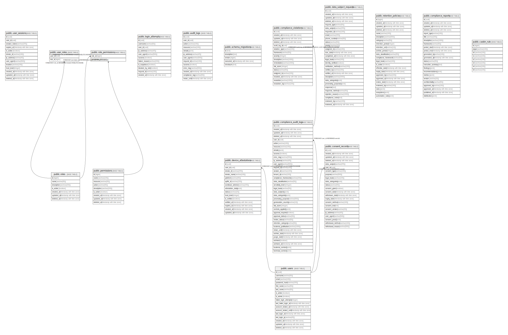

# mvp_db

## Tables

| Name | Columns | Comment | Type |
| ---- | ------- | ------- | ---- |
| [public.user_sessions](public.user_sessions.md) | 13 |  | BASE TABLE |
| [public.roles](public.roles.md) | 7 |  | BASE TABLE |
| [public.permissions](public.permissions.md) | 9 |  | BASE TABLE |
| [public.user_roles](public.user_roles.md) | 2 |  | BASE TABLE |
| [public.role_permissions](public.role_permissions.md) | 2 |  | BASE TABLE |
| [public.login_attempts](public.login_attempts.md) | 11 |  | BASE TABLE |
| [public.audit_logs](public.audit_logs.md) | 13 |  | BASE TABLE |
| [public.schema_migrations](public.schema_migrations.md) | 5 |  | BASE TABLE |
| [public.users](public.users.md) | 17 |  | BASE TABLE |
| [public.device_attestations](public.device_attestations.md) | 15 |  | BASE TABLE |
| [public.compliance_audit_logs](public.compliance_audit_logs.md) | 37 |  | BASE TABLE |
| [public.compliance_violations](public.compliance_violations.md) | 16 |  | BASE TABLE |
| [public.data_subject_requests](public.data_subject_requests.md) | 28 |  | BASE TABLE |
| [public.consent_records](public.consent_records.md) | 23 |  | BASE TABLE |
| [public.retention_policies](public.retention_policies.md) | 23 |  | BASE TABLE |
| [public.compliance_reports](public.compliance_reports.md) | 23 |  | BASE TABLE |
| [public.casbin_rule](public.casbin_rule.md) | 8 |  | BASE TABLE |

## Relations

---

> Generated by [tbls](https://github.com/k1LoW/tbls)
