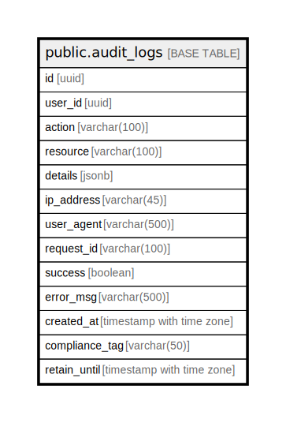

# public.audit_logs

## Description

## Columns

| Name | Type | Default | Nullable | Children | Parents | Comment |
| ---- | ---- | ------- | -------- | -------- | ------- | ------- |
| id | uuid | gen_random_uuid() | false |  |  |  |
| user_id | uuid |  | true |  |  |  |
| action | varchar(100) |  | false |  |  |  |
| resource | varchar(100) |  | true |  |  |  |
| details | jsonb |  | true |  |  |  |
| ip_address | varchar(45) |  | true |  |  |  |
| user_agent | varchar(500) |  | true |  |  |  |
| request_id | varchar(100) |  | true |  |  |  |
| success | boolean | false | true |  |  |  |
| error_msg | varchar(500) |  | true |  |  |  |
| created_at | timestamp with time zone | CURRENT_TIMESTAMP | true |  |  |  |
| compliance_tag | varchar(50) |  | true |  |  |  |
| retain_until | timestamp with time zone |  | true |  |  |  |

## Constraints

| Name | Type | Definition |
| ---- | ---- | ---------- |
| audit_logs_pkey | PRIMARY KEY | PRIMARY KEY (id) |

## Indexes

| Name | Definition |
| ---- | ---------- |
| audit_logs_pkey | CREATE UNIQUE INDEX audit_logs_pkey ON public.audit_logs USING btree (id) |
| idx_audit_logs_user_id | CREATE INDEX idx_audit_logs_user_id ON public.audit_logs USING btree (user_id) |
| idx_audit_logs_action | CREATE INDEX idx_audit_logs_action ON public.audit_logs USING btree (action) |
| idx_audit_logs_created_at | CREATE INDEX idx_audit_logs_created_at ON public.audit_logs USING btree (created_at) |
| idx_audit_logs_user_created | CREATE INDEX idx_audit_logs_user_created ON public.audit_logs USING btree (user_id, created_at DESC) |
| idx_audit_logs_action_created | CREATE INDEX idx_audit_logs_action_created ON public.audit_logs USING btree (action, created_at DESC) |
| idx_audit_logs_success_created | CREATE INDEX idx_audit_logs_success_created ON public.audit_logs USING btree (success, created_at DESC) |
| idx_audit_logs_ip_created | CREATE INDEX idx_audit_logs_ip_created ON public.audit_logs USING btree (ip_address, created_at DESC) |
| idx_audit_logs_resource_action | CREATE INDEX idx_audit_logs_resource_action ON public.audit_logs USING btree (resource, action) |
| idx_audit_logs_user_action_time | CREATE INDEX idx_audit_logs_user_action_time ON public.audit_logs USING btree (user_id, action, created_at DESC) |

## Relations

---

> Generated by [tbls](https://github.com/k1LoW/tbls)
