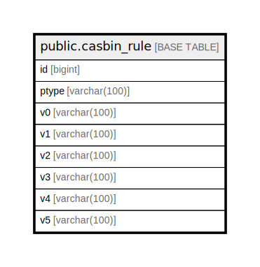

# public.casbin_rule

## Description

## Columns

| Name | Type | Default | Nullable | Children | Parents | Comment |
| ---- | ---- | ------- | -------- | -------- | ------- | ------- |
| id | bigint | nextval('casbin_rule_id_seq'::regclass) | false |  |  |  |
| ptype | varchar(100) |  | true |  |  |  |
| v0 | varchar(100) |  | true |  |  |  |
| v1 | varchar(100) |  | true |  |  |  |
| v2 | varchar(100) |  | true |  |  |  |
| v3 | varchar(100) |  | true |  |  |  |
| v4 | varchar(100) |  | true |  |  |  |
| v5 | varchar(100) |  | true |  |  |  |

## Constraints

| Name | Type | Definition |
| ---- | ---- | ---------- |
| casbin_rule_pkey | PRIMARY KEY | PRIMARY KEY (id) |

## Indexes

| Name | Definition |
| ---- | ---------- |
| casbin_rule_pkey | CREATE UNIQUE INDEX casbin_rule_pkey ON public.casbin_rule USING btree (id) |
| idx_casbin_rule | CREATE UNIQUE INDEX idx_casbin_rule ON public.casbin_rule USING btree (ptype, v0, v1, v2, v3, v4, v5) |

## Relations

---

> Generated by [tbls](https://github.com/k1LoW/tbls)
