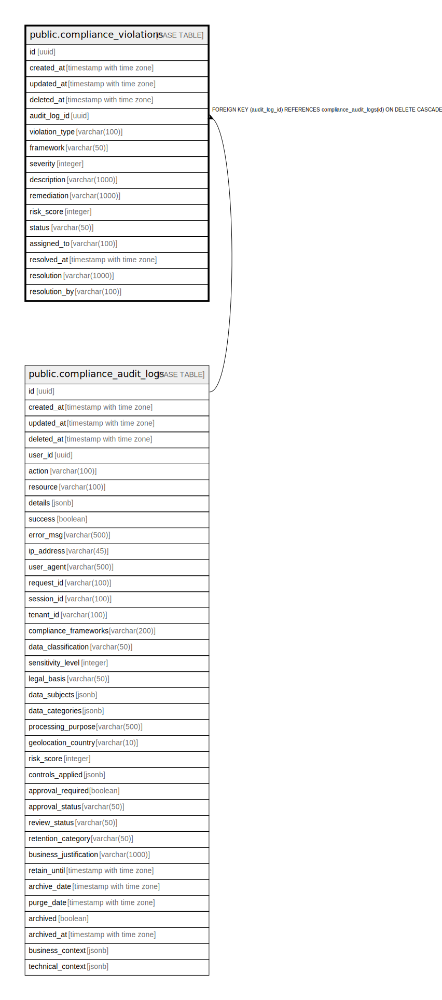

# public.compliance_violations

## Description

## Columns

| Name | Type | Default | Nullable | Children | Parents | Comment |
| ---- | ---- | ------- | -------- | -------- | ------- | ------- |
| id | uuid | gen_random_uuid() | false |  |  |  |
| created_at | timestamp with time zone | CURRENT_TIMESTAMP | true |  |  |  |
| updated_at | timestamp with time zone | CURRENT_TIMESTAMP | true |  |  |  |
| deleted_at | timestamp with time zone |  | true |  |  |  |
| audit_log_id | uuid |  | false |  | [public.compliance_audit_logs](public.compliance_audit_logs.md) |  |
| violation_type | varchar(100) |  | false |  |  |  |
| framework | varchar(50) |  | true |  |  |  |
| severity | integer |  | false |  |  |  |
| description | varchar(1000) |  | true |  |  |  |
| remediation | varchar(1000) |  | true |  |  |  |
| risk_score | integer | 0 | true |  |  |  |
| status | varchar(50) | 'OPEN'::character varying | true |  |  |  |
| assigned_to | varchar(100) |  | true |  |  |  |
| resolved_at | timestamp with time zone |  | true |  |  |  |
| resolution | varchar(1000) |  | true |  |  |  |
| resolution_by | varchar(100) |  | true |  |  |  |

## Constraints

| Name | Type | Definition |
| ---- | ---- | ---------- |
| compliance_violations_risk_score_check | CHECK | CHECK (((risk_score >= 0) AND (risk_score <= 100))) |
| compliance_violations_severity_check | CHECK | CHECK (((severity >= 1) AND (severity <= 5))) |
| compliance_violations_status_check | CHECK | CHECK (((status)::text = ANY ((ARRAY['OPEN'::character varying, 'IN_PROGRESS'::character varying, 'RESOLVED'::character varying, 'ACCEPTED'::character varying])::text[]))) |
| compliance_violations_audit_log_id_fkey | FOREIGN KEY | FOREIGN KEY (audit_log_id) REFERENCES compliance_audit_logs(id) ON DELETE CASCADE |
| compliance_violations_pkey | PRIMARY KEY | PRIMARY KEY (id) |

## Indexes

| Name | Definition |
| ---- | ---------- |
| compliance_violations_pkey | CREATE UNIQUE INDEX compliance_violations_pkey ON public.compliance_violations USING btree (id) |
| idx_compliance_violations_audit_log_id | CREATE INDEX idx_compliance_violations_audit_log_id ON public.compliance_violations USING btree (audit_log_id) |
| idx_compliance_violations_violation_type | CREATE INDEX idx_compliance_violations_violation_type ON public.compliance_violations USING btree (violation_type) |
| idx_compliance_violations_framework | CREATE INDEX idx_compliance_violations_framework ON public.compliance_violations USING btree (framework) |
| idx_compliance_violations_severity | CREATE INDEX idx_compliance_violations_severity ON public.compliance_violations USING btree (severity) |
| idx_compliance_violations_status | CREATE INDEX idx_compliance_violations_status ON public.compliance_violations USING btree (status) |
| idx_compliance_violations_created_at | CREATE INDEX idx_compliance_violations_created_at ON public.compliance_violations USING btree (created_at DESC) |
| idx_compliance_violations_assigned_to | CREATE INDEX idx_compliance_violations_assigned_to ON public.compliance_violations USING btree (assigned_to) |
| idx_compliance_violations_resolved_at | CREATE INDEX idx_compliance_violations_resolved_at ON public.compliance_violations USING btree (resolved_at DESC) |
| idx_compliance_violations_framework_severity | CREATE INDEX idx_compliance_violations_framework_severity ON public.compliance_violations USING btree (framework, severity DESC) |
| idx_compliance_violations_status_created | CREATE INDEX idx_compliance_violations_status_created ON public.compliance_violations USING btree (status, created_at DESC) |

## Relations

---

> Generated by [tbls](https://github.com/k1LoW/tbls)
