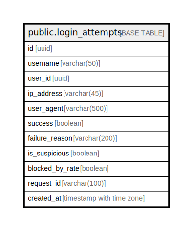

# public.login_attempts

## Description

## Columns

| Name | Type | Default | Nullable | Children | Parents | Comment |
| ---- | ---- | ------- | -------- | -------- | ------- | ------- |
| id | uuid | gen_random_uuid() | false |  |  |  |
| username | varchar(50) |  | false |  |  |  |
| user_id | uuid |  | true |  |  |  |
| ip_address | varchar(45) |  | false |  |  |  |
| user_agent | varchar(500) |  | true |  |  |  |
| success | boolean | false | true |  |  |  |
| failure_reason | varchar(200) |  | true |  |  |  |
| is_suspicious | boolean | false | true |  |  |  |
| blocked_by_rate | boolean | false | true |  |  |  |
| request_id | varchar(100) |  | true |  |  |  |
| created_at | timestamp with time zone | CURRENT_TIMESTAMP | true |  |  |  |

## Constraints

| Name | Type | Definition |
| ---- | ---- | ---------- |
| login_attempts_pkey | PRIMARY KEY | PRIMARY KEY (id) |

## Indexes

| Name | Definition |
| ---- | ---------- |
| login_attempts_pkey | CREATE UNIQUE INDEX login_attempts_pkey ON public.login_attempts USING btree (id) |
| idx_login_attempts_username | CREATE INDEX idx_login_attempts_username ON public.login_attempts USING btree (username) |
| idx_login_attempts_user_id | CREATE INDEX idx_login_attempts_user_id ON public.login_attempts USING btree (user_id) |
| idx_login_attempts_ip_address | CREATE INDEX idx_login_attempts_ip_address ON public.login_attempts USING btree (ip_address) |
| idx_login_attempts_success | CREATE INDEX idx_login_attempts_success ON public.login_attempts USING btree (success) |
| idx_login_attempts_created_at | CREATE INDEX idx_login_attempts_created_at ON public.login_attempts USING btree (created_at) |
| idx_login_attempts_suspicious | CREATE INDEX idx_login_attempts_suspicious ON public.login_attempts USING btree (is_suspicious) |
| idx_login_attempts_ip_success_time | CREATE INDEX idx_login_attempts_ip_success_time ON public.login_attempts USING btree (ip_address, success, created_at) |
| idx_login_attempts_username_success_time | CREATE INDEX idx_login_attempts_username_success_time ON public.login_attempts USING btree (username, success, created_at) |
| idx_login_attempts_username_created | CREATE INDEX idx_login_attempts_username_created ON public.login_attempts USING btree (username, created_at DESC) |
| idx_login_attempts_ip_created | CREATE INDEX idx_login_attempts_ip_created ON public.login_attempts USING btree (ip_address, created_at DESC) |
| idx_login_attempts_success_created | CREATE INDEX idx_login_attempts_success_created ON public.login_attempts USING btree (success, created_at DESC) |
| idx_login_attempts_user_success | CREATE INDEX idx_login_attempts_user_success ON public.login_attempts USING btree (user_id, success, created_at DESC) |

## Relations

---

> Generated by [tbls](https://github.com/k1LoW/tbls)
