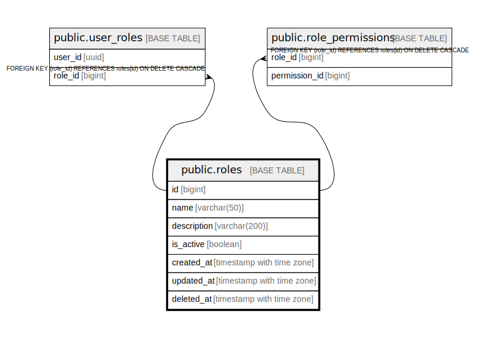

# public.roles

## Description

## Columns

| Name | Type | Default | Nullable | Children | Parents | Comment |
| ---- | ---- | ------- | -------- | -------- | ------- | ------- |
| id | bigint | nextval('roles_id_seq'::regclass) | false | [public.user_roles](public.user_roles.md) [public.role_permissions](public.role_permissions.md) |  |  |
| name | varchar(50) |  | false |  |  |  |
| description | varchar(200) |  | true |  |  |  |
| is_active | boolean | true | true |  |  |  |
| created_at | timestamp with time zone | CURRENT_TIMESTAMP | true |  |  |  |
| updated_at | timestamp with time zone | CURRENT_TIMESTAMP | true |  |  |  |
| deleted_at | timestamp with time zone |  | true |  |  |  |

## Constraints

| Name | Type | Definition |
| ---- | ---- | ---------- |
| roles_pkey | PRIMARY KEY | PRIMARY KEY (id) |
| roles_name_key | UNIQUE | UNIQUE (name) |

## Indexes

| Name | Definition |
| ---- | ---------- |
| roles_pkey | CREATE UNIQUE INDEX roles_pkey ON public.roles USING btree (id) |
| roles_name_key | CREATE UNIQUE INDEX roles_name_key ON public.roles USING btree (name) |
| idx_roles_name | CREATE INDEX idx_roles_name ON public.roles USING btree (name) |
| idx_roles_name_active | CREATE INDEX idx_roles_name_active ON public.roles USING btree (name) WHERE (is_active = true) |

## Relations

---

> Generated by [tbls](https://github.com/k1LoW/tbls)
