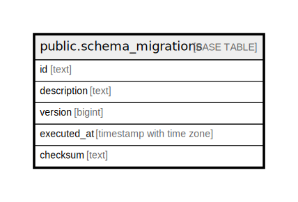

# public.schema_migrations

## Description

## Columns

| Name | Type | Default | Nullable | Children | Parents | Comment |
| ---- | ---- | ------- | -------- | -------- | ------- | ------- |
| id | text |  | false |  |  |  |
| description | text |  | false |  |  |  |
| version | bigint |  | false |  |  |  |
| executed_at | timestamp with time zone | CURRENT_TIMESTAMP | false |  |  |  |
| checksum | text |  | false |  |  |  |

## Constraints

| Name | Type | Definition |
| ---- | ---- | ---------- |
| schema_migrations_pkey | PRIMARY KEY | PRIMARY KEY (id) |

## Indexes

| Name | Definition |
| ---- | ---------- |
| schema_migrations_pkey | CREATE UNIQUE INDEX schema_migrations_pkey ON public.schema_migrations USING btree (id) |
| idx_schema_migrations_version | CREATE UNIQUE INDEX idx_schema_migrations_version ON public.schema_migrations USING btree (version) |

## Relations

---

> Generated by [tbls](https://github.com/k1LoW/tbls)
