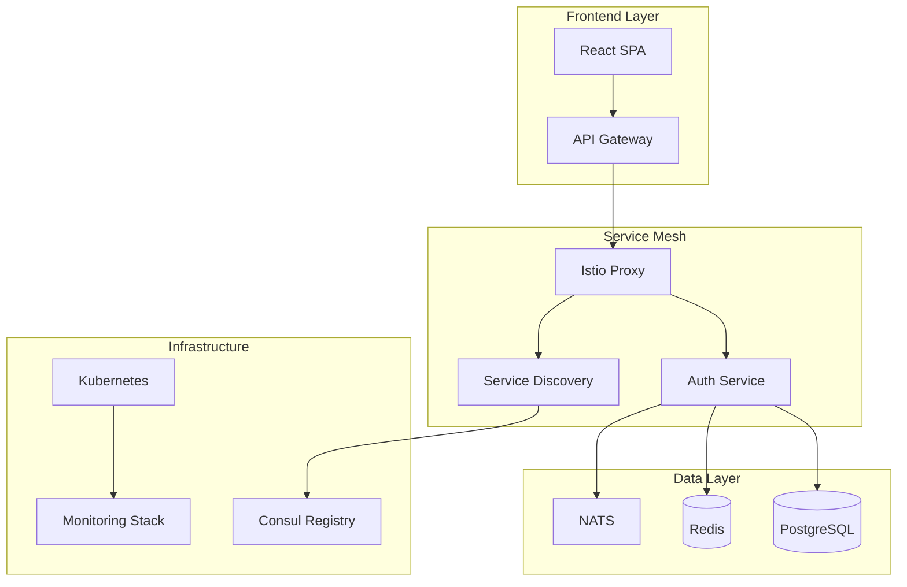

# Zamaz Zero Trust Platform Documentation

Welcome to the comprehensive documentation for the **Zamaz Zero Trust Authentication Platform**. This platform provides enterprise-grade authentication, authorization, and service discovery capabilities with modern DevOps practices.

## 🚀 What is Zamaz?

Zamaz is a modern Zero Trust authentication platform that provides:

- **🔐 Zero Trust Security**: Comprehensive authentication and authorization
- **🕸️ Service Mesh Integration**: Native Istio support with mTLS
- **🔍 Service Discovery**: Consul and Kubernetes DNS integration
- **⚡ Modern CI/CD**: Automated security scanning and deployment
- **📊 Observability**: Built-in monitoring, logging, and tracing
- **🏗️ Cloud Native**: Kubernetes-first with Docker support

## 🎯 Quick Navigation

### For Developers
- **[Quick Start](getting-started/quick-start.md)** - Get up and running in 5 minutes
- **[Development Environment](getting-started/development.md)** - Set up your local environment
- **[API Documentation](api/overview.md)** - Complete API reference
- **[SDKs](sdk/overview.md)** - Client libraries for Go, JavaScript, and Python

### For Operations
- **[Deployment Guide](deployment/overview.md)** - Production deployment strategies
- **[Kubernetes Setup](deployment/kubernetes.md)** - Container orchestration
- **[Monitoring](operations/monitoring.md)** - Observability and alerting
- **[Troubleshooting](operations/troubleshooting.md)** - Common issues and solutions

### For Security Teams
- **[Security Architecture](architecture/security.md)** - Security design principles
- **[Threat Model](security/threat-model.md)** - Security analysis and mitigations
- **[Security Scanning](security/scanning.md)** - Automated security validation
- **[Compliance](security/compliance.md)** - Regulatory requirements

### For Architects
- **[Architecture Overview](architecture/overview.md)** - System design and components
- **[Service Discovery](architecture/service-discovery.md)** - Dynamic service location
- **[Service Mesh](architecture/service-mesh.md)** - Traffic management and security
- **[Database Design](architecture/database.md)** - Data modeling and storage

## 🏗️ Architecture Highlights

## 🔑 Key Features

### Zero Trust Security
- **Multi-factor Authentication**: TOTP, WebAuthn, SMS
- **Device Attestation**: Hardware-based device verification
- **Dynamic Authorization**: Context-aware access control
- **Certificate Management**: Automated PKI with rotation

### Service Discovery
- **Multi-Provider Support**: Consul, Kubernetes DNS, static configuration
- **Health Monitoring**: Automated endpoint health checking
- **Load Balancing**: Round-robin, weighted, and consistent hashing
- **Circuit Breaker**: Fault tolerance and resilience patterns

### Modern DevOps
- **GitOps Workflow**: Infrastructure and configuration as code
- **Security-First CI/CD**: Comprehensive scanning and validation
- **Multi-Architecture**: ARM64 and AMD64 support
- **Package Distribution**: Multiple package managers supported

### Observability
- **Distributed Tracing**: End-to-end request tracking
- **Metrics Collection**: Prometheus-compatible metrics
- **Centralized Logging**: Structured logging with correlation IDs
- **Real-time Monitoring**: Grafana dashboards and alerting

## 📚 Documentation Structure

This documentation is organized into logical sections:

| Section | Description | Audience |
|---------|-------------|----------|
| **Getting Started** | Installation, setup, and quick start guides | All users |
| **Architecture** | System design, patterns, and decisions | Architects, Senior Developers |
| **API Documentation** | Complete API reference and examples | Developers |
| **Development** | Contributing, testing, and development workflows | Contributors |
| **Security** | Security policies, threat model, and compliance | Security Teams |
| **Deployment** | Production deployment and configuration | DevOps, Operations |
| **CI/CD** | Build, test, and deployment automation | DevOps Engineers |
| **SDKs** | Client libraries and integration guides | Application Developers |
| **Examples** | Code samples and integration patterns | All Developers |
| **Operations** | Monitoring, troubleshooting, and maintenance | Operations Teams |
| **Reference** | Configuration, CLI, and API references | All users |

## 🚦 Getting Started

1. **[Install Prerequisites](getting-started/installation.md)** - Required tools and dependencies
2. **[Set Up Development Environment](getting-started/development.md)** - Local development setup
3. **[Run Your First Example](examples/overview.md)** - Working code examples
4. **[Deploy to Kubernetes](deployment/kubernetes.md)** - Production deployment

## 🤝 Contributing

We welcome contributions! Please see our [Contributing Guide](development/contributing.md) for:

- Code style guidelines
- Development workflow
- Testing requirements
- Documentation standards

## 📞 Support & Community

- **📖 Documentation**: You're reading it!
- **🐛 Issues**: [GitHub Issues](https://github.com/zamaz/root-zamaz/issues)
- **💬 Discussions**: [GitHub Discussions](https://github.com/zamaz/root-zamaz/discussions)
- **📧 Email**: [support@zamaz.io](mailto:support@zamaz.io)

## 📄 License

This project is licensed under the MIT License. See the [License](appendix/license.md) page for details.

---

**Ready to get started?** 👉 [Quick Start Guide](getting-started/quick-start.md)