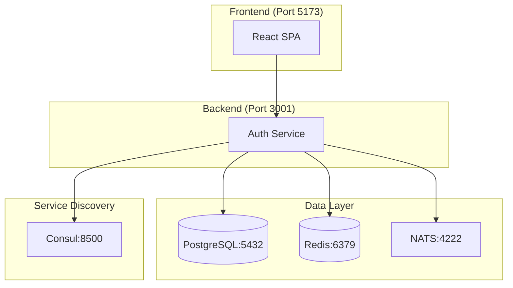

# Quick Start Guide

Get up and running with the Zamaz Zero Trust Platform in under 5 minutes!

## Prerequisites

Before you begin, ensure you have the following installed:

- **Go 1.23+** - [Install Go](https://golang.org/doc/install)
- **Node.js 18+** - [Install Node.js](https://nodejs.org/)
- **Docker** - [Install Docker](https://docs.docker.com/get-docker/)
- **Make** - Usually pre-installed on macOS/Linux
- **Git** - [Install Git](https://git-scm.com/downloads)

## 🚀 Quick Setup

### 1. Clone the Repository

```bash
git clone https://github.com/zamaz/root-zamaz.git
cd root-zamaz
```

### 2. Start Development Services

Our Make system handles all the complexity:

```bash
# Start all development services (PostgreSQL, Redis, NATS, Consul)
make dev-start

# Wait for services to be ready
make dev-health
```

### 3. Run Database Migrations

```bash
# Set up the database schema
make db-migrate
```

### 4. Start the Backend

```bash
# Start the authentication service
make dev-run
```

The API will be available at `http://localhost:3001`

### 5. Start the Frontend

In a new terminal:

```bash
# Install frontend dependencies and start dev server
cd frontend
npm install
npm run dev
```

The frontend will be available at `http://localhost:5173`

## 🧪 Verify Your Setup

### Test the API

```bash
# Check API health
curl http://localhost:3001/health

# Expected response:
# {
#   "status": "healthy",
#   "version": "dev",
#   "database": "connected",
#   "redis": "connected"
# }
```

### Test Service Discovery

```bash
# Check Consul service registration
curl http://localhost:8500/v1/agent/services

# Check service health
make consul-health
```

### Test the Frontend

1. Open your browser to `http://localhost:5173`
2. You should see the Zamaz login page
3. The frontend should automatically discover the backend API

## 🔧 Development Commands

Our Make system provides comprehensive development tools:

```bash
# Development
make dev-all           # Start complete development environment
make dev-stop          # Stop all development services
make dev-clean         # Clean development data

# Testing
make test-all          # Run all tests
make test-coverage     # Run tests with coverage
make test-integration  # Run integration tests

# Code Quality
make lint              # Run all linters
make format            # Format all code
make security-scan     # Run security scanning

# Documentation
make docs-serve        # Serve documentation locally
make docs-generate     # Generate API documentation
```

## 🏗️ Architecture Overview



## 🔐 Default Credentials

The development environment comes with default credentials:

- **Admin User**: `admin@zamaz.io` / `admin123`
- **Test User**: `user@zamaz.io` / `user123`
- **Database**: `postgres` / `postgres`
- **Consul**: No authentication (development only)

> ⚠️ **Security Note**: These are development-only credentials. Never use these in production!

## 📚 Next Steps

Now that you have the platform running, explore these areas:

### For Developers
1. **[API Documentation](../api/overview.md)** - Learn the API endpoints
2. **[Development Setup](development.md)** - Detailed development environment
3. **[Testing Guide](../development/testing.md)** - How to write and run tests

### For DevOps
1. **[Docker Deployment](../deployment/docker.md)** - Containerized deployment
2. **[Kubernetes Setup](../deployment/kubernetes.md)** - Production deployment
3. **[CI/CD Pipeline](../cicd/overview.md)** - Automated workflows

### For Security Teams
1. **[Security Architecture](../architecture/security.md)** - Security design
2. **[Threat Model](../security/threat-model.md)** - Security analysis
3. **[Security Scanning](../security/scanning.md)** - Automated security

## 🆘 Troubleshooting

### Common Issues

**Services won't start:**
```bash
# Check if ports are in use
make dev-status

# Clean and restart
make dev-clean
make dev-start
```

**Database connection errors:**
```bash
# Verify PostgreSQL is running
docker ps | grep postgres

# Check database connectivity
make db-health
```

**Frontend can't connect to API:**
```bash
# Verify API is running
curl http://localhost:3001/health

# Check service discovery
curl http://localhost:8500/v1/agent/services
```

**Port conflicts:**
```bash
# Check what's using your ports
lsof -i :3001  # API port
lsof -i :5173  # Frontend port
lsof -i :5432  # PostgreSQL port
```

### Getting Help

If you encounter issues:

1. **Check the logs**: `make dev-logs`
2. **Review the troubleshooting guide**: [Troubleshooting](../operations/troubleshooting.md)
3. **Ask for help**: [GitHub Discussions](https://github.com/zamaz/root-zamaz/discussions)

## 🎉 Success!

You now have a fully functional Zero Trust authentication platform with:

- ✅ **Backend API** with authentication and authorization
- ✅ **Frontend SPA** with service discovery
- ✅ **Service Registry** with Consul
- ✅ **Database** with PostgreSQL
- ✅ **Caching** with Redis
- ✅ **Message Queue** with NATS

Ready to build something amazing? 🚀

**Continue to**: [Development Environment Setup](development.md)