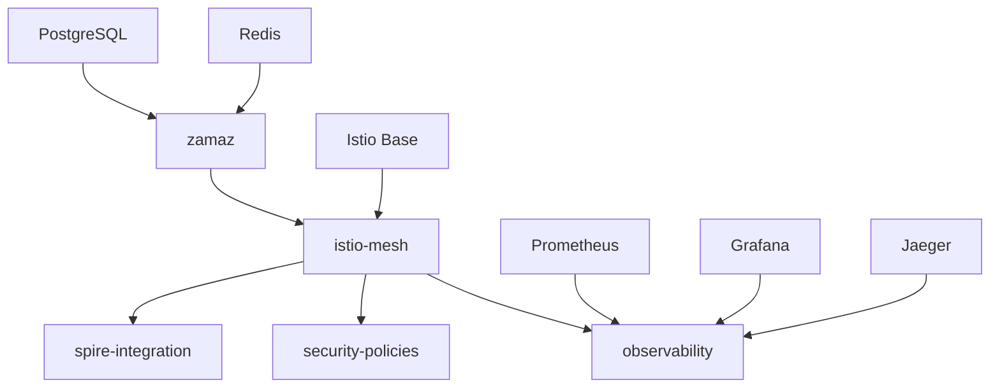

# Helm Charts Reference

## Overview

This document provides a comprehensive reference for all Helm charts created for the Zamaz Zero Trust Authentication MVP with Istio Service Mesh integration.

## Chart Structure

```
charts/
├── zamaz/                      # Main application chart
├── istio-mesh/                 # Service mesh configuration
├── spire-integration/          # SPIRE workload identity
├── security-policies/          # Security and network policies  
└── observability/             # Enhanced monitoring stack
```

## Chart Dependencies



## Charts Reference

### 1. zamaz (Main Application)

**Purpose**: Deploys the Zamaz Zero Trust Authentication application with optional Istio service mesh support.

#### Key Features
- Dual deployment support (legacy + mesh)
- Istio sidecar injection configuration
- SPIRE workload identity integration
- Enhanced security context
- Comprehensive health checks

#### Configuration Examples

```yaml
# Basic deployment
global:
  serviceMesh:
    enabled: false

replicaCount: 3
image:
  repository: zamaz/server
  tag: "1.0.0"
```

```yaml
# Service mesh deployment
global:
  serviceMesh:
    enabled: true
    namespace: zamaz-mesh
    istio:
      injection: enabled

istio:
  enabled: true
  security:
    peerAuthentication:
      enabled: true
      mtls:
        mode: STRICT
```

#### Values Schema

| Parameter | Description | Default |
|-----------|-------------|---------|
| `global.serviceMesh.enabled` | Enable service mesh integration | `false` |
| `global.serviceMesh.namespace` | Service mesh namespace | `zamaz-mesh` |
| `istio.enabled` | Enable Istio configuration | `false` |
| `istio.virtualService.enabled` | Create VirtualService | `true` |
| `istio.destinationRule.enabled` | Create DestinationRule | `true` |
| `istio.security.peerAuthentication.enabled` | Enable mTLS | `true` |

### 2. istio-mesh (Service Mesh Infrastructure)

**Purpose**: Configures Istio service mesh components including gateways, virtual services, and destination rules.

#### Key Features
- Gateway configuration for external traffic
- VirtualService for traffic routing
- DestinationRule for load balancing and circuit breaking
- Security policies integration
- Telemetry configuration

#### Configuration Examples

```yaml
# Gateway configuration
gateway:
  name: zamaz-gateway
  servers:
    - port:
        number: 443
        name: https
        protocol: HTTPS
      hosts:
        - "api.zamaz.com"
      tls:
        mode: SIMPLE
        credentialName: zamaz-tls-cert
```

```yaml
# Traffic policies
destinationRule:
  api:
    trafficPolicy:
      loadBalancer:
        simple: LEAST_CONN
      circuitBreaker:
        consecutiveGatewayErrors: 5
        interval: 30s
        baseEjectionTime: 30s
```

#### Values Schema

| Parameter | Description | Default |
|-----------|-------------|---------|
| `gateway.enabled` | Create Istio Gateway | `true` |
| `virtualService.enabled` | Create VirtualService | `true` |
| `destinationRule.enabled` | Create DestinationRule | `true` |
| `security.authorizationPolicy.enabled` | Create AuthorizationPolicy | `true` |
| `telemetry.enabled` | Enable telemetry collection | `true` |

### 3. spire-integration (Workload Identity)

**Purpose**: Deploys SPIRE server and agent for cryptographic workload identity in the service mesh.

#### Key Features
- SPIRE server with persistent storage
- SPIRE agent DaemonSet
- Kubernetes workload attestation
- Istio integration for mTLS
- Automatic registration entries

#### Configuration Examples

```yaml
# SPIRE server configuration
server:
  enabled: true
  persistence:
    enabled: true
    size: 10Gi
  
  config:
    server:
      trust_domain: "zamaz.cluster.local"
      ca_subject:
        organization: ["Zamaz"]
        common_name: "Zamaz Root CA"
```

```yaml
# Registration entries
registrationEntries:
  enabled: true
  zamazApi:
    spiffeId: "spiffe://zamaz.cluster.local/ns/zamaz-mesh/sa/zamaz-api"
    selectors:
      - "k8s:ns:zamaz-mesh"
      - "k8s:sa:zamaz-api"
```

#### Values Schema

| Parameter | Description | Default |
|-----------|-------------|---------|
| `global.trustDomain` | SPIFFE trust domain | `zamaz.cluster.local` |
| `server.enabled` | Deploy SPIRE server | `true` |
| `agent.enabled` | Deploy SPIRE agent | `true` |
| `registrationEntries.enabled` | Create workload entries | `true` |
| `istio.enabled` | Enable Istio integration | `true` |

### 4. security-policies (Security Framework)

**Purpose**: Implements comprehensive security policies including network policies, pod security standards, and Istio authorization.

#### Key Features
- Default-deny network policies
- Pod Security Standards enforcement
- Istio authorization policies
- Service account management
- Compliance configurations

#### Configuration Examples

```yaml
# Network policies
networkPolicies:
  enabled: true
  defaultDeny: true
  policies:
    - name: zamaz-api-ingress
      namespace: zamaz-mesh
      spec:
        podSelector:
          matchLabels:
            app: zamaz
            component: api
        policyTypes:
          - Ingress
        ingress:
          - from:
            - namespaceSelector:
                matchLabels:
                  name: istio-system
```

```yaml
# Istio security
istioSecurity:
  enabled: true
  authorizationPolicies:
    - name: zamaz-api-access
      namespace: zamaz-mesh
      spec:
        selector:
          matchLabels:
            app: zamaz
            component: api
        rules:
          - from:
            - source:
                principals:
                  - "cluster.local/ns/istio-system/sa/zamaz-gateway"
```

#### Values Schema

| Parameter | Description | Default |
|-----------|-------------|---------|
| `networkPolicies.enabled` | Enable network policies | `true` |
| `networkPolicies.defaultDeny` | Default deny all traffic | `true` |
| `istioSecurity.enabled` | Enable Istio security policies | `true` |
| `podSecurityStandards.enabled` | Enable Pod Security Standards | `true` |

### 5. observability (Monitoring Stack)

**Purpose**: Provides enhanced monitoring, logging, and tracing capabilities for the service mesh.

#### Key Features
- Prometheus with Istio metrics
- Grafana dashboards for service mesh
- Jaeger distributed tracing
- Loki log aggregation
- Custom alerts and rules

#### Configuration Examples

```yaml
# Prometheus configuration
prometheus:
  enabled: true
  kube-prometheus-stack:
    prometheus:
      prometheusSpec:
        retention: 30d
        additionalScrapeConfigs:
          - job_name: 'istio-proxy'
            kubernetes_sd_configs:
            - role: endpoints
```

```yaml
# Grafana dashboards
dashboards:
  enabled: true
  zamaz:
    enabled: true
    dashboards:
      - name: zamaz-overview
        title: "Zamaz Application Overview"
        panels:
          - title: "Request Rate"
            type: stat
```

#### Values Schema

| Parameter | Description | Default |
|-----------|-------------|---------|
| `prometheus.enabled` | Enable Prometheus stack | `true` |
| `jaeger.enabled` | Enable Jaeger tracing | `true` |
| `loki.enabled` | Enable Loki logging | `true` |
| `serviceMonitors.enabled` | Create ServiceMonitors | `true` |
| `prometheusRules.enabled` | Create Prometheus rules | `true` |

## Deployment Strategies

### Development Environment

```bash
# Install with minimal resources
helm install zamaz ./charts/zamaz \
  --set replicaCount=1 \
  --set resources.requests.memory=256Mi \
  --set global.serviceMesh.enabled=false
```

### Staging Environment

```bash
# Install with service mesh
helm install zamaz ./charts/zamaz -n zamaz-mesh \
  --set global.serviceMesh.enabled=true \
  --set istio.enabled=true \
  --set replicaCount=2

# Install mesh infrastructure
helm install istio-mesh ./charts/istio-mesh -n istio-system
helm install spire-integration ./charts/spire-integration -n spire-system
helm install security-policies ./charts/security-policies -n zamaz-mesh
```

### Production Environment

```bash
# Install with full observability
helm install observability ./charts/observability -n monitoring

# Install security policies
helm install security-policies ./charts/security-policies -n zamaz-mesh

# Install SPIRE
helm install spire-integration ./charts/spire-integration -n spire-system

# Install mesh infrastructure
helm install istio-mesh ./charts/istio-mesh -n istio-system

# Install application
helm install zamaz ./charts/zamaz -n zamaz-mesh \
  --set global.serviceMesh.enabled=true \
  --set istio.enabled=true \
  --set replicaCount=3 \
  --set autoscaling.enabled=true \
  --set resources.requests.memory=512Mi \
  --set resources.limits.memory=1Gi
```

## Customization Examples

### Custom Gateway Configuration

```yaml
# values-custom-gateway.yaml
gateway:
  servers:
    - port:
        number: 80
        name: http
        protocol: HTTP
      hosts:
        - "*.zamaz.dev"
      redirect:
        httpsRedirect: true
    - port:
        number: 443
        name: https
        protocol: HTTPS
      hosts:
        - "*.zamaz.dev"
      tls:
        mode: SIMPLE
        credentialName: zamaz-wildcard-cert
```

### Custom Security Policies

```yaml
# values-security.yaml
istioSecurity:
  authorizationPolicies:
    - name: custom-api-access
      namespace: zamaz-mesh
      spec:
        selector:
          matchLabels:
            app: zamaz
            component: api
        rules:
          - from:
            - source:
                requestPrincipals: ["*"]
            when:
            - key: request.headers[user-role]
              values: ["admin", "user"]
```

### Custom Monitoring

```yaml
# values-monitoring.yaml
prometheusRules:
  zamaz:
    rules:
      - alert: CustomHighLatency
        expr: |
          histogram_quantile(0.99, 
            sum(rate(istio_request_duration_milliseconds_bucket{
              destination_service_name="zamaz-api"
            }[5m])) by (le)
          ) > 1000
        for: 2m
        labels:
          severity: warning
        annotations:
          summary: "Custom high latency alert"
```

## Upgrade Procedures

### Chart Upgrades

```bash
# Upgrade application
helm upgrade zamaz ./charts/zamaz -n zamaz-mesh

# Upgrade with new values
helm upgrade zamaz ./charts/zamaz -n zamaz-mesh \
  -f values-production.yaml

# Upgrade infrastructure
helm upgrade istio-mesh ./charts/istio-mesh -n istio-system
```

### Version Compatibility

| Chart Version | Kubernetes | Istio | SPIRE |
|---------------|------------|-------|--------|
| 1.0.0         | 1.25+      | 1.20+ | 1.8+   |

### Rolling Updates

```bash
# Update application image
helm upgrade zamaz ./charts/zamaz -n zamaz-mesh \
  --set image.tag=1.1.0 \
  --wait

# Monitor rollout
kubectl rollout status deployment/zamaz -n zamaz-mesh
```

## Troubleshooting

### Common Issues

#### 1. Chart Installation Failures

```bash
# Check dependencies
helm dependency update ./charts/zamaz

# Validate template
helm template zamaz ./charts/zamaz --debug

# Dry run
helm install zamaz ./charts/zamaz --dry-run
```

#### 2. Value Validation Errors

```bash
# Lint chart
helm lint ./charts/zamaz

# Check schema
helm template zamaz ./charts/zamaz \
  --set invalid.value=true \
  --debug
```

#### 3. Resource Creation Issues

```bash
# Check chart resources
kubectl get all -l app.kubernetes.io/managed-by=Helm

# Check events
kubectl get events --sort-by=.metadata.creationTimestamp
```

### Debug Commands

```bash
# Get chart values
helm get values zamaz -n zamaz-mesh

# Get chart manifest
helm get manifest zamaz -n zamaz-mesh

# Chart history
helm history zamaz -n zamaz-mesh

# Rollback
helm rollback zamaz 1 -n zamaz-mesh
```

## Best Practices

### Values Organization

```yaml
# values-base.yaml (common settings)
global:
  imageRegistry: "your-registry.com"
  
# values-dev.yaml (development overrides)
global:
  serviceMesh:
    enabled: false
replicaCount: 1

# values-prod.yaml (production overrides)
global:
  serviceMesh:
    enabled: true
replicaCount: 3
autoscaling:
  enabled: true
```

### Security Considerations

1. **Secrets Management**
   ```yaml
   # Use external secrets
   secrets:
     external:
       enabled: true
       secretStore: vault-backend
   ```

2. **Image Security**
   ```yaml
   # Use specific tags, not latest
   image:
     tag: "1.0.0"
     pullPolicy: IfNotPresent
   ```

3. **Resource Limits**
   ```yaml
   # Always set resource limits
   resources:
     limits:
       cpu: 1000m
       memory: 1Gi
     requests:
       cpu: 500m
       memory: 512Mi
   ```

### Performance Optimization

1. **Resource Tuning**
   ```yaml
   # Adjust based on load testing
   autoscaling:
     targetCPUUtilizationPercentage: 70
     targetMemoryUtilizationPercentage: 80
   ```

2. **Connection Pooling**
   ```yaml
   # Optimize for your traffic patterns
   destinationRule:
     api:
       trafficPolicy:
         connectionPool:
           tcp:
             maxConnections: 100
   ```

## Reference Links

- [Helm Documentation](https://helm.sh/docs/)
- [Istio Helm Charts](https://istio.io/latest/docs/setup/install/helm/)
- [Prometheus Operator](https://prometheus-operator.dev/)
- [SPIRE Helm Charts](https://github.com/spiffe/helm-charts)

---

*This document is part of the Zamaz Zero Trust Authentication MVP documentation.*