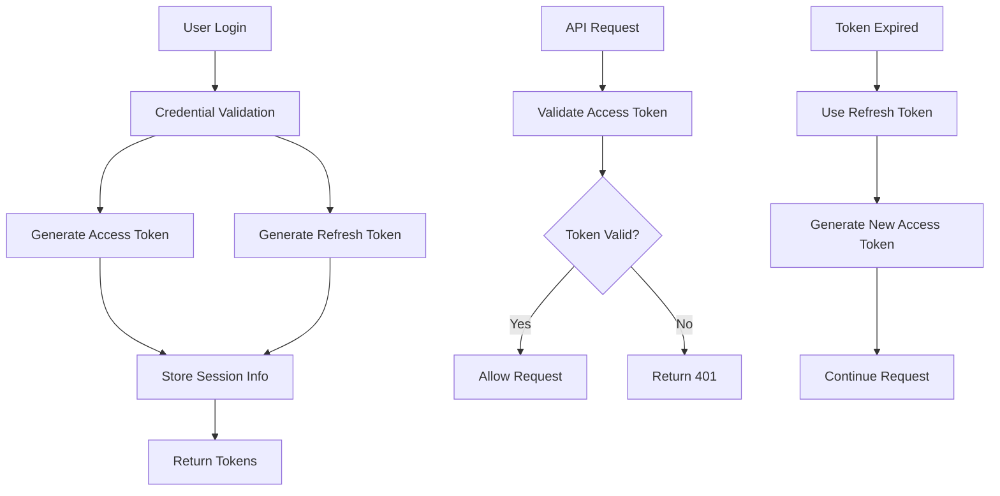
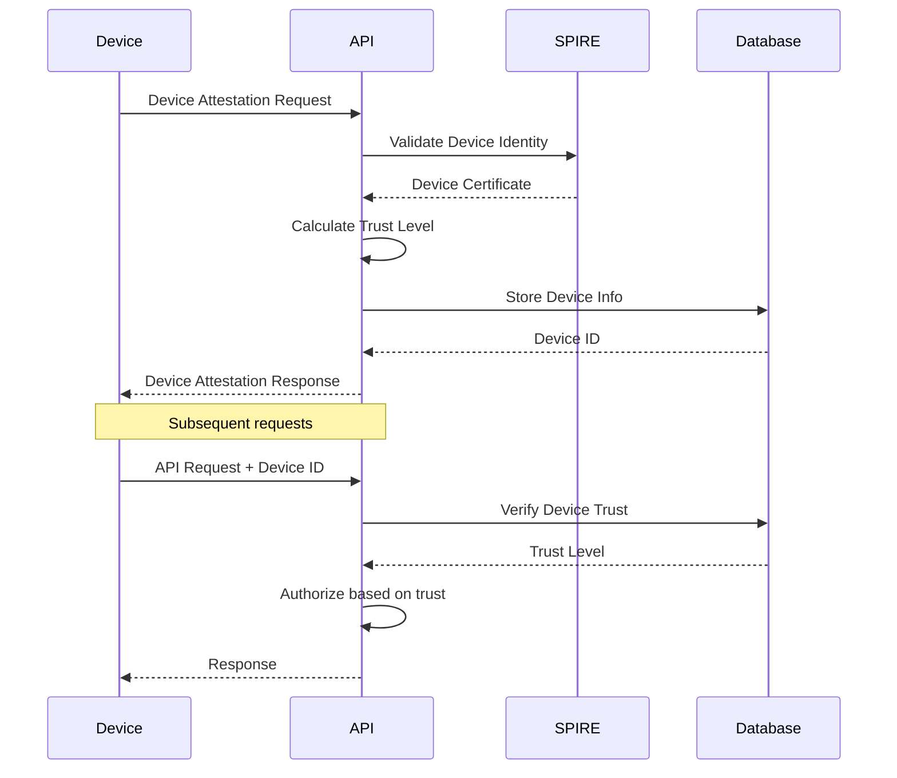
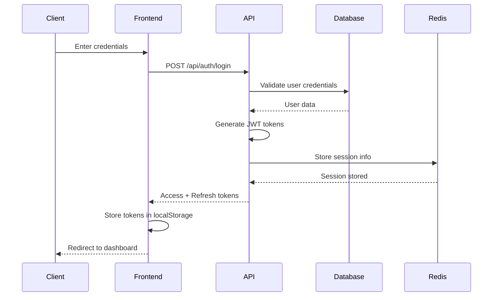
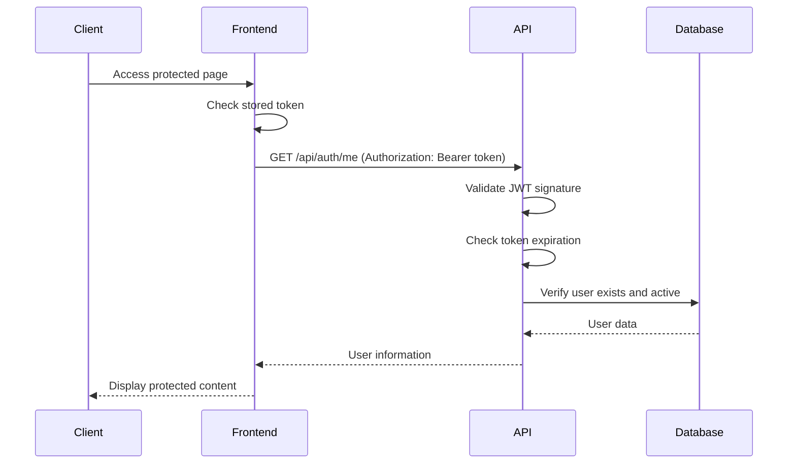
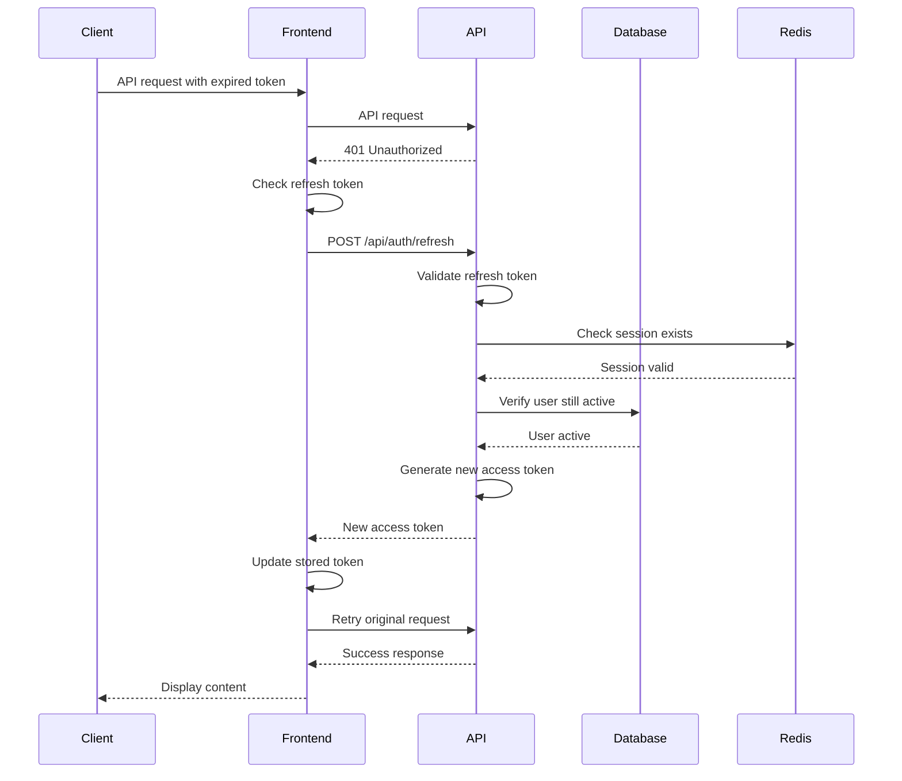
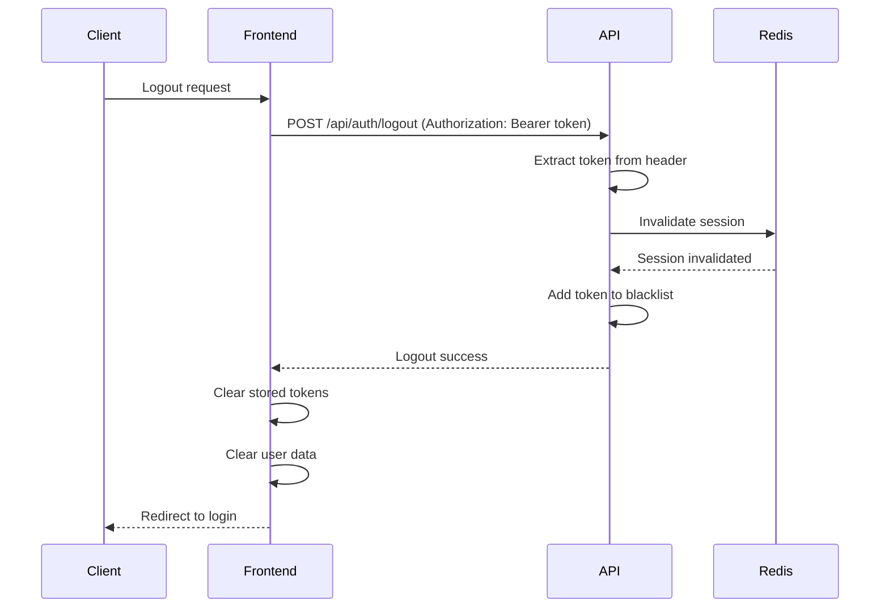

# Authentication Flow Documentation

This document details the authentication mechanisms and flows implemented in the Zero Trust Auth MVP.

## 🔐 Authentication Overview

The system implements a multi-layered authentication approach designed for Zero Trust security:

1. **Primary Authentication**: Username/password with JWT tokens
2. **Device Authentication**: Device attestation with trust levels
3. **Continuous Verification**: Session validation and refresh
4. **Demo Token Support**: Temporary development authentication

## 🎯 Authentication Strategies

### 1. JWT-Based Authentication

The primary authentication mechanism uses JSON Web Tokens (JWT) with dual tokens:



#### Access Token Structure
```json
{
  "header": {
    "alg": "HS256",
    "typ": "JWT"
  },
  "payload": {
    "sub": "550e8400-e29b-41d4-a716-446655440000",
    "username": "admin",
    "roles": ["admin", "user"],
    "permissions": ["system:admin", "device:verify"],
    "iat": 1642252800,
    "exp": 1642339200,
    "iss": "mvp-zero-trust-auth",
    "aud": "mvp-zero-trust-auth"
  },
  "signature": "..."
}
```

#### Token Configuration
```yaml
jwt:
  secret: "${JWT_SECRET}"
  access_token_expiration: "24h"
  refresh_token_expiration: "7d"
  issuer: "mvp-zero-trust-auth"
  audience: "mvp-zero-trust-auth"
  algorithm: "HS256"
```

### 2. Demo Token Authentication (Development)

For development and testing, the system supports demo tokens:

```go
// Demo token format: demo-token-{username}-{timestamp}
// Example: demo-token-admin-1750274157

func (a *AuthMiddleware) handleDemoToken(tokenString string) error {
    // Extract username from demo token
    if len(tokenString) > 10 && tokenString[:10] == "demo-token" {
        // Find user in database
        var user models.User
        if err := a.db.Where("username = ?", "admin").First(&user).Error; err != nil {
            return err
        }
        
        // Set user context
        c.Locals("user_id", user.ID)
        c.Locals("user", &user)
        c.Locals("user_roles", []string{"admin", "user"})
        
        return nil
    }
    return errors.New("invalid demo token")
}
```

### 3. Device-Based Authentication

Zero Trust requires device verification:



#### Trust Level Calculation
```go
func (h *DeviceHandler) calculateInitialTrustLevel(platform string, attestationData map[string]interface{}) int {
    baseTrust := 30
    
    // Platform-based adjustments
    switch platform {
    case "Windows 11", "macOS", "Linux":
        baseTrust += 20
    case "iOS", "Android":
        baseTrust += 15
    }
    
    // Security feature adjustments
    if attestationData != nil {
        if tpm, ok := attestationData["tpm"]; ok && tpm == "enabled" {
            baseTrust += 20
        }
        if biometric, ok := attestationData["biometric"]; ok && biometric == "enabled" {
            baseTrust += 15
        }
        if secureBoot, ok := attestationData["secure_boot"]; ok && secureBoot == "enabled" {
            baseTrust += 10
        }
    }
    
    // Cap at 85 for initial attestation
    if baseTrust > 85 {
        baseTrust = 85
    }
    
    return baseTrust
}
```

## 🔄 Authentication Flows

### 1. Initial Login Flow



### 2. Protected Resource Access



### 3. Token Refresh Flow



### 4. Logout Flow



## 🛡️ Security Measures

### 1. Password Security

```go
type PasswordPolicy struct {
    MinLength    int
    RequireUpper bool
    RequireLower bool
    RequireDigit bool
    RequireSymbol bool
    MaxAge       time.Duration
    History      int
}

func (p *PasswordPolicy) Validate(password string) error {
    if len(password) < p.MinLength {
        return errors.New("password too short")
    }
    
    if p.RequireUpper && !hasUppercase(password) {
        return errors.New("password must contain uppercase letter")
    }
    
    // Additional validation...
    return nil
}
```

### 2. Token Security

#### JWT Configuration
```go
type JWTConfig struct {
    Secret              string
    AccessTokenTTL      time.Duration
    RefreshTokenTTL     time.Duration
    Issuer             string
    Audience           string
    Algorithm          string
    TokenBlacklist     bool
    RotateRefreshToken bool
}
```

#### Token Validation
```go
func (j *JWTService) ValidateToken(tokenString string) (*Claims, error) {
    // Check blacklist first
    if j.isTokenBlacklisted(tokenString) {
        return nil, errors.New("token is blacklisted")
    }
    
    // Parse and validate JWT
    token, err := jwt.ParseWithClaims(tokenString, &Claims{}, func(token *jwt.Token) (interface{}, error) {
        if _, ok := token.Method.(*jwt.SigningMethodHMAC); !ok {
            return nil, fmt.Errorf("unexpected signing method: %v", token.Header["alg"])
        }
        return []byte(j.config.Secret), nil
    })
    
    if err != nil {
        return nil, err
    }
    
    if claims, ok := token.Claims.(*Claims); ok && token.Valid {
        return claims, nil
    }
    
    return nil, errors.New("invalid token")
}
```

### 3. Session Management

```go
type SessionManager struct {
    redis      *redis.Client
    expiration time.Duration
}

func (s *SessionManager) CreateSession(userID string, tokenData map[string]interface{}) error {
    sessionKey := fmt.Sprintf("session:%s", userID)
    data, _ := json.Marshal(tokenData)
    
    return s.redis.Set(context.Background(), sessionKey, data, s.expiration).Err()
}

func (s *SessionManager) ValidateSession(userID string) bool {
    sessionKey := fmt.Sprintf("session:%s", userID)
    exists := s.redis.Exists(context.Background(), sessionKey).Val()
    return exists > 0
}

func (s *SessionManager) InvalidateSession(userID string) error {
    sessionKey := fmt.Sprintf("session:%s", userID)
    return s.redis.Del(context.Background(), sessionKey).Err()
}
```

### 4. Rate Limiting

```go
type RateLimiter struct {
    redis  *redis.Client
    limits map[string]RateLimit
}

type RateLimit struct {
    Requests int
    Window   time.Duration
}

func (r *RateLimiter) CheckLimit(endpoint, clientID string) error {
    limit, exists := r.limits[endpoint]
    if !exists {
        return nil // No limit configured
    }
    
    key := fmt.Sprintf("rate_limit:%s:%s", endpoint, clientID)
    count := r.redis.Incr(context.Background(), key).Val()
    
    if count == 1 {
        r.redis.Expire(context.Background(), key, limit.Window)
    }
    
    if count > int64(limit.Requests) {
        return errors.New("rate limit exceeded")
    }
    
    return nil
}
```

## 🔧 Configuration

### Environment Variables

```bash
# JWT Configuration
JWT_SECRET=your-super-secret-jwt-key-here
JWT_ACCESS_TOKEN_EXPIRATION=24h
JWT_REFRESH_TOKEN_EXPIRATION=7d

# Session Configuration
SESSION_EXPIRATION=24h
REDIS_URL=redis://localhost:6379

# Security Configuration
DISABLE_AUTH=false
CORS_ALLOWED_ORIGINS=http://localhost:5175
PASSWORD_MIN_LENGTH=8
PASSWORD_REQUIRE_UPPERCASE=true
PASSWORD_REQUIRE_LOWERCASE=true
PASSWORD_REQUIRE_DIGITS=true
PASSWORD_REQUIRE_SYMBOLS=true

# Rate Limiting
RATE_LIMIT_LOGIN_REQUESTS=10
RATE_LIMIT_LOGIN_WINDOW=1m
RATE_LIMIT_API_REQUESTS=100
RATE_LIMIT_API_WINDOW=1m
```

### Configuration File

```yaml
security:
  jwt:
    secret: "${JWT_SECRET}"
    access_token_expiration: "24h"
    refresh_token_expiration: "7d"
    issuer: "mvp-zero-trust-auth"
    audience: "mvp-zero-trust-auth"
    algorithm: "HS256"
  
  password:
    min_length: 8
    require_uppercase: true
    require_lowercase: true
    require_digits: true
    require_symbols: false
    max_age: "90d"
    history: 5
  
  session:
    expiration: "24h"
    rotate_refresh_tokens: true
    blacklist_tokens: true
  
  rate_limiting:
    enabled: true
    limits:
      "/api/auth/login":
        requests: 10
        window: "1m"
      "/api/auth/register":
        requests: 5
        window: "1m"
      "/api/*":
        requests: 100
        window: "1m"
```

## 🧪 Testing Authentication

### Unit Tests

```go
func TestAuthHandler_Login(t *testing.T) {
    tests := []struct {
        name           string
        request        LoginRequest
        expectedStatus int
        expectedUser   string
    }{
        {
            name: "successful_login",
            request: LoginRequest{
                Username: "admin",
                Password: "password",
            },
            expectedStatus: 200,
            expectedUser:   "admin",
        },
        {
            name: "invalid_credentials",
            request: LoginRequest{
                Username: "admin",
                Password: "wrongpassword",
            },
            expectedStatus: 401,
        },
    }
    
    for _, tt := range tests {
        t.Run(tt.name, func(t *testing.T) {
            // Test implementation
        })
    }
}
```

### Integration Tests

```bash
# Test login flow
curl -X POST http://localhost:8080/api/auth/login \
  -H "Content-Type: application/json" \
  -d '{"username":"admin","password":"password"}'

# Test protected endpoint
TOKEN="obtained_from_login"
curl -X GET http://localhost:8080/api/auth/me \
  -H "Authorization: Bearer $TOKEN"

# Test refresh token
REFRESH_TOKEN="obtained_from_login"
curl -X POST http://localhost:8080/api/auth/refresh \
  -H "Content-Type: application/json" \
  -d '{"refresh_token":"'$REFRESH_TOKEN'"}'

# Test logout
curl -X POST http://localhost:8080/api/auth/logout \
  -H "Authorization: Bearer $TOKEN"
```

### E2E Tests

```typescript
// Frontend E2E test with Playwright
test('should complete full authentication flow', async ({ page }) => {
  // Navigate to login page
  await page.goto('/login');
  
  // Fill login form
  await page.fill('input[name="username"]', 'admin');
  await page.fill('input[name="password"]', 'password');
  
  // Submit login
  await page.click('button[type="submit"]');
  
  // Verify redirect to dashboard
  await page.waitForURL('/dashboard');
  
  // Verify user menu is visible
  await expect(page.locator('[data-testid="user-menu"]')).toBeVisible();
  
  // Test logout
  await page.click('[data-testid="logout-button"]');
  await page.waitForURL('/login');
});
```

## 🚨 Common Authentication Issues

### 1. Token Expiration
**Symptom**: 401 Unauthorized errors
**Solution**: Implement automatic token refresh

### 2. CORS Issues
**Symptom**: Browser blocks requests
**Solution**: Configure CORS properly

### 3. Session Conflicts
**Symptom**: Inconsistent authentication state
**Solution**: Implement proper session management

### 4. Demo Token in Production
**Symptom**: Security vulnerability
**Solution**: Disable demo tokens in production

```go
// Production safety check
if os.Getenv("ENVIRONMENT") == "production" && isDemoToken(token) {
    return errors.New("demo tokens not allowed in production")
}
```

## 📚 Further Reading

- [JWT Best Practices](https://tools.ietf.org/html/rfc8725)
- [OAuth 2.0 Security Best Practices](https://tools.ietf.org/html/draft-ietf-oauth-security-topics)
- [Zero Trust Architecture](https://csrc.nist.gov/publications/detail/sp/800-207/final)
- [SPIFFE/SPIRE Documentation](https://spiffe.io/docs/)