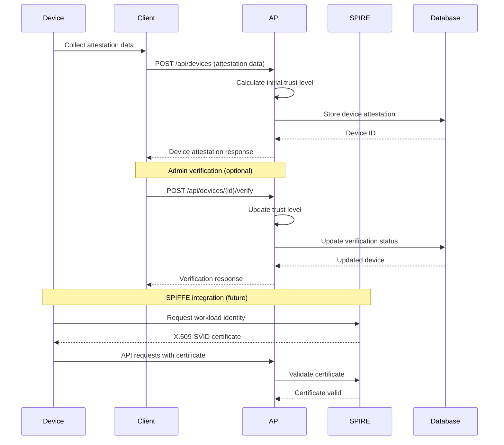
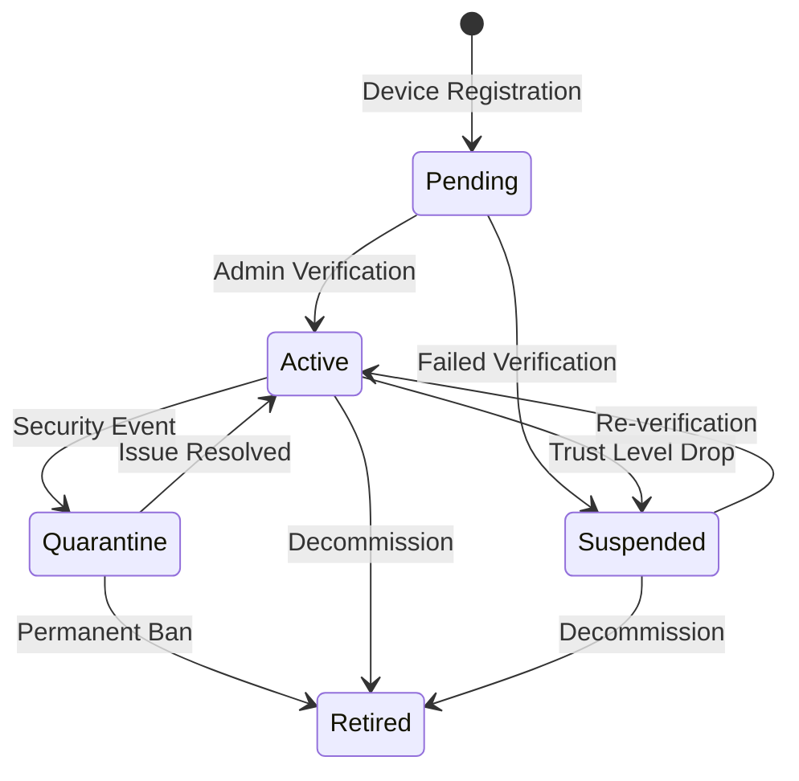

# Device Management API

The Device Management API provides endpoints for device attestation, verification, and trust management in the Zero Trust architecture.

## 🎯 Overview

Device attestation is a core component of Zero Trust security, ensuring that only trusted devices can access resources. The API provides:

- **Device Registration**: Register new devices with attestation data
- **Trust Level Management**: Calculate and update device trust scores
- **Device Verification**: Admin verification of device attestations
- **Continuous Monitoring**: Track device security posture over time

## 🔒 Device Attestation Flow



## 📱 Device Attestation Data

### Platform-Specific Data

#### macOS Device
```json
{
  "device_id": "macbook-pro-2023",
  "device_name": "MacBook Pro 16-inch",
  "platform": "macOS",
  "attestation_data": {
    "secure_enclave": "enabled",
    "system_integrity_protection": "enabled",
    "gatekeeper": "enabled",
    "filevault": "enabled",
    "firewall": "enabled",
    "biometric": "touch_id",
    "os_version": "14.2.1",
    "hardware_model": "MacBookPro18,2",
    "serial_number": "C02ABC123DEF"
  }
}
```

#### Windows Device
```json
{
  "device_id": "windows-laptop-001",
  "device_name": "Surface Laptop Studio",
  "platform": "Windows 11",
  "attestation_data": {
    "tpm": "enabled",
    "secure_boot": "enabled",
    "windows_defender": "enabled",
    "bitlocker": "enabled",
    "credential_guard": "enabled",
    "biometric": "windows_hello",
    "os_version": "22H2",
    "hardware_model": "Surface Laptop Studio",
    "device_encryption": "enabled"
  }
}
```

#### iOS Device
```json
{
  "device_id": "iphone-14-pro",
  "device_name": "iPhone 14 Pro",
  "platform": "iOS",
  "attestation_data": {
    "secure_enclave": "enabled",
    "biometric": "face_id",
    "jailbreak_detection": "passed",
    "app_transport_security": "enabled",
    "ios_version": "17.2.1",
    "device_model": "iPhone15,2",
    "passcode_enabled": true,
    "find_my_enabled": true
  }
}
```

#### Android Device
```json
{
  "device_id": "pixel-7-pro",
  "device_name": "Google Pixel 7 Pro",
  "platform": "Android",
  "attestation_data": {
    "hardware_security_module": "enabled",
    "verified_boot": "green",
    "biometric": "fingerprint",
    "root_detection": "passed",
    "safetynet_attestation": "passed",
    "android_version": "14",
    "security_patch_level": "2024-01-05",
    "device_encryption": "enabled"
  }
}
```

#### Linux Device
```json
{
  "device_id": "ubuntu-workstation",
  "device_name": "Ubuntu Workstation",
  "platform": "Linux",
  "attestation_data": {
    "tpm": "enabled",
    "secure_boot": "enabled",
    "full_disk_encryption": "enabled",
    "kernel_version": "6.5.0-14-generic",
    "distribution": "Ubuntu 22.04.3 LTS",
    "selinux_enforcing": false,
    "apparmor_enabled": true,
    "firewall": "ufw_enabled"
  }
}
```

## 🎯 Trust Level Calculation

The system calculates device trust levels based on multiple factors:

### Base Trust Levels
```go
const (
    MinimumTrustLevel = 0
    LowTrustLevel     = 25
    MediumTrustLevel  = 50
    HighTrustLevel    = 75
    MaxTrustLevel     = 100
)
```

### Trust Calculation Algorithm
```go
func calculateTrustLevel(platform string, attestationData map[string]interface{}) int {
    baseTrust := 30 // Starting baseline
    
    // Platform-based trust adjustments
    platformTrust := map[string]int{
        "macOS":       20,
        "Windows 11":  20,
        "Linux":       20,
        "iOS":         15,
        "Android":     15,
        "Windows 10":  10,
    }
    
    if trust, exists := platformTrust[platform]; exists {
        baseTrust += trust
    }
    
    // Security feature adjustments
    securityFeatures := map[string]int{
        "tpm":                    20,
        "secure_enclave":         20,
        "secure_boot":           10,
        "biometric":             15,
        "hardware_security_module": 20,
        "verified_boot":         15,
        "full_disk_encryption":  10,
        "device_encryption":     10,
        "bitlocker":            10,
        "filevault":            10,
    }
    
    for feature, value := range securityFeatures {
        if enabled, ok := attestationData[feature]; ok {
            switch v := enabled.(type) {
            case bool:
                if v {
                    baseTrust += value
                }
            case string:
                if v == "enabled" || v == "green" || v == "passed" {
                    baseTrust += value
                }
            }
        }
    }
    
    // Security risks (negative adjustments)
    risks := map[string]int{
        "jailbreak_detection": -50, // if failed
        "root_detection":      -50, // if failed
        "safetynet_attestation": -30, // if failed
    }
    
    for risk, penalty := range risks {
        if status, ok := attestationData[risk]; ok {
            if status == "failed" || status == false {
                baseTrust += penalty
            }
        }
    }
    
    // Ensure trust level is within bounds
    if baseTrust < MinimumTrustLevel {
        baseTrust = MinimumTrustLevel
    }
    if baseTrust > MaxTrustLevel {
        baseTrust = MaxTrustLevel
    }
    
    return baseTrust
}
```

### Trust Level Categories

| Trust Level | Range | Description | Access Level |
|-------------|-------|-------------|--------------|
| **Critical** | 0-24 | Compromised or untrusted device | Blocked |
| **Low** | 25-49 | Basic security features | Limited access |
| **Medium** | 50-74 | Good security posture | Standard access |
| **High** | 75-89 | Strong security features | Extended access |
| **Maximum** | 90-100 | Verified enterprise device | Full access |

## 🛡️ Security Policies

### Access Control Based on Trust Level

```go
type AccessPolicy struct {
    MinTrustLevel int
    MaxTrustLevel int
    AllowedActions []string
    RequiredFeatures []string
}

var DeviceAccessPolicies = map[string]AccessPolicy{
    "read_basic": {
        MinTrustLevel: 25,
        AllowedActions: []string{"read", "list"},
    },
    "read_sensitive": {
        MinTrustLevel: 50,
        AllowedActions: []string{"read", "list"},
        RequiredFeatures: []string{"biometric", "encryption"},
    },
    "write_operations": {
        MinTrustLevel: 60,
        AllowedActions: []string{"read", "write", "update"},
        RequiredFeatures: []string{"biometric", "encryption"},
    },
    "admin_operations": {
        MinTrustLevel: 80,
        AllowedActions: []string{"read", "write", "update", "delete", "admin"},
        RequiredFeatures: []string{"biometric", "encryption", "tpm"},
    },
    "critical_operations": {
        MinTrustLevel: 90,
        AllowedActions: []string{"*"},
        RequiredFeatures: []string{"biometric", "encryption", "tpm", "verified"},
    },
}
```

### Conditional Access Examples

```go
func (h *DeviceHandler) checkDeviceAccess(userID, deviceID, action string) error {
    device, err := h.getDeviceByID(deviceID)
    if err != nil {
        return err
    }
    
    // Check if device belongs to user
    if device.UserID != userID {
        return errors.New("device not owned by user")
    }
    
    // Get required policy for action
    policy, exists := DeviceAccessPolicies[action]
    if !exists {
        return errors.New("unknown action")
    }
    
    // Check trust level
    if device.TrustLevel < policy.MinTrustLevel {
        return fmt.Errorf("device trust level %d below required %d", 
            device.TrustLevel, policy.MinTrustLevel)
    }
    
    // Check required features
    for _, feature := range policy.RequiredFeatures {
        if !device.HasFeature(feature) {
            return fmt.Errorf("device missing required feature: %s", feature)
        }
    }
    
    return nil
}
```

## 📊 Device Monitoring

### Continuous Assessment

The system continuously monitors device security posture:

```go
type DeviceHealthCheck struct {
    DeviceID        string    `json:"device_id"`
    LastChecked     time.Time `json:"last_checked"`
    TrustLevel      int       `json:"trust_level"`
    PreviousTrust   int       `json:"previous_trust"`
    SecurityEvents  []SecurityEvent `json:"security_events"`
    Recommendations []string  `json:"recommendations"`
}

type SecurityEvent struct {
    Type        string    `json:"type"`
    Severity    string    `json:"severity"`
    Description string    `json:"description"`
    Timestamp   time.Time `json:"timestamp"`
    Resolved    bool      `json:"resolved"`
}
```

### Automated Trust Updates

```go
func (s *DeviceService) PerformHealthCheck(deviceID string) (*DeviceHealthCheck, error) {
    device, err := s.getDevice(deviceID)
    if err != nil {
        return nil, err
    }
    
    // Collect current attestation data
    currentData, err := s.collectAttestationData(deviceID)
    if err != nil {
        return nil, err
    }
    
    // Recalculate trust level
    newTrustLevel := s.calculateTrustLevel(device.Platform, currentData)
    
    // Check for security events
    events := s.detectSecurityEvents(device, currentData)
    
    // Generate recommendations
    recommendations := s.generateRecommendations(device, currentData)
    
    healthCheck := &DeviceHealthCheck{
        DeviceID:        deviceID,
        LastChecked:     time.Now(),
        TrustLevel:      newTrustLevel,
        PreviousTrust:   device.TrustLevel,
        SecurityEvents:  events,
        Recommendations: recommendations,
    }
    
    // Update device trust level if changed
    if newTrustLevel != device.TrustLevel {
        err = s.updateDeviceTrustLevel(deviceID, newTrustLevel)
        if err != nil {
            return nil, err
        }
    }
    
    return healthCheck, nil
}
```

## 🔄 Device Lifecycle Management

### Device Registration Process

1. **Initial Attestation**: Device provides security posture data
2. **Trust Calculation**: System calculates initial trust level
3. **Admin Review**: Optional manual verification
4. **Continuous Monitoring**: Ongoing security assessment
5. **Trust Updates**: Automatic trust level adjustments
6. **Retirement**: Device decommissioning process

### Device States

```go
type DeviceState string

const (
    DeviceStatePending    DeviceState = "pending"    // Awaiting verification
    DeviceStateActive     DeviceState = "active"     // Verified and trusted
    DeviceStateSuspended  DeviceState = "suspended"  // Temporarily blocked
    DeviceStateQuarantine DeviceState = "quarantine" // Security issue detected
    DeviceStateRetired    DeviceState = "retired"    // Decommissioned
)
```

### State Transitions



## 🔧 Configuration

### Device Policy Configuration

```yaml
device_security:
  trust_levels:
    minimum_for_access: 25
    minimum_for_sensitive: 50
    minimum_for_admin: 80
    verification_required_above: 90
  
  required_features:
    basic_access:
      - encryption
    sensitive_access:
      - encryption
      - biometric
    admin_access:
      - encryption
      - biometric
      - tpm
  
  monitoring:
    health_check_interval: "24h"
    trust_level_threshold_change: 10
    automatic_quarantine_threshold: 20
  
  platform_support:
    - macOS
    - Windows 11
    - Linux
    - iOS
    - Android
  
  blocked_platforms:
    - Windows 7
    - Windows 8
```

### Environment Variables

```bash
# Device Security Configuration
DEVICE_MIN_TRUST_LEVEL=25
DEVICE_ADMIN_VERIFICATION_REQUIRED=true
DEVICE_HEALTH_CHECK_INTERVAL=24h
DEVICE_AUTO_QUARANTINE_THRESHOLD=20

# SPIRE Integration
SPIRE_SOCKET_PATH=/tmp/spire-agent/public/api.sock
SPIRE_TRUST_DOMAIN=mvp.local
SPIFFE_ID_PREFIX=spiffe://mvp.local/device/

# Platform Configuration
SUPPORTED_PLATFORMS=macOS,Windows 11,Linux,iOS,Android
BLOCKED_PLATFORMS=Windows 7,Windows 8,Windows XP
```

## 🧪 Testing Device Management

### Unit Tests

```go
func TestTrustLevelCalculation(t *testing.T) {
    tests := []struct {
        name           string
        platform       string
        attestationData map[string]interface{}
        expectedTrust   int
    }{
        {
            name:     "macOS with strong security",
            platform: "macOS",
            attestationData: map[string]interface{}{
                "secure_enclave": "enabled",
                "biometric":     "touch_id",
                "filevault":     "enabled",
            },
            expectedTrust: 85,
        },
        {
            name:     "compromised Android device",
            platform: "Android",
            attestationData: map[string]interface{}{
                "root_detection": "failed",
                "safetynet_attestation": "failed",
            },
            expectedTrust: 0,
        },
    }
    
    for _, tt := range tests {
        t.Run(tt.name, func(t *testing.T) {
            trust := calculateTrustLevel(tt.platform, tt.attestationData)
            assert.Equal(t, tt.expectedTrust, trust)
        })
    }
}
```

### Integration Tests

```bash
# Register a new device
curl -X POST http://localhost:8080/api/devices \
  -H "Authorization: Bearer $TOKEN" \
  -H "Content-Type: application/json" \
  -d '{
    "device_id": "test-device-001",
    "device_name": "Test MacBook",
    "platform": "macOS",
    "attestation_data": {
      "secure_enclave": "enabled",
      "biometric": "touch_id",
      "filevault": "enabled"
    }
  }'

# Verify device (admin required)
DEVICE_ID="1"
curl -X POST http://localhost:8080/api/devices/$DEVICE_ID/verify \
  -H "Authorization: Bearer $ADMIN_TOKEN" \
  -H "Content-Type: application/json" \
  -d '{"trust_level": 95}'

# Get device details
curl -X GET http://localhost:8080/api/devices/$DEVICE_ID \
  -H "Authorization: Bearer $TOKEN"

# Update device attestation
curl -X PUT http://localhost:8080/api/devices/$DEVICE_ID \
  -H "Authorization: Bearer $TOKEN" \
  -H "Content-Type: application/json" \
  -d '{
    "device_name": "Updated Device Name",
    "attestation_data": {
      "secure_enclave": "enabled",
      "biometric": "face_id",
      "filevault": "enabled"
    }
  }'
```

### E2E Device Management

```typescript
// Playwright E2E test for device management
test('device management flow', async ({ page }) => {
  // Login as admin
  await page.goto('/login');
  await page.fill('input[name="username"]', 'admin');
  await page.fill('input[name="password"]', 'password');
  await page.click('button[type="submit"]');
  
  // Navigate to devices page
  await page.click('nav a[href="/devices"]');
  
  // Add new device
  await page.click('button:has-text("Add Device")');
  await page.fill('input[name="device_name"]', 'Test Device');
  await page.fill('input[name="device_id"]', 'test-device-001');
  await page.selectOption('select[name="platform"]', 'macOS');
  await page.click('button[type="submit"]');
  
  // Verify device appears in list
  await expect(page.locator('text=Test Device')).toBeVisible();
  
  // Verify device
  await page.click('button:has-text("Verify")');
  await page.fill('input[name="trust_level"]', '90');
  await page.click('button:has-text("Confirm")');
  
  // Check verification status
  await expect(page.locator('text=Verified')).toBeVisible();
});
```

## 🚨 Common Issues

### 1. Low Trust Levels
**Cause**: Missing security features
**Solution**: Enable device security features

### 2. Failed Device Verification
**Cause**: Insufficient attestation data
**Solution**: Provide complete attestation information

### 3. Access Denied
**Cause**: Trust level below policy requirement
**Solution**: Improve device security posture or verify device

### 4. SPIFFE Integration Issues
**Cause**: SPIRE agent not running
**Solution**: Ensure SPIRE infrastructure is properly configured

## 📚 Related Documentation

- [SPIFFE/SPIRE Documentation](https://spiffe.io/docs/)
- [Zero Trust Device Security](docs/architecture/zero-trust.md)
- [Security Monitoring](docs/architecture/observability.md)
- [API Reference](docs/api/README.md)