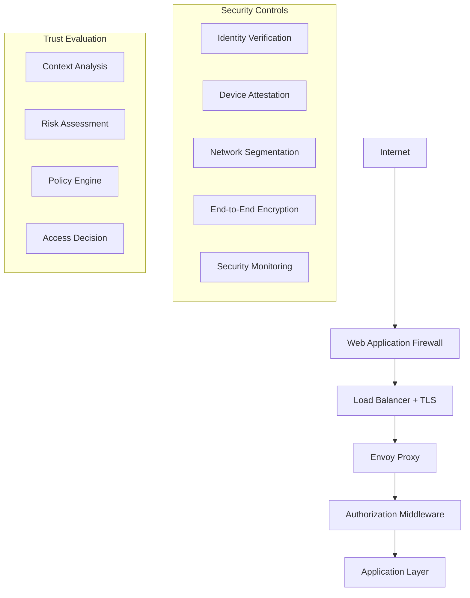
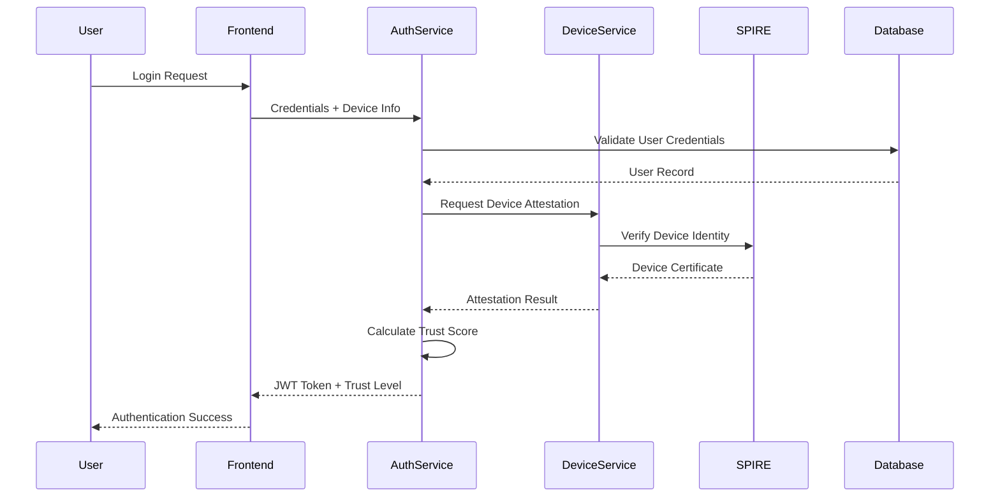
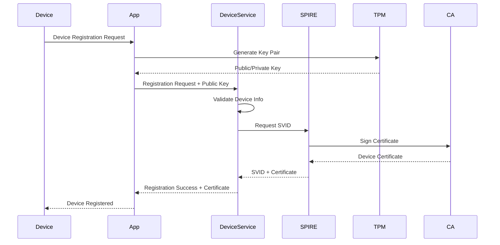

# Security Architecture Guide

This document outlines the comprehensive security architecture of the Zero Trust Auth MVP, covering authentication mechanisms, authorization models, encryption, and security best practices.

## 🔐 Zero Trust Security Model

### Core Principles

The MVP implements a **Zero Trust Architecture** based on these fundamental principles:

1. **Never Trust, Always Verify**: Every request is authenticated and authorized
2. **Least Privilege Access**: Users and services get minimal required permissions
3. **Assume Breach**: Design assumes the network is already compromised
4. **Verify Explicitly**: Use all available data points for access decisions
5. **Continuous Monitoring**: Real-time security monitoring and alerting

### Security Layers



## 🔑 Authentication Architecture

### Multi-Factor Authentication Flow



### Authentication Methods

#### 1. Primary Authentication
- **Username/Password**: PBKDF2 with salt for password hashing
- **Multi-Factor Authentication**: TOTP (Time-based One-Time Password)
- **Biometric Authentication**: WebAuthn for fingerprint/face recognition
- **Certificate-based**: X.509 client certificates for automated systems

#### 2. Device Authentication
- **Device Registration**: Unique device fingerprinting
- **Hardware Attestation**: TPM-based device verification
- **SPIFFE/SPIRE Integration**: Workload identity verification
- **Certificate Pinning**: Public key pinning for mobile apps

#### 3. Continuous Authentication
- **Behavioral Analysis**: User behavior pattern recognition
- **Geolocation Verification**: Location-based risk assessment
- **Session Monitoring**: Real-time session anomaly detection
- **Adaptive Authentication**: Dynamic authentication requirements

### JWT Token Structure

```json
{
  "header": {
    "alg": "HS256",
    "typ": "JWT",
    "kid": "key-id-2024"
  },
  "payload": {
    "sub": "user-id",
    "username": "admin",
    "email": "admin@company.com",
    "roles": ["admin", "user"],
    "permissions": ["system:admin", "device:verify", "user:read"],
    "device_id": "device-12345",
    "trust_level": "high",
    "session_id": "session-abcdef",
    "iat": 1640995200,
    "exp": 1641081600,
    "iss": "mvp-zero-trust-auth",
    "aud": "mvp-client-app",
    "context": {
      "ip_address": "192.168.1.100",
      "user_agent": "Mozilla/5.0...",
      "location": "US-CA-SF",
      "risk_score": 0.2
    }
  },
  "signature": "HMACSHA256(...)"
}
```

### Token Management

#### Access Tokens
- **Short-lived**: 1 hour expiration for production
- **Stateless**: Self-contained with user context
- **Scoped**: Specific permissions and resources
- **Revocable**: Centralized revocation list

#### Refresh Tokens
- **Long-lived**: 24 hours expiration
- **Rotating**: New refresh token on each use
- **Secure Storage**: HttpOnly, Secure cookies
- **Device-bound**: Tied to specific device fingerprint

#### Token Security
```go
// Token configuration
type JWTConfig struct {
    Secret                string        `env:"JWT_SECRET"`
    AccessTokenTTL        time.Duration `env:"JWT_ACCESS_TOKEN_TTL" default:"1h"`
    RefreshTokenTTL       time.Duration `env:"JWT_REFRESH_TOKEN_TTL" default:"24h"`
    Issuer                string        `env:"JWT_ISSUER" default:"mvp-zero-trust-auth"`
    Audience              string        `env:"JWT_AUDIENCE" default:"mvp-client"`
    Algorithm             string        `env:"JWT_ALGORITHM" default:"HS256"`
    ClockSkewTolerance    time.Duration `env:"JWT_CLOCK_SKEW" default:"30s"`
    RefreshTokenRotation  bool          `env:"JWT_REFRESH_ROTATION" default:"true"`
    RevokedTokenCacheSize int           `env:"JWT_REVOCATION_CACHE_SIZE" default:"10000"`
}
```

## 🛡️ Authorization Model

### Role-Based Access Control (RBAC)

#### Role Hierarchy
```
Super Admin
├── System Admin
│   ├── User Admin
│   └── Device Admin
├── Security Officer
│   ├── Auditor
│   └── Analyst
└── Regular User
    ├── Device Owner
    └── Guest User
```

#### Permission Matrix
| Resource | Create | Read | Update | Delete | Verify | Admin |
|----------|--------|------|--------|--------|--------|-------|
| Users    | ✓ SA   | ✓ UA | ✓ UA   | ✓ SA   | ✓ SO   | ✓ SA  |
| Devices  | ✓ U    | ✓ U  | ✓ DO   | ✓ DA   | ✓ SO   | ✓ DA  |
| Policies | ✗      | ✓ SO | ✗      | ✗      | ✗      | ✓ SA  |
| Audit    | ✗      | ✓ A  | ✗      | ✗      | ✗      | ✓ SO  |

*Legend: SA=Super Admin, UA=User Admin, DA=Device Admin, SO=Security Officer, A=Auditor, U=User, DO=Device Owner*

### Attribute-Based Access Control (ABAC)

#### Context Attributes
```json
{
  "subject": {
    "user_id": "user-123",
    "roles": ["admin"],
    "clearance_level": "secret",
    "department": "engineering"
  },
  "resource": {
    "type": "device",
    "classification": "confidential",
    "owner": "user-456",
    "location": "datacenter-1"
  },
  "environment": {
    "time": "2024-01-15T14:30:00Z",
    "location": "office-network",
    "risk_level": "low",
    "security_posture": "compliant"
  },
  "action": {
    "operation": "read",
    "method": "API",
    "urgency": "normal"
  }
}
```

#### Policy Examples
```json
{
  "policy_id": "device-access-policy",
  "name": "Device Access Control",
  "description": "Controls device access based on user role and device trust level",
  "rules": [
    {
      "effect": "ALLOW",
      "condition": {
        "AND": [
          {"subject.roles": {"contains": "admin"}},
          {"resource.type": {"equals": "device"}},
          {"environment.location": {"in": ["office-network", "vpn"]}}
        ]
      }
    },
    {
      "effect": "DENY",
      "condition": {
        "OR": [
          {"environment.risk_level": {"equals": "high"}},
          {"resource.classification": {"equals": "top-secret"}}
        ]
      }
    }
  ]
}
```

### Dynamic Authorization

#### Trust Score Calculation
```go
type TrustCalculator struct {
    DeviceScore      float64 `json:"device_score"`      // 0.0 - 1.0
    LocationScore    float64 `json:"location_score"`    // 0.0 - 1.0
    BehaviorScore    float64 `json:"behavior_score"`    // 0.0 - 1.0
    TimeScore        float64 `json:"time_score"`        // 0.0 - 1.0
    NetworkScore     float64 `json:"network_score"`     // 0.0 - 1.0
}

func (tc *TrustCalculator) CalculateOverallTrust() TrustLevel {
    weights := map[string]float64{
        "device":   0.3,
        "location": 0.2,
        "behavior": 0.25,
        "time":     0.1,
        "network":  0.15,
    }
    
    score := tc.DeviceScore*weights["device"] +
             tc.LocationScore*weights["location"] +
             tc.BehaviorScore*weights["behavior"] +
             tc.TimeScore*weights["time"] +
             tc.NetworkScore*weights["network"]
    
    switch {
    case score >= 0.8:
        return TrustLevelHigh
    case score >= 0.6:
        return TrustLevelMedium
    case score >= 0.4:
        return TrustLevelLow
    default:
        return TrustLevelDeny
    }
}
```

## 🔒 Encryption and Data Protection

### Encryption at Rest

#### Database Encryption
- **Field-level Encryption**: PII and sensitive data encrypted
- **Transparent Data Encryption**: PostgreSQL encryption
- **Key Management**: Separate encryption keys per data type
- **Key Rotation**: Automated quarterly key rotation

```go
type EncryptedField struct {
    Value     string    `json:"-"`                    // Never serialized
    Encrypted string    `json:"encrypted"`            // Base64 encoded
    KeyID     string    `json:"key_id"`              // Key identifier
    Algorithm string    `json:"algorithm"`            // Encryption algorithm
    CreatedAt time.Time `json:"created_at"`          // Encryption timestamp
}

func (e *EncryptedField) Encrypt(plaintext string, keyID string) error {
    key, err := e.keyManager.GetKey(keyID)
    if err != nil {
        return err
    }
    
    // Use AES-256-GCM for authenticated encryption
    block, err := aes.NewCipher(key)
    if err != nil {
        return err
    }
    
    gcm, err := cipher.NewGCM(block)
    if err != nil {
        return err
    }
    
    nonce := make([]byte, gcm.NonceSize())
    if _, err := rand.Read(nonce); err != nil {
        return err
    }
    
    ciphertext := gcm.Seal(nonce, nonce, []byte(plaintext), nil)
    e.Encrypted = base64.StdEncoding.EncodeToString(ciphertext)
    e.KeyID = keyID
    e.Algorithm = "AES-256-GCM"
    e.CreatedAt = time.Now()
    
    return nil
}
```

#### File System Encryption
- **Volume Encryption**: LUKS for Linux, FileVault for macOS
- **Application Data**: Encrypted application logs and temporary files
- **Backup Encryption**: All backups encrypted with separate keys

### Encryption in Transit

#### TLS Configuration
```yaml
# TLS security configuration
tls:
  version: "1.3"                    # Minimum TLS version
  cipher_suites:
    - "TLS_AES_256_GCM_SHA384"
    - "TLS_CHACHA20_POLY1305_SHA256"
    - "TLS_AES_128_GCM_SHA256"
  curves:
    - "P-256"
    - "P-384"
    - "X25519"
  prefer_server_cipher_suites: true
  session_timeout: "24h"
  session_cache_size: 10000
  hsts:
    enabled: true
    max_age: "31536000"
    include_subdomains: true
    preload: true
```

#### Certificate Management
- **Certificate Authority**: Internal CA for service-to-service communication
- **Certificate Pinning**: Pin certificates in mobile applications
- **Certificate Transparency**: Monitor certificate issuance
- **Automated Renewal**: Automated certificate renewal with Let's Encrypt

### Key Management

#### Key Hierarchy
```
Root Key (HSM)
├── Domain Encryption Key
│   ├── Database Encryption Key
│   ├── Application Encryption Key
│   └── Backup Encryption Key
├── JWT Signing Key
│   ├── Access Token Key
│   └── Refresh Token Key
└── TLS Certificate Key
    ├── Server Certificate
    └── Client Certificate
```

#### Key Rotation Policy
```go
type KeyRotationPolicy struct {
    KeyType        string        `json:"key_type"`
    RotationPeriod time.Duration `json:"rotation_period"`
    GracePeriod    time.Duration `json:"grace_period"`
    MaxKeyAge      time.Duration `json:"max_key_age"`
    NotifyBefore   time.Duration `json:"notify_before"`
}

var DefaultKeyPolicies = map[string]KeyRotationPolicy{
    "jwt_signing": {
        KeyType:        "jwt_signing",
        RotationPeriod: 90 * 24 * time.Hour,  // 90 days
        GracePeriod:    7 * 24 * time.Hour,   // 7 days
        MaxKeyAge:      180 * 24 * time.Hour, // 180 days
        NotifyBefore:   14 * 24 * time.Hour,  // 14 days
    },
    "database_encryption": {
        KeyType:        "database_encryption",
        RotationPeriod: 365 * 24 * time.Hour, // 1 year
        GracePeriod:    30 * 24 * time.Hour,  // 30 days
        MaxKeyAge:      730 * 24 * time.Hour, // 2 years
        NotifyBefore:   60 * 24 * time.Hour,  // 60 days
    },
}
```

## 🛡️ Device Trust and Attestation

### Device Registration Process



### Hardware Attestation

#### TPM-based Attestation
```go
type AttestationRequest struct {
    DeviceID        string    `json:"device_id"`
    Platform        string    `json:"platform"`          // Windows, macOS, Linux, iOS, Android
    TPMVersion      string    `json:"tpm_version"`        // TPM 2.0
    PCRMeasurements []PCR     `json:"pcr_measurements"`   // Platform Configuration Registers
    Quote           string    `json:"quote"`              // TPM Quote
    Signature       string    `json:"signature"`          // Quote signature
    Certificate     string    `json:"certificate"`        // AIK certificate
    Timestamp       time.Time `json:"timestamp"`
}

type PCR struct {
    Index  int    `json:"index"`
    Value  string `json:"value"`  // SHA-256 hash
    Bank   string `json:"bank"`   // Hash algorithm
}

func (a *AttestationService) VerifyTPMAttestation(req *AttestationRequest) (*AttestationResult, error) {
    // 1. Verify TPM quote signature
    if err := a.verifyQuoteSignature(req.Quote, req.Signature, req.Certificate); err != nil {
        return nil, fmt.Errorf("invalid quote signature: %w", err)
    }
    
    // 2. Validate PCR measurements against known good values
    if err := a.validatePCRMeasurements(req.PCRMeasurements); err != nil {
        return nil, fmt.Errorf("invalid PCR measurements: %w", err)
    }
    
    // 3. Check certificate chain
    if err := a.validateCertificateChain(req.Certificate); err != nil {
        return nil, fmt.Errorf("invalid certificate chain: %w", err)
    }
    
    // 4. Calculate trust score
    trustScore := a.calculateDeviceTrustScore(req)
    
    return &AttestationResult{
        DeviceID:    req.DeviceID,
        Verified:    true,
        TrustScore:  trustScore,
        ValidUntil:  time.Now().Add(24 * time.Hour),
        Attestation: req,
    }, nil
}
```

#### Mobile Device Attestation
```go
// iOS DeviceCheck and Android SafetyNet integration
type MobileAttestationRequest struct {
    DeviceID          string `json:"device_id"`
    Platform          string `json:"platform"`           // ios, android
    AttestationToken  string `json:"attestation_token"`   // Platform-specific token
    AppBundleID       string `json:"app_bundle_id"`      // App identifier
    AppVersion        string `json:"app_version"`        // App version
    DeviceModel       string `json:"device_model"`       // Device model
    OSVersion         string `json:"os_version"`         // OS version
    JailbrokenRooted  bool   `json:"jailbroken_rooted"`  // Security status
}
```

### Trust Level Assessment

#### Device Trust Factors
```go
type DeviceTrustFactors struct {
    // Hardware Security
    TPMPresent        bool    `json:"tpm_present"`
    SecureBootEnabled bool    `json:"secure_boot_enabled"`
    HardwareIntegrity float64 `json:"hardware_integrity"`    // 0.0 - 1.0
    
    // Software Security
    OSVersion         string  `json:"os_version"`
    SecurityPatches   bool    `json:"security_patches"`
    AntivirusActive   bool    `json:"antivirus_active"`
    SoftwareIntegrity float64 `json:"software_integrity"`    // 0.0 - 1.0
    
    // Behavioral Factors
    UsagePattern      string  `json:"usage_pattern"`         // normal, suspicious, unknown
    LocationPattern   string  `json:"location_pattern"`      // consistent, variable, anomalous
    AccessPattern     string  `json:"access_pattern"`        // regular, irregular, unusual
    
    // Risk Factors
    CompromiseHistory bool    `json:"compromise_history"`
    PolicyCompliance  bool    `json:"policy_compliance"`
    LastVerification  time.Time `json:"last_verification"`
}
```

## 🔍 Security Monitoring and Auditing

### Security Events

#### Event Types
```go
type SecurityEventType string

const (
    // Authentication Events
    EventLoginSuccess        SecurityEventType = "auth.login.success"
    EventLoginFailure        SecurityEventType = "auth.login.failure"
    EventPasswordChange      SecurityEventType = "auth.password.change"
    EventTokenRefresh        SecurityEventType = "auth.token.refresh"
    EventLogout              SecurityEventType = "auth.logout"
    
    // Authorization Events
    EventAccessGranted       SecurityEventType = "authz.access.granted"
    EventAccessDenied        SecurityEventType = "authz.access.denied"
    EventPrivilegeEscalation SecurityEventType = "authz.privilege.escalation"
    EventRoleChange          SecurityEventType = "authz.role.change"
    
    // Device Events
    EventDeviceRegistered    SecurityEventType = "device.registered"
    EventDeviceAttested      SecurityEventType = "device.attested"
    EventDeviceCompromised   SecurityEventType = "device.compromised"
    EventDeviceRevoked       SecurityEventType = "device.revoked"
    
    // Security Events
    EventSuspiciousActivity  SecurityEventType = "security.suspicious.activity"
    EventBruteForceAttempt   SecurityEventType = "security.brute.force"
    EventAnomalousAccess     SecurityEventType = "security.anomalous.access"
    EventSecurityPolicyViolation SecurityEventType = "security.policy.violation"
)
```

#### Security Event Structure
```go
type SecurityEvent struct {
    ID          string                 `json:"id"`
    Type        SecurityEventType      `json:"type"`
    Timestamp   time.Time             `json:"timestamp"`
    UserID      string                `json:"user_id,omitempty"`
    DeviceID    string                `json:"device_id,omitempty"`
    SessionID   string                `json:"session_id,omitempty"`
    Resource    string                `json:"resource,omitempty"`
    Action      string                `json:"action,omitempty"`
    Result      string                `json:"result"`              // success, failure, denied
    Severity    string                `json:"severity"`            // low, medium, high, critical
    Source      EventSource           `json:"source"`
    Details     map[string]interface{} `json:"details"`
    Risk        RiskAssessment        `json:"risk"`
    Response    ResponseAction        `json:"response,omitempty"`
}

type EventSource struct {
    IPAddress   string `json:"ip_address"`
    UserAgent   string `json:"user_agent"`
    Location    string `json:"location"`
    Service     string `json:"service"`
    Component   string `json:"component"`
}

type RiskAssessment struct {
    Score       float64           `json:"score"`        // 0.0 - 1.0
    Factors     []string          `json:"factors"`
    Confidence  float64           `json:"confidence"`   // 0.0 - 1.0
    Context     map[string]string `json:"context"`
}
```

### Real-time Monitoring

#### Anomaly Detection
```go
type AnomalyDetector struct {
    UserBehaviorModels    map[string]*BehaviorModel `json:"user_behavior_models"`
    DeviceBehaviorModels  map[string]*BehaviorModel `json:"device_behavior_models"`
    NetworkBehaviorModel  *BehaviorModel            `json:"network_behavior_model"`
    ThresholdConfig       *ThresholdConfig          `json:"threshold_config"`
}

type BehaviorModel struct {
    ID                string                 `json:"id"`
    Type              string                 `json:"type"`      // user, device, network
    Features          map[string]float64     `json:"features"`
    Baseline          map[string]Statistics  `json:"baseline"`
    LastUpdated       time.Time             `json:"last_updated"`
    ConfidenceLevel   float64               `json:"confidence_level"`
}

type Statistics struct {
    Mean              float64 `json:"mean"`
    StdDev            float64 `json:"std_dev"`
    Min               float64 `json:"min"`
    Max               float64 `json:"max"`
    Percentile95      float64 `json:"percentile_95"`
    SampleCount       int64   `json:"sample_count"`
}

func (ad *AnomalyDetector) DetectAnomalies(event *SecurityEvent) []Anomaly {
    var anomalies []Anomaly
    
    // Check user behavior anomalies
    if model, exists := ad.UserBehaviorModels[event.UserID]; exists {
        if anomaly := ad.checkUserBehavior(event, model); anomaly != nil {
            anomalies = append(anomalies, *anomaly)
        }
    }
    
    // Check device behavior anomalies
    if model, exists := ad.DeviceBehaviorModels[event.DeviceID]; exists {
        if anomaly := ad.checkDeviceBehavior(event, model); anomaly != nil {
            anomalies = append(anomalies, *anomaly)
        }
    }
    
    // Check network behavior anomalies
    if anomaly := ad.checkNetworkBehavior(event, ad.NetworkBehaviorModel); anomaly != nil {
        anomalies = append(anomalies, *anomaly)
    }
    
    return anomalies
}
```

#### Alert Management
```go
type AlertManager struct {
    Rules        []AlertRule      `json:"rules"`
    Channels     []AlertChannel   `json:"channels"`
    Escalation   EscalationPolicy `json:"escalation"`
    Suppressions []Suppression    `json:"suppressions"`
}

type AlertRule struct {
    ID          string            `json:"id"`
    Name        string            `json:"name"`
    Description string            `json:"description"`
    Condition   AlertCondition    `json:"condition"`
    Severity    string            `json:"severity"`
    Enabled     bool              `json:"enabled"`
    Throttle    time.Duration     `json:"throttle"`
    Actions     []AlertAction     `json:"actions"`
}

type AlertCondition struct {
    EventType     SecurityEventType     `json:"event_type"`
    Threshold     map[string]float64    `json:"threshold"`
    TimeWindow    time.Duration         `json:"time_window"`
    Aggregation   string                `json:"aggregation"`  // count, rate, sum, avg
    Filters       map[string]string     `json:"filters"`
}
```

### Audit Trail

#### Comprehensive Logging
```go
type AuditLog struct {
    ID            string                 `json:"id"`
    Timestamp     time.Time             `json:"timestamp"`
    EventType     string                `json:"event_type"`
    Actor         AuditActor            `json:"actor"`
    Target        AuditTarget           `json:"target"`
    Action        AuditAction           `json:"action"`
    Result        AuditResult           `json:"result"`
    Context       map[string]interface{} `json:"context"`
    Metadata      AuditMetadata         `json:"metadata"`
    Signature     string                `json:"signature"`     // Tamper protection
}

type AuditActor struct {
    Type      string `json:"type"`       // user, service, system
    ID        string `json:"id"`
    Name      string `json:"name"`
    IP        string `json:"ip"`
    UserAgent string `json:"user_agent"`
    Session   string `json:"session"`
}

type AuditTarget struct {
    Type       string                 `json:"type"`        // user, device, policy, system
    ID         string                 `json:"id"`
    Name       string                 `json:"name"`
    Properties map[string]interface{} `json:"properties"`
}

type AuditAction struct {
    Type        string                 `json:"type"`         // create, read, update, delete, execute
    Resource    string                 `json:"resource"`
    Method      string                 `json:"method"`       // API method or function
    Parameters  map[string]interface{} `json:"parameters"`
}

type AuditResult struct {
    Status      string                 `json:"status"`       // success, failure, denied
    StatusCode  int                    `json:"status_code"`
    Message     string                 `json:"message"`
    Duration    time.Duration          `json:"duration"`
    Changes     map[string]interface{} `json:"changes"`      // What was changed
    Error       string                 `json:"error,omitempty"`
}
```

#### Tamper-Evident Logging
```go
type TamperEvidenceManager struct {
    HashChain    []string    `json:"hash_chain"`
    MerkleTree   *MerkleTree `json:"merkle_tree"`
    DigitalSign  *RSAPrivKey `json:"digital_sign"`
    TimestampCA  string      `json:"timestamp_ca"`
}

func (tem *TamperEvidenceManager) CreateTamperProof(log *AuditLog) error {
    // 1. Calculate hash of log entry
    logHash := sha256.Sum256([]byte(log.String()))
    
    // 2. Chain with previous hash
    if len(tem.HashChain) > 0 {
        prevHash := tem.HashChain[len(tem.HashChain)-1]
        chainInput := fmt.Sprintf("%s%x", prevHash, logHash)
        chainHash := sha256.Sum256([]byte(chainInput))
        tem.HashChain = append(tem.HashChain, fmt.Sprintf("%x", chainHash))
    } else {
        tem.HashChain = append(tem.HashChain, fmt.Sprintf("%x", logHash))
    }
    
    // 3. Add to Merkle tree
    tem.MerkleTree.AddLeaf(logHash[:])
    
    // 4. Digital signature
    signature, err := rsa.SignPKCS1v15(rand.Reader, tem.DigitalSign, crypto.SHA256, logHash[:])
    if err != nil {
        return err
    }
    log.Signature = base64.StdEncoding.EncodeToString(signature)
    
    return nil
}
```

## 🚨 Incident Response

### Automated Response Actions

#### Security Automation
```go
type SecurityAutomation struct {
    TriggerRules    []TriggerRule     `json:"trigger_rules"`
    ResponseActions []ResponseAction  `json:"response_actions"`
    Playbooks      []SecurityPlaybook `json:"playbooks"`
}

type TriggerRule struct {
    ID          string            `json:"id"`
    Name        string            `json:"name"`
    EventType   SecurityEventType `json:"event_type"`
    Conditions  []Condition       `json:"conditions"`
    Severity    string            `json:"severity"`
    Confidence  float64           `json:"confidence"`
    Actions     []string          `json:"actions"`     // Action IDs to execute
}

type ResponseAction struct {
    ID          string                 `json:"id"`
    Type        string                 `json:"type"`        // block, quarantine, notify, escalate
    Parameters  map[string]interface{} `json:"parameters"`
    AutoExecute bool                   `json:"auto_execute"`
    RequireApproval bool               `json:"require_approval"`
    Timeout     time.Duration          `json:"timeout"`
}

var DefaultResponseActions = []ResponseAction{
    {
        ID:   "block_user",
        Type: "block",
        Parameters: map[string]interface{}{
            "target_type": "user",
            "duration":    "1h",
            "reason":      "Suspicious activity detected",
        },
        AutoExecute: true,
        Timeout:     5 * time.Minute,
    },
    {
        ID:   "quarantine_device",
        Type: "quarantine",
        Parameters: map[string]interface{}{
            "target_type":    "device",
            "network_access": false,
            "reason":         "Device compromise suspected",
        },
        AutoExecute:     false,
        RequireApproval: true,
        Timeout:         15 * time.Minute,
    },
}
```

### Security Playbooks

#### Incident Response Workflow
```yaml
# security-playbooks/credential-compromise.yml
playbook:
  name: "Credential Compromise Response"
  version: "1.0"
  description: "Automated response to credential compromise"
  
  triggers:
    - event_type: "auth.login.failure"
      threshold: 5
      time_window: "5m"
    - event_type: "auth.login.success"
      anomaly_score: "> 0.8"
  
  steps:
    - name: "immediate_containment"
      type: "parallel"
      actions:
        - action: "block_user"
          parameters:
            user_id: "${event.user_id}"
            duration: "1h"
            reason: "Credential compromise suspected"
        - action: "revoke_tokens"
          parameters:
            user_id: "${event.user_id}"
            scope: "all"
        - action: "notify_security_team"
          parameters:
            severity: "high"
            message: "Credential compromise detected for user ${event.user_id}"
    
    - name: "investigation"
      type: "sequential"
      actions:
        - action: "collect_evidence"
          parameters:
            user_id: "${event.user_id}"
            time_range: "24h"
        - action: "analyze_behavior"
          parameters:
            user_id: "${event.user_id}"
            comparison_period: "30d"
        - action: "check_related_accounts"
          parameters:
            user_id: "${event.user_id}"
            relationship_types: ["same_department", "shared_devices"]
    
    - name: "recovery"
      type: "manual_approval"
      actions:
        - action: "force_password_reset"
          parameters:
            user_id: "${event.user_id}"
            require_mfa: true
        - action: "revoke_device_certificates"
          parameters:
            user_id: "${event.user_id}"
        - action: "schedule_security_training"
          parameters:
            user_id: "${event.user_id}"
            training_type: "credential_security"
```

## 🔧 Security Configuration

### Security Headers

#### HTTP Security Headers
```go
func SecurityHeadersMiddleware() fiber.Handler {
    return func(c *fiber.Ctx) error {
        // Prevent MIME sniffing
        c.Set("X-Content-Type-Options", "nosniff")
        
        // Prevent clickjacking
        c.Set("X-Frame-Options", "DENY")
        
        // XSS protection
        c.Set("X-XSS-Protection", "1; mode=block")
        
        // HSTS
        c.Set("Strict-Transport-Security", "max-age=31536000; includeSubDomains; preload")
        
        // CSP
        csp := "default-src 'self'; " +
               "script-src 'self' 'unsafe-inline'; " +
               "style-src 'self' 'unsafe-inline'; " +
               "img-src 'self' data: https:; " +
               "font-src 'self'; " +
               "connect-src 'self' wss: https:; " +
               "frame-ancestors 'none'; " +
               "base-uri 'self'; " +
               "object-src 'none'"
        c.Set("Content-Security-Policy", csp)
        
        // Referrer policy
        c.Set("Referrer-Policy", "strict-origin-when-cross-origin")
        
        // Feature policy
        c.Set("Feature-Policy", "geolocation 'none'; microphone 'none'; camera 'none'")
        
        // Permissions policy
        c.Set("Permissions-Policy", "geolocation=(), microphone=(), camera=()")
        
        return c.Next()
    }
}
```

### Rate Limiting

#### Advanced Rate Limiting
```go
type RateLimiter struct {
    Redis     *redis.Client
    Rules     []RateLimitRule
    Whitelist []string
    Blacklist []string
}

type RateLimitRule struct {
    ID          string        `json:"id"`
    Path        string        `json:"path"`
    Method      string        `json:"method"`
    Limit       int           `json:"limit"`
    Window      time.Duration `json:"window"`
    Burst       int           `json:"burst"`
    PerUser     bool          `json:"per_user"`
    PerIP       bool          `json:"per_ip"`
    PerDevice   bool          `json:"per_device"`
}

var DefaultRateLimitRules = []RateLimitRule{
    {
        ID:     "auth_login",
        Path:   "/api/auth/login",
        Method: "POST",
        Limit:  5,
        Window: time.Minute,
        Burst:  2,
        PerIP:  true,
    },
    {
        ID:     "auth_general",
        Path:   "/api/auth/*",
        Method: "*",
        Limit:  100,
        Window: time.Minute,
        PerUser: true,
    },
    {
        ID:     "api_general",
        Path:   "/api/*",
        Method: "*",
        Limit:  1000,
        Window: time.Minute,
        PerUser: true,
    },
}
```

### Input Validation

#### Comprehensive Input Validation
```go
type InputValidator struct {
    Rules map[string]ValidationRule `json:"rules"`
}

type ValidationRule struct {
    Required     bool              `json:"required"`
    Type         string            `json:"type"`         // string, int, email, uuid, etc.
    MinLength    int               `json:"min_length"`
    MaxLength    int               `json:"max_length"`
    Pattern      string            `json:"pattern"`      // Regex pattern
    Whitelist    []string          `json:"whitelist"`
    Blacklist    []string          `json:"blacklist"`
    Sanitize     bool              `json:"sanitize"`
    CustomRules  []string          `json:"custom_rules"`
}

var InputValidationRules = map[string]ValidationRule{
    "username": {
        Required:  true,
        Type:      "string",
        MinLength: 3,
        MaxLength: 32,
        Pattern:   "^[a-zA-Z0-9_-]+$",
        Sanitize:  true,
    },
    "password": {
        Required:  true,
        Type:      "string",
        MinLength: 12,
        MaxLength: 128,
        CustomRules: []string{"password_complexity", "password_history"},
    },
    "email": {
        Required:  true,
        Type:      "email",
        MaxLength: 254,
        Sanitize:  true,
    },
    "device_id": {
        Required: true,
        Type:     "uuid",
        Pattern:  "^[0-9a-f]{8}-[0-9a-f]{4}-[0-9a-f]{4}-[0-9a-f]{4}-[0-9a-f]{12}$",
    },
}
```

## 📋 Security Compliance

### Compliance Frameworks

#### Implementation Mapping
| Control | NIST | ISO 27001 | SOC 2 | Implementation |
|---------|------|-----------|-------|----------------|
| Access Control | AC-2, AC-3 | A.9.1, A.9.2 | CC6.1, CC6.2 | RBAC + ABAC |
| Authentication | IA-2, IA-5 | A.9.4 | CC6.1 | MFA + Device Attestation |
| Encryption | SC-8, SC-13 | A.10.1 | CC6.1 | AES-256-GCM |
| Audit Logging | AU-2, AU-3 | A.12.4 | CC7.1 | Comprehensive Audit Trail |
| Incident Response | IR-4, IR-6 | A.16.1 | CC7.3 | Automated + Manual Response |

#### GDPR Compliance
```go
type GDPRCompliance struct {
    DataProcessor     *DataProcessor     `json:"data_processor"`
    ConsentManager    *ConsentManager    `json:"consent_manager"`
    DataRetention     *RetentionPolicy   `json:"data_retention"`
    RightToErasure    *ErasureService    `json:"right_to_erasure"`
    DataPortability   *PortabilityService `json:"data_portability"`
    PrivacyByDesign   *PrivacyControls   `json:"privacy_by_design"`
}

type DataProcessor struct {
    PurposeLimitation map[string][]string `json:"purpose_limitation"`
    DataMinimization  map[string][]string `json:"data_minimization"`
    StorageLimitation map[string]time.Duration `json:"storage_limitation"`
    ProcessingBasis   map[string]string   `json:"processing_basis"`
}
```

### Security Metrics

#### Key Performance Indicators
```go
type SecurityMetrics struct {
    AuthenticationMetrics   AuthMetrics      `json:"authentication_metrics"`
    AuthorizationMetrics    AuthzMetrics     `json:"authorization_metrics"`
    IncidentMetrics        IncidentMetrics   `json:"incident_metrics"`
    ComplianceMetrics      ComplianceMetrics `json:"compliance_metrics"`
}

type AuthMetrics struct {
    LoginSuccessRate       float64 `json:"login_success_rate"`
    LoginFailureRate       float64 `json:"login_failure_rate"`
    MFAAdoptionRate        float64 `json:"mfa_adoption_rate"`
    PasswordStrengthScore  float64 `json:"password_strength_score"`
    AccountLockoutRate     float64 `json:"account_lockout_rate"`
    SuspiciousLoginRate    float64 `json:"suspicious_login_rate"`
}

type AuthzMetrics struct {
    AccessDenialRate       float64 `json:"access_denial_rate"`
    PrivilegeEscalations   int64   `json:"privilege_escalations"`
    PolicyViolations       int64   `json:"policy_violations"`
    UnauthorizedAccess     int64   `json:"unauthorized_access"`
}

type IncidentMetrics struct {
    IncidentCount          int64         `json:"incident_count"`
    MeanTimeToDetection    time.Duration `json:"mean_time_to_detection"`
    MeanTimeToResponse     time.Duration `json:"mean_time_to_response"`
    MeanTimeToResolution   time.Duration `json:"mean_time_to_resolution"`
    FalsePositiveRate      float64       `json:"false_positive_rate"`
    SecurityEventVolume    int64         `json:"security_event_volume"`
}
```

## 🔧 Security Configuration Management

### Environment-specific Security

#### Development Security
```yaml
security:
  environment: development
  auth:
    jwt_secret: "development-secret-do-not-use-in-production"
    token_expiration: "24h"
    mfa_required: false
    demo_tokens_enabled: true
  
  encryption:
    at_rest: false
    in_transit: true
    tls_version: "1.2"
  
  monitoring:
    audit_level: "basic"
    log_level: "debug"
    retention: "7d"
  
  rate_limiting:
    enabled: true
    strict: false
```

#### Production Security
```yaml
security:
  environment: production
  auth:
    jwt_secret: "${JWT_SECRET_FROM_VAULT}"
    token_expiration: "1h"
    mfa_required: true
    demo_tokens_enabled: false
    certificate_validation: strict
  
  encryption:
    at_rest: true
    in_transit: true
    tls_version: "1.3"
    cipher_suites: ["TLS_AES_256_GCM_SHA384"]
    key_rotation: "90d"
  
  monitoring:
    audit_level: "comprehensive"
    log_level: "warn"
    retention: "7y"
    real_time_alerting: true
  
  rate_limiting:
    enabled: true
    strict: true
    adaptive: true
  
  compliance:
    frameworks: ["NIST", "ISO27001", "SOC2"]
    data_retention: "as_required"
    gdpr_enabled: true
```

## 📚 Security Documentation and Training

### Security Procedures

#### Security Incident Response Procedures
1. **Detection and Analysis** (0-15 minutes)
   - Automated detection triggers alert
   - Security team notified immediately
   - Initial impact assessment performed
   - Incident severity classified

2. **Containment** (15-60 minutes)
   - Immediate containment actions executed
   - Affected systems isolated
   - User accounts secured
   - Evidence preservation initiated

3. **Investigation** (1-24 hours)
   - Detailed forensic analysis
   - Root cause identification
   - Impact assessment completion
   - Timeline reconstruction

4. **Recovery** (Variable)
   - System restoration
   - Security patches applied
   - Configuration hardening
   - Service restoration

5. **Post-Incident** (1-7 days)
   - Lessons learned documentation
   - Process improvements
   - Policy updates
   - Training updates

### Security Training

#### Required Training Programs
- **Security Awareness**: All users (quarterly)
- **Secure Development**: Developers (annually)
- **Incident Response**: Security team (bi-annually)
- **Compliance Training**: Management (annually)
- **Privacy Training**: All staff (annually)

### Security References

#### External Resources
- [NIST Cybersecurity Framework](https://www.nist.gov/cyberframework)
- [OWASP Top 10](https://owasp.org/www-project-top-ten/)
- [Zero Trust Architecture (NIST SP 800-207)](https://csrc.nist.gov/publications/detail/sp/800-207/final)
- [CIS Controls](https://www.cisecurity.org/controls/)
- [ISO 27001:2013](https://www.iso.org/standard/54534.html)

#### Internal Documentation
- [Security Policies](docs/security/policies.md)
- [Incident Response Playbooks](docs/security/playbooks/)
- [Security Architecture Diagrams](docs/architecture/security-diagrams.md)
- [Threat Model](docs/security/threat-model.md)