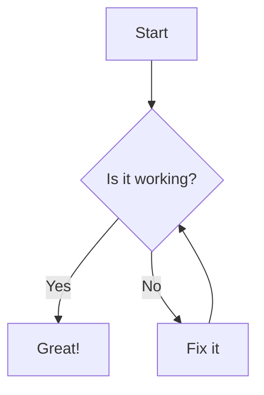
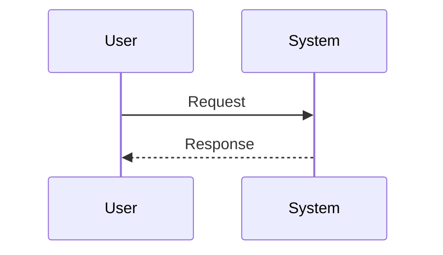
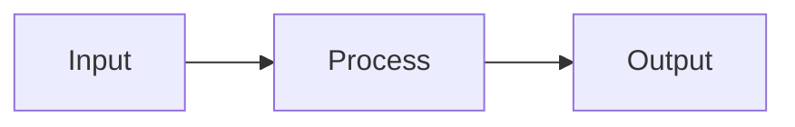

# Mermaid Diagram Test

This page tests Mermaid diagram rendering in GitHub Wiki.

## Simple Graph

## Sequence Diagram

## Flowchart

If these diagrams don't render, check:
1. GitHub Wiki Mermaid support is enabled
2. Syntax is correct
3. No unsupported features are used
