# Database Schema Documentation

The Zamaz Zero Trust Platform database is designed around security-first principles with comprehensive audit trails, compliance support, and zero trust device attestation.

## 🏗️ Architecture by Domain

The schema is organized into logical domains that work together to provide enterprise-grade security and compliance:

### 🔐 [Authentication & Authorization](auth-domain.md)
Core user management, RBAC, and session handling with zero trust principles.

**Tables:** [users](public.users.md) | [roles](public.roles.md) | [permissions](public.permissions.md) | [user_roles](public.user_roles.md) | [role_permissions](public.role_permissions.md) | [user_sessions](public.user_sessions.md) | [casbin_rule](public.casbin_rule.md)

### 🛡️ [Security & Monitoring](security-domain.md)
Real-time security monitoring, threat detection, and comprehensive audit logging.

**Tables:** [login_attempts](public.login_attempts.md) | [audit_logs](public.audit_logs.md)

### 🔍 [Zero Trust & Device Security](zero-trust-domain.md)
Device attestation, trust scoring, and SPIRE/SPIFFE identity integration.

**Tables:** [device_attestations](public.device_attestations.md)

### 📊 [Compliance & Data Governance](compliance-domain.md)
GDPR, HIPAA, SOC2 compliance with automated data governance and reporting.

**Tables:** [compliance_audit_logs](public.compliance_audit_logs.md) | [compliance_violations](public.compliance_violations.md) | [data_subject_requests](public.data_subject_requests.md) | [consent_records](public.consent_records.md) | [retention_policies](public.retention_policies.md) | [compliance_reports](public.compliance_reports.md)

## 📋 Complete Table Index

| Table | Domain | Columns | Purpose |
|-------|--------|---------|---------|
| [users](public.users.md) | [Auth](auth-domain.md) | 17 | User accounts and authentication |
| [roles](public.roles.md) | [Auth](auth-domain.md) | 7 | RBAC role definitions |
| [permissions](public.permissions.md) | [Auth](auth-domain.md) | 9 | System permissions |
| [user_roles](public.user_roles.md) | [Auth](auth-domain.md) | 2 | User-role associations |
| [role_permissions](public.role_permissions.md) | [Auth](auth-domain.md) | 2 | Role-permission mapping |
| [user_sessions](public.user_sessions.md) | [Auth](auth-domain.md) | 13 | Session management |
| [casbin_rule](public.casbin_rule.md) | [Auth](auth-domain.md) | 8 | Policy enforcement rules |
| [login_attempts](public.login_attempts.md) | [Security](security-domain.md) | 11 | Login tracking & protection |
| [audit_logs](public.audit_logs.md) | [Security](security-domain.md) | 13 | System activity audit |
| [device_attestations](public.device_attestations.md) | [Zero Trust](zero-trust-domain.md) | 15 | Device trust & SPIRE integration |
| [compliance_audit_logs](public.compliance_audit_logs.md) | [Compliance](compliance-domain.md) | 37 | Compliance event logging |
| [compliance_violations](public.compliance_violations.md) | [Compliance](compliance-domain.md) | 16 | Policy violation tracking |
| [data_subject_requests](public.data_subject_requests.md) | [Compliance](compliance-domain.md) | 28 | GDPR request management |
| [consent_records](public.consent_records.md) | [Compliance](compliance-domain.md) | 23 | Privacy consent tracking |
| [retention_policies](public.retention_policies.md) | [Compliance](compliance-domain.md) | 23 | Data retention rules |
| [compliance_reports](public.compliance_reports.md) | [Compliance](compliance-domain.md) | 23 | Automated compliance reporting |
| [schema_migrations](public.schema_migrations.md) | System | 5 | Database version control |

## 🔗 Complete System Architecture

```mermaid
erDiagram

"public.user_roles" }o--|| "public.roles" : "FOREIGN KEY (role_id) REFERENCES roles(id) ON DELETE CASCADE"
"public.role_permissions" }o--|| "public.roles" : "FOREIGN KEY (role_id) REFERENCES roles(id) ON DELETE CASCADE"
"public.role_permissions" }o--|| "public.permissions" : "FOREIGN KEY (permission_id) REFERENCES permissions(id) ON DELETE CASCADE"
"public.device_attestations" }o--|| "public.users" : "FOREIGN KEY (user_id) REFERENCES users(id) ON DELETE CASCADE"
"public.compliance_audit_logs" }o--o| "public.users" : "FOREIGN KEY (user_id) REFERENCES users(id)"
"public.compliance_violations" }o--|| "public.compliance_audit_logs" : "FOREIGN KEY (audit_log_id) REFERENCES compliance_audit_logs(id) ON DELETE CASCADE"
"public.consent_records" }o--o| "public.users" : "FOREIGN KEY (user_id) REFERENCES users(id)"

"public.user_sessions" {
  uuid id
  uuid user_id
  varchar_255_ session_token
  timestamp_with_time_zone expires_at
  boolean is_active
  varchar_100_ device_id
  varchar_45_ ip_address
  varchar_500_ user_agent
  varchar_100_ location
  integer trust_level
  timestamp_with_time_zone created_at
  timestamp_with_time_zone updated_at
  timestamp_with_time_zone deleted_at
}
"public.roles" {
  bigint id
  varchar_50_ name
  varchar_200_ description
  boolean is_active
  timestamp_with_time_zone created_at
  timestamp_with_time_zone updated_at
  timestamp_with_time_zone deleted_at
}
"public.permissions" {
  bigint id
  varchar_100_ name
  varchar_50_ resource
  varchar_50_ action
  varchar_200_ description
  boolean is_active
  timestamp_with_time_zone created_at
  timestamp_with_time_zone updated_at
  timestamp_with_time_zone deleted_at
}
"public.user_roles" {
  uuid user_id
  bigint role_id FK
}
"public.role_permissions" {
  bigint role_id FK
  bigint permission_id FK
}
"public.login_attempts" {
  uuid id
  varchar_50_ username
  uuid user_id
  varchar_45_ ip_address
  varchar_500_ user_agent
  boolean success
  varchar_200_ failure_reason
  boolean is_suspicious
  boolean blocked_by_rate
  varchar_100_ request_id
  timestamp_with_time_zone created_at
}
"public.audit_logs" {
  uuid id
  uuid user_id
  varchar_100_ action
  varchar_100_ resource
  jsonb details
  varchar_45_ ip_address
  varchar_500_ user_agent
  varchar_100_ request_id
  boolean success
  varchar_500_ error_msg
  timestamp_with_time_zone created_at
  varchar_50_ compliance_tag
  timestamp_with_time_zone retain_until
}
"public.schema_migrations" {
  text id
  text description
  bigint version
  timestamp_with_time_zone executed_at
  text checksum
}
"public.users" {
  uuid id
  varchar_50_ username
  varchar_100_ email
  varchar_255_ password_hash
  varchar_50_ first_name
  varchar_50_ last_name
  boolean is_active
  boolean is_admin
  integer failed_login_attempts
  timestamp_with_time_zone last_failed_login_at
  timestamp_with_time_zone account_locked_at
  timestamp_with_time_zone account_locked_until
  timestamp_with_time_zone last_login_at
  varchar_45_ last_login_ip
  timestamp_with_time_zone created_at
  timestamp_with_time_zone updated_at
  timestamp_with_time_zone deleted_at
}
"public.device_attestations" {
  uuid id
  uuid user_id FK
  varchar_255_ device_id
  varchar_100_ device_name
  varchar_50_ platform
  varchar_255_ spiffe_id
  varchar_255_ workload_selector
  jsonb attestation_data
  varchar_20_ status
  integer trust_level
  boolean is_verified
  timestamp_with_time_zone verified_at
  timestamp_with_time_zone expires_at
  timestamp_with_time_zone created_at
  timestamp_with_time_zone updated_at
}
"public.compliance_audit_logs" {
  uuid id
  timestamp_with_time_zone created_at
  timestamp_with_time_zone updated_at
  timestamp_with_time_zone deleted_at
  uuid user_id FK
  varchar_100_ action
  varchar_100_ resource
  jsonb details
  boolean success
  varchar_500_ error_msg
  varchar_45_ ip_address
  varchar_500_ user_agent
  varchar_100_ request_id
  varchar_100_ session_id
  varchar_100_ tenant_id
  varchar_200_ compliance_frameworks
  varchar_50_ data_classification
  integer sensitivity_level
  varchar_50_ legal_basis
  jsonb data_subjects
  jsonb data_categories
  varchar_500_ processing_purpose
  varchar_10_ geolocation_country
  integer risk_score
  jsonb controls_applied
  boolean approval_required
  varchar_50_ approval_status
  varchar_50_ review_status
  varchar_50_ retention_category
  varchar_1000_ business_justification
  timestamp_with_time_zone retain_until
  timestamp_with_time_zone archive_date
  timestamp_with_time_zone purge_date
  boolean archived
  timestamp_with_time_zone archived_at
  jsonb business_context
  jsonb technical_context
}
"public.compliance_violations" {
  uuid id
  timestamp_with_time_zone created_at
  timestamp_with_time_zone updated_at
  timestamp_with_time_zone deleted_at
  uuid audit_log_id FK
  varchar_100_ violation_type
  varchar_50_ framework
  integer severity
  varchar_1000_ description
  varchar_1000_ remediation
  integer risk_score
  varchar_50_ status
  varchar_100_ assigned_to
  timestamp_with_time_zone resolved_at
  varchar_1000_ resolution
  varchar_100_ resolution_by
}
"public.data_subject_requests" {
  uuid id
  timestamp_with_time_zone created_at
  timestamp_with_time_zone updated_at
  timestamp_with_time_zone deleted_at
  varchar_50_ request_type
  varchar_255_ data_subject
  varchar_100_ requestor_id
  varchar_255_ email
  varchar_50_ phone_number
  varchar_50_ status
  varchar_20_ priority
  varchar_100_ assigned_to
  timestamp_with_time_zone due_date
  timestamp_with_time_zone completed_at
  varchar_100_ legal_basis
  boolean identity_verified
  varchar_100_ verification_method
  varchar_100_ verified_by
  timestamp_with_time_zone verified_at
  varchar_2000_ description
  jsonb data_categories
  jsonb processing_purposes
  text response
  varchar_50_ response_method
  varchar_1000_ rejection_reason
  text compliance_notes
  varchar_100_ reviewed_by
  timestamp_with_time_zone reviewed_at
}
"public.consent_records" {
  uuid id
  timestamp_with_time_zone created_at
  timestamp_with_time_zone updated_at
  timestamp_with_time_zone deleted_at
  varchar_255_ data_subject
  uuid user_id FK
  varchar_100_ consent_type
  varchar_500_ purpose
  varchar_100_ legal_basis
  jsonb data_categories
  varchar_50_ status
  boolean consent_given
  timestamp_with_time_zone consent_date
  timestamp_with_time_zone withdrawn_date
  timestamp_with_time_zone expiry_date
  varchar_100_ consent_method
  text consent_text
  varchar_20_ consent_version
  varchar_45_ ip_address
  varchar_500_ user_agent
  jsonb consent_proof
  varchar_100_ withdrawal_method
  varchar_500_ withdrawal_reason
}
"public.retention_policies" {
  bigint id
  timestamp_with_time_zone created_at
  timestamp_with_time_zone updated_at
  timestamp_with_time_zone deleted_at
  varchar_100_ name
  varchar_500_ description
  varchar_50_ category
  integer retention_period
  varchar_10_ retention_unit
  integer archive_period
  varchar_50_ data_classification
  varchar_50_ compliance_framework
  varchar_100_ legal_basis
  boolean is_active
  timestamp_with_time_zone effective_date
  timestamp_with_time_zone expiry_date
  varchar_100_ approved_by
  timestamp_with_time_zone approved_at
  timestamp_with_time_zone review_date
  varchar_100_ reviewed_by
  jsonb rules
  jsonb exceptions
  jsonb automation_rules
}
"public.compliance_reports" {
  uuid id
  timestamp_with_time_zone created_at
  timestamp_with_time_zone updated_at
  timestamp_with_time_zone deleted_at
  varchar_100_ report_type
  varchar_200_ title
  varchar_1000_ description
  varchar_50_ framework
  timestamp_with_time_zone period_start
  timestamp_with_time_zone period_end
  varchar_100_ generated_by
  timestamp_with_time_zone generated_at
  varchar_50_ status
  text executive_summary
  jsonb findings
  jsonb recommendations
  jsonb metrics
  varchar_20_ version
  varchar_50_ confidentiality
  varchar_100_ approved_by
  timestamp_with_time_zone approved_at
  timestamp_with_time_zone published_at
  jsonb distribution
}
"public.casbin_rule" {
  bigint id
  varchar_100_ ptype
  varchar_100_ v0
  varchar_100_ v1
  varchar_100_ v2
  varchar_100_ v3
  varchar_100_ v4
  varchar_100_ v5
}
```

---

> Generated by [tbls](https://github.com/k1LoW/tbls)
