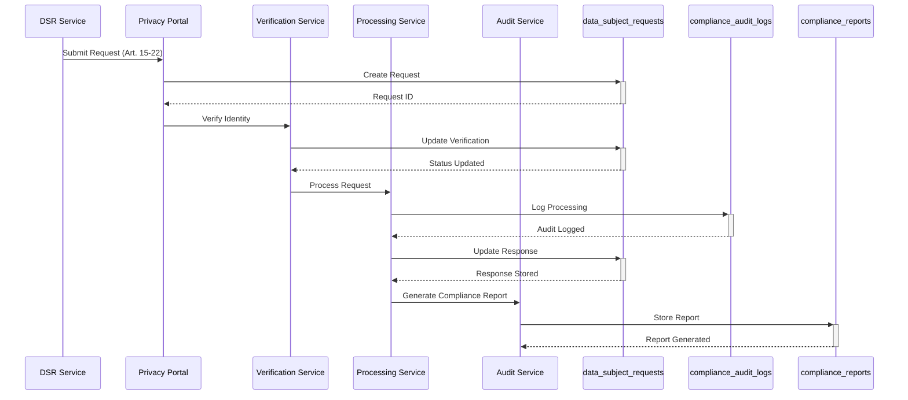
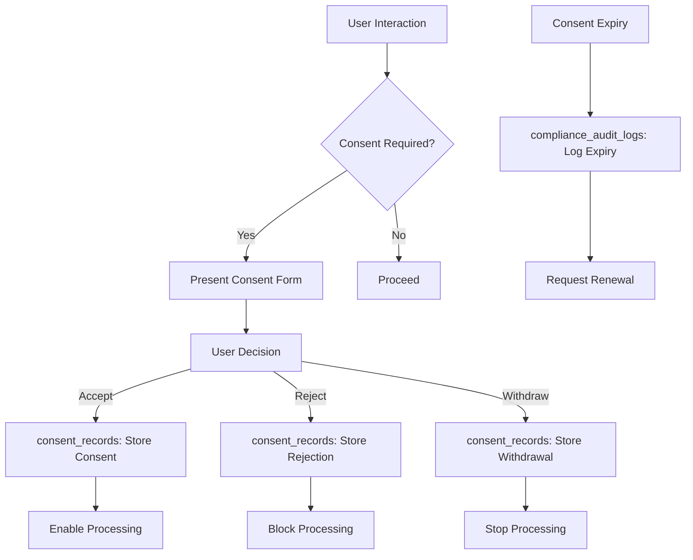
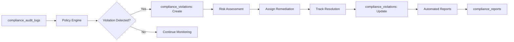
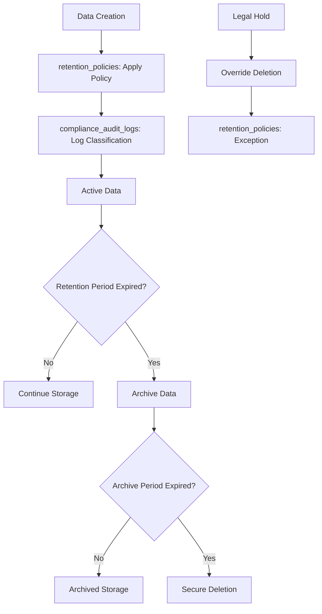

# Compliance & Data Governance Domain

## Overview
This domain ensures regulatory compliance with GDPR, HIPAA, SOC2, and other frameworks through comprehensive audit logging, data subject rights management, consent tracking, and automated compliance reporting.

## Tables in this Domain

| Table | Purpose | Details |
|-------|---------|---------|
| [compliance_audit_logs](public.compliance_audit_logs.md) | Compliance-specific audit events | Framework tagging, data classification, retention policies |
| [compliance_violations](public.compliance_violations.md) | Detected compliance policy violations | Risk scoring, remediation tracking, resolution workflow |
| [data_subject_requests](public.data_subject_requests.md) | GDPR data subject access/deletion requests | Identity verification, request workflow, compliance tracking |
| [consent_records](public.consent_records.md) | User privacy consent tracking | Granular consent, withdrawal tracking, proof of consent |
| [retention_policies](public.retention_policies.md) | Data retention policy definitions | Automated retention, legal hold, policy enforcement |
| [compliance_reports](public.compliance_reports.md) | Generated compliance assessment reports | Automated reporting, executive summaries, audit findings |

## GDPR Compliance Flow

## Consent Management Flow

## Violation Detection & Remediation

## Data Retention Lifecycle

## Key Compliance Features

### GDPR Compliance
- **Data Subject Rights**: Complete GDPR Article 15-22 support
- **Consent Management**: Granular consent tracking and withdrawal
- **Data Portability**: Structured data export capabilities
- **Right to Erasure**: Automated data deletion workflows
- **Privacy by Design**: Built-in privacy protection mechanisms

### Automated Compliance Monitoring
- **Policy Violations**: Real-time compliance violation detection
- **Risk Scoring**: Automated risk assessment for compliance events
- **Control Effectiveness**: Monitoring of security control effectiveness
- **Gap Analysis**: Identification of compliance gaps and weaknesses
- **Trend Analysis**: Long-term compliance trend monitoring

### Data Governance Framework
- **Data Classification**: Sensitivity levels and categories
- **Lifecycle Management**: Creation to deletion tracking
- **Access Controls**: Role-based data access restrictions
- **Audit Trails**: Complete data processing audit trails
- **Retention Enforcement**: Automated policy enforcement

## Related Domains
- [Authentication & Authorization](auth-domain.md) - User identity and access management
- [Security & Monitoring](security-domain.md) - Security monitoring and incident response
- [Zero Trust & Device Security](zero-trust-domain.md) - Device trust and attestation