# public.compliance_audit_logs

## Description

## Columns

| Name | Type | Default | Nullable | Children | Parents | Comment |
| ---- | ---- | ------- | -------- | -------- | ------- | ------- |
| id | uuid | gen_random_uuid() | false | [public.compliance_violations](public.compliance_violations.md) |  |  |
| created_at | timestamp with time zone | CURRENT_TIMESTAMP | true |  |  |  |
| updated_at | timestamp with time zone | CURRENT_TIMESTAMP | true |  |  |  |
| deleted_at | timestamp with time zone |  | true |  |  |  |
| user_id | uuid |  | true |  | [public.users](public.users.md) |  |
| action | varchar(100) |  | false |  |  |  |
| resource | varchar(100) |  | true |  |  |  |
| details | jsonb |  | true |  |  |  |
| success | boolean | false | true |  |  |  |
| error_msg | varchar(500) |  | true |  |  |  |
| ip_address | varchar(45) |  | true |  |  |  |
| user_agent | varchar(500) |  | true |  |  |  |
| request_id | varchar(100) |  | true |  |  |  |
| session_id | varchar(100) |  | true |  |  |  |
| tenant_id | varchar(100) |  | true |  |  |  |
| compliance_frameworks | varchar(200) |  | true |  |  |  |
| data_classification | varchar(50) |  | true |  |  |  |
| sensitivity_level | integer | 1 | true |  |  |  |
| legal_basis | varchar(50) |  | true |  |  |  |
| data_subjects | jsonb |  | true |  |  |  |
| data_categories | jsonb |  | true |  |  |  |
| processing_purpose | varchar(500) |  | true |  |  |  |
| geolocation_country | varchar(10) |  | true |  |  |  |
| risk_score | integer | 0 | true |  |  |  |
| controls_applied | jsonb |  | true |  |  |  |
| approval_required | boolean | false | true |  |  |  |
| approval_status | varchar(50) |  | true |  |  |  |
| review_status | varchar(50) |  | true |  |  |  |
| retention_category | varchar(50) |  | true |  |  |  |
| business_justification | varchar(1000) |  | true |  |  |  |
| retain_until | timestamp with time zone |  | true |  |  |  |
| archive_date | timestamp with time zone |  | true |  |  |  |
| purge_date | timestamp with time zone |  | true |  |  |  |
| archived | boolean | false | true |  |  |  |
| archived_at | timestamp with time zone |  | true |  |  |  |
| business_context | jsonb |  | true |  |  |  |
| technical_context | jsonb |  | true |  |  |  |

## Constraints

| Name | Type | Definition |
| ---- | ---- | ---------- |
| compliance_audit_logs_risk_score_check | CHECK | CHECK (((risk_score >= 0) AND (risk_score <= 100))) |
| compliance_audit_logs_sensitivity_level_check | CHECK | CHECK (((sensitivity_level >= 1) AND (sensitivity_level <= 5))) |
| compliance_audit_logs_user_id_fkey | FOREIGN KEY | FOREIGN KEY (user_id) REFERENCES users(id) |
| compliance_audit_logs_pkey | PRIMARY KEY | PRIMARY KEY (id) |

## Indexes

| Name | Definition |
| ---- | ---------- |
| compliance_audit_logs_pkey | CREATE UNIQUE INDEX compliance_audit_logs_pkey ON public.compliance_audit_logs USING btree (id) |
| idx_compliance_audit_logs_user_id | CREATE INDEX idx_compliance_audit_logs_user_id ON public.compliance_audit_logs USING btree (user_id) |
| idx_compliance_audit_logs_action | CREATE INDEX idx_compliance_audit_logs_action ON public.compliance_audit_logs USING btree (action) |
| idx_compliance_audit_logs_created_at | CREATE INDEX idx_compliance_audit_logs_created_at ON public.compliance_audit_logs USING btree (created_at DESC) |
| idx_compliance_audit_logs_data_classification | CREATE INDEX idx_compliance_audit_logs_data_classification ON public.compliance_audit_logs USING btree (data_classification) |
| idx_compliance_audit_logs_sensitivity_level | CREATE INDEX idx_compliance_audit_logs_sensitivity_level ON public.compliance_audit_logs USING btree (sensitivity_level) |
| idx_compliance_audit_logs_risk_score | CREATE INDEX idx_compliance_audit_logs_risk_score ON public.compliance_audit_logs USING btree (risk_score) |
| idx_compliance_audit_logs_retention_category | CREATE INDEX idx_compliance_audit_logs_retention_category ON public.compliance_audit_logs USING btree (retention_category) |
| idx_compliance_audit_logs_archive_date | CREATE INDEX idx_compliance_audit_logs_archive_date ON public.compliance_audit_logs USING btree (archive_date) |
| idx_compliance_audit_logs_purge_date | CREATE INDEX idx_compliance_audit_logs_purge_date ON public.compliance_audit_logs USING btree (purge_date) |
| idx_compliance_audit_logs_archived | CREATE INDEX idx_compliance_audit_logs_archived ON public.compliance_audit_logs USING btree (archived) |
| idx_compliance_audit_logs_geolocation | CREATE INDEX idx_compliance_audit_logs_geolocation ON public.compliance_audit_logs USING btree (geolocation_country) |
| idx_compliance_audit_logs_request_id | CREATE INDEX idx_compliance_audit_logs_request_id ON public.compliance_audit_logs USING btree (request_id) |
| idx_compliance_audit_logs_session_id | CREATE INDEX idx_compliance_audit_logs_session_id ON public.compliance_audit_logs USING btree (session_id) |
| idx_compliance_audit_logs_tenant_id | CREATE INDEX idx_compliance_audit_logs_tenant_id ON public.compliance_audit_logs USING btree (tenant_id) |
| idx_compliance_audit_logs_user_time | CREATE INDEX idx_compliance_audit_logs_user_time ON public.compliance_audit_logs USING btree (user_id, created_at DESC) |
| idx_compliance_audit_logs_classification_risk | CREATE INDEX idx_compliance_audit_logs_classification_risk ON public.compliance_audit_logs USING btree (data_classification, risk_score DESC) |
| idx_compliance_audit_logs_retention_archive | CREATE INDEX idx_compliance_audit_logs_retention_archive ON public.compliance_audit_logs USING btree (retention_category, archive_date) |

## Relations

```mermaid
erDiagram

"public.compliance_violations" }o--|| "public.compliance_audit_logs" : "FOREIGN KEY (audit_log_id) REFERENCES compliance_audit_logs(id) ON DELETE CASCADE"
"public.compliance_audit_logs" }o--o| "public.users" : "FOREIGN KEY (user_id) REFERENCES users(id)"

"public.compliance_audit_logs" {
  uuid id
  timestamp_with_time_zone created_at
  timestamp_with_time_zone updated_at
  timestamp_with_time_zone deleted_at
  uuid user_id FK
  varchar_100_ action
  varchar_100_ resource
  jsonb details
  boolean success
  varchar_500_ error_msg
  varchar_45_ ip_address
  varchar_500_ user_agent
  varchar_100_ request_id
  varchar_100_ session_id
  varchar_100_ tenant_id
  varchar_200_ compliance_frameworks
  varchar_50_ data_classification
  integer sensitivity_level
  varchar_50_ legal_basis
  jsonb data_subjects
  jsonb data_categories
  varchar_500_ processing_purpose
  varchar_10_ geolocation_country
  integer risk_score
  jsonb controls_applied
  boolean approval_required
  varchar_50_ approval_status
  varchar_50_ review_status
  varchar_50_ retention_category
  varchar_1000_ business_justification
  timestamp_with_time_zone retain_until
  timestamp_with_time_zone archive_date
  timestamp_with_time_zone purge_date
  boolean archived
  timestamp_with_time_zone archived_at
  jsonb business_context
  jsonb technical_context
}
"public.compliance_violations" {
  uuid id
  timestamp_with_time_zone created_at
  timestamp_with_time_zone updated_at
  timestamp_with_time_zone deleted_at
  uuid audit_log_id FK
  varchar_100_ violation_type
  varchar_50_ framework
  integer severity
  varchar_1000_ description
  varchar_1000_ remediation
  integer risk_score
  varchar_50_ status
  varchar_100_ assigned_to
  timestamp_with_time_zone resolved_at
  varchar_1000_ resolution
  varchar_100_ resolution_by
}
"public.users" {
  uuid id
  varchar_50_ username
  varchar_100_ email
  varchar_255_ password_hash
  varchar_50_ first_name
  varchar_50_ last_name
  boolean is_active
  boolean is_admin
  integer failed_login_attempts
  timestamp_with_time_zone last_failed_login_at
  timestamp_with_time_zone account_locked_at
  timestamp_with_time_zone account_locked_until
  timestamp_with_time_zone last_login_at
  varchar_45_ last_login_ip
  timestamp_with_time_zone created_at
  timestamp_with_time_zone updated_at
  timestamp_with_time_zone deleted_at
}
```

---

> Generated by [tbls](https://github.com/k1LoW/tbls)
