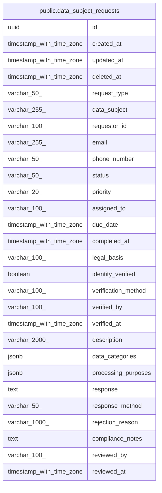

# public.data_subject_requests

## Description

## Columns

| Name | Type | Default | Nullable | Children | Parents | Comment |
| ---- | ---- | ------- | -------- | -------- | ------- | ------- |
| id | uuid | gen_random_uuid() | false |  |  |  |
| created_at | timestamp with time zone | CURRENT_TIMESTAMP | true |  |  |  |
| updated_at | timestamp with time zone | CURRENT_TIMESTAMP | true |  |  |  |
| deleted_at | timestamp with time zone |  | true |  |  |  |
| request_type | varchar(50) |  | false |  |  |  |
| data_subject | varchar(255) |  | false |  |  |  |
| requestor_id | varchar(100) |  | true |  |  |  |
| email | varchar(255) |  | true |  |  |  |
| phone_number | varchar(50) |  | true |  |  |  |
| status | varchar(50) | 'RECEIVED'::character varying | true |  |  |  |
| priority | varchar(20) | 'NORMAL'::character varying | true |  |  |  |
| assigned_to | varchar(100) |  | true |  |  |  |
| due_date | timestamp with time zone |  | true |  |  |  |
| completed_at | timestamp with time zone |  | true |  |  |  |
| legal_basis | varchar(100) |  | true |  |  |  |
| identity_verified | boolean | false | true |  |  |  |
| verification_method | varchar(100) |  | true |  |  |  |
| verified_by | varchar(100) |  | true |  |  |  |
| verified_at | timestamp with time zone |  | true |  |  |  |
| description | varchar(2000) |  | true |  |  |  |
| data_categories | jsonb |  | true |  |  |  |
| processing_purposes | jsonb |  | true |  |  |  |
| response | text |  | true |  |  |  |
| response_method | varchar(50) |  | true |  |  |  |
| rejection_reason | varchar(1000) |  | true |  |  |  |
| compliance_notes | text |  | true |  |  |  |
| reviewed_by | varchar(100) |  | true |  |  |  |
| reviewed_at | timestamp with time zone |  | true |  |  |  |

## Constraints

| Name | Type | Definition |
| ---- | ---- | ---------- |
| data_subject_requests_priority_check | CHECK | CHECK (((priority)::text = ANY ((ARRAY['LOW'::character varying, 'NORMAL'::character varying, 'HIGH'::character varying, 'URGENT'::character varying])::text[]))) |
| data_subject_requests_request_type_check | CHECK | CHECK (((request_type)::text = ANY ((ARRAY['ACCESS'::character varying, 'RECTIFICATION'::character varying, 'ERASURE'::character varying, 'RESTRICTION'::character varying, 'PORTABILITY'::character varying, 'OBJECTION'::character varying])::text[]))) |
| data_subject_requests_response_method_check | CHECK | CHECK (((response_method)::text = ANY ((ARRAY['EMAIL'::character varying, 'POSTAL'::character varying, 'SECURE_PORTAL'::character varying])::text[]))) |
| data_subject_requests_status_check | CHECK | CHECK (((status)::text = ANY ((ARRAY['RECEIVED'::character varying, 'VERIFIED'::character varying, 'PROCESSING'::character varying, 'COMPLETED'::character varying, 'REJECTED'::character varying])::text[]))) |
| data_subject_requests_pkey | PRIMARY KEY | PRIMARY KEY (id) |

## Indexes

| Name | Definition |
| ---- | ---------- |
| data_subject_requests_pkey | CREATE UNIQUE INDEX data_subject_requests_pkey ON public.data_subject_requests USING btree (id) |
| idx_data_subject_requests_request_type | CREATE INDEX idx_data_subject_requests_request_type ON public.data_subject_requests USING btree (request_type) |
| idx_data_subject_requests_data_subject | CREATE INDEX idx_data_subject_requests_data_subject ON public.data_subject_requests USING btree (data_subject) |
| idx_data_subject_requests_status | CREATE INDEX idx_data_subject_requests_status ON public.data_subject_requests USING btree (status) |
| idx_data_subject_requests_priority | CREATE INDEX idx_data_subject_requests_priority ON public.data_subject_requests USING btree (priority) |
| idx_data_subject_requests_due_date | CREATE INDEX idx_data_subject_requests_due_date ON public.data_subject_requests USING btree (due_date) |
| idx_data_subject_requests_created_at | CREATE INDEX idx_data_subject_requests_created_at ON public.data_subject_requests USING btree (created_at DESC) |
| idx_data_subject_requests_assigned_to | CREATE INDEX idx_data_subject_requests_assigned_to ON public.data_subject_requests USING btree (assigned_to) |
| idx_data_subject_requests_completed_at | CREATE INDEX idx_data_subject_requests_completed_at ON public.data_subject_requests USING btree (completed_at DESC) |
| idx_data_subject_requests_type_status | CREATE INDEX idx_data_subject_requests_type_status ON public.data_subject_requests USING btree (request_type, status) |
| idx_data_subject_requests_status_due | CREATE INDEX idx_data_subject_requests_status_due ON public.data_subject_requests USING btree (status, due_date) |

## Relations

---

> Generated by [tbls](https://github.com/k1LoW/tbls)
