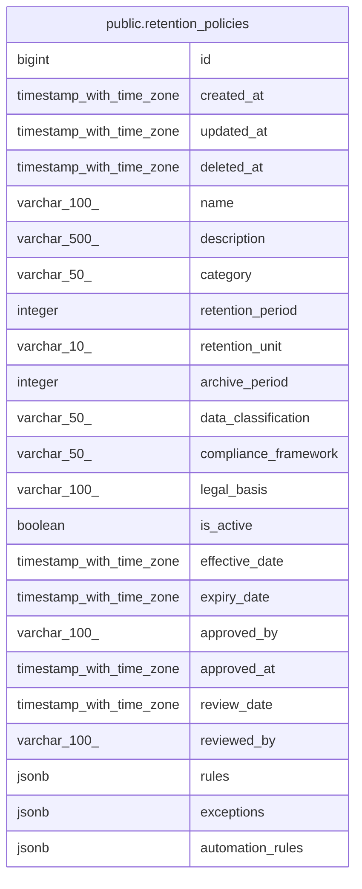

# public.retention_policies

## Description

## Columns

| Name | Type | Default | Nullable | Children | Parents | Comment |
| ---- | ---- | ------- | -------- | -------- | ------- | ------- |
| id | bigint | nextval('retention_policies_id_seq'::regclass) | false |  |  |  |
| created_at | timestamp with time zone | CURRENT_TIMESTAMP | true |  |  |  |
| updated_at | timestamp with time zone | CURRENT_TIMESTAMP | true |  |  |  |
| deleted_at | timestamp with time zone |  | true |  |  |  |
| name | varchar(100) |  | false |  |  |  |
| description | varchar(500) |  | true |  |  |  |
| category | varchar(50) |  | false |  |  |  |
| retention_period | integer |  | false |  |  |  |
| retention_unit | varchar(10) | 'DAYS'::character varying | true |  |  |  |
| archive_period | integer |  | true |  |  |  |
| data_classification | varchar(50) |  | true |  |  |  |
| compliance_framework | varchar(50) |  | true |  |  |  |
| legal_basis | varchar(100) |  | true |  |  |  |
| is_active | boolean | true | true |  |  |  |
| effective_date | timestamp with time zone |  | false |  |  |  |
| expiry_date | timestamp with time zone |  | true |  |  |  |
| approved_by | varchar(100) |  | true |  |  |  |
| approved_at | timestamp with time zone |  | true |  |  |  |
| review_date | timestamp with time zone |  | true |  |  |  |
| reviewed_by | varchar(100) |  | true |  |  |  |
| rules | jsonb |  | true |  |  |  |
| exceptions | jsonb |  | true |  |  |  |
| automation_rules | jsonb |  | true |  |  |  |

## Constraints

| Name | Type | Definition |
| ---- | ---- | ---------- |
| retention_policies_retention_unit_check | CHECK | CHECK (((retention_unit)::text = ANY ((ARRAY['DAYS'::character varying, 'MONTHS'::character varying, 'YEARS'::character varying])::text[]))) |
| retention_policies_pkey | PRIMARY KEY | PRIMARY KEY (id) |
| retention_policies_name_key | UNIQUE | UNIQUE (name) |

## Indexes

| Name | Definition |
| ---- | ---------- |
| retention_policies_pkey | CREATE UNIQUE INDEX retention_policies_pkey ON public.retention_policies USING btree (id) |
| retention_policies_name_key | CREATE UNIQUE INDEX retention_policies_name_key ON public.retention_policies USING btree (name) |
| idx_retention_policies_name | CREATE INDEX idx_retention_policies_name ON public.retention_policies USING btree (name) |
| idx_retention_policies_category | CREATE INDEX idx_retention_policies_category ON public.retention_policies USING btree (category) |
| idx_retention_policies_data_classification | CREATE INDEX idx_retention_policies_data_classification ON public.retention_policies USING btree (data_classification) |
| idx_retention_policies_compliance_framework | CREATE INDEX idx_retention_policies_compliance_framework ON public.retention_policies USING btree (compliance_framework) |
| idx_retention_policies_is_active | CREATE INDEX idx_retention_policies_is_active ON public.retention_policies USING btree (is_active) |
| idx_retention_policies_effective_date | CREATE INDEX idx_retention_policies_effective_date ON public.retention_policies USING btree (effective_date) |
| idx_retention_policies_review_date | CREATE INDEX idx_retention_policies_review_date ON public.retention_policies USING btree (review_date) |

## Relations

---

> Generated by [tbls](https://github.com/k1LoW/tbls)
