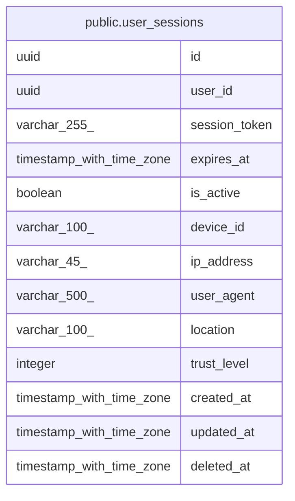

# public.user_sessions

## Description

## Columns

| Name | Type | Default | Nullable | Children | Parents | Comment |
| ---- | ---- | ------- | -------- | -------- | ------- | ------- |
| id | uuid | gen_random_uuid() | false |  |  |  |
| user_id | uuid |  | false |  |  |  |
| session_token | varchar(255) |  | false |  |  |  |
| expires_at | timestamp with time zone |  | false |  |  |  |
| is_active | boolean | true | true |  |  |  |
| device_id | varchar(100) |  | true |  |  |  |
| ip_address | varchar(45) |  | true |  |  |  |
| user_agent | varchar(500) |  | true |  |  |  |
| location | varchar(100) |  | true |  |  |  |
| trust_level | integer | 0 | true |  |  |  |
| created_at | timestamp with time zone | CURRENT_TIMESTAMP | true |  |  |  |
| updated_at | timestamp with time zone | CURRENT_TIMESTAMP | true |  |  |  |
| deleted_at | timestamp with time zone |  | true |  |  |  |

## Constraints

| Name | Type | Definition |
| ---- | ---- | ---------- |
| user_sessions_pkey | PRIMARY KEY | PRIMARY KEY (id) |
| user_sessions_session_token_key | UNIQUE | UNIQUE (session_token) |

## Indexes

| Name | Definition |
| ---- | ---------- |
| user_sessions_pkey | CREATE UNIQUE INDEX user_sessions_pkey ON public.user_sessions USING btree (id) |
| user_sessions_session_token_key | CREATE UNIQUE INDEX user_sessions_session_token_key ON public.user_sessions USING btree (session_token) |
| idx_user_sessions_token | CREATE INDEX idx_user_sessions_token ON public.user_sessions USING btree (session_token) |
| idx_user_sessions_user_id | CREATE INDEX idx_user_sessions_user_id ON public.user_sessions USING btree (user_id) |
| idx_user_sessions_expires_at | CREATE INDEX idx_user_sessions_expires_at ON public.user_sessions USING btree (expires_at) |
| idx_user_sessions_session_token | CREATE INDEX idx_user_sessions_session_token ON public.user_sessions USING btree (session_token) |
| idx_user_sessions_user_active | CREATE INDEX idx_user_sessions_user_active ON public.user_sessions USING btree (user_id, is_active) WHERE (is_active = true) |
| idx_user_sessions_device_user | CREATE INDEX idx_user_sessions_device_user ON public.user_sessions USING btree (device_id, user_id) |
| idx_user_sessions_ip_created | CREATE INDEX idx_user_sessions_ip_created ON public.user_sessions USING btree (ip_address, created_at DESC) |
| idx_user_sessions_token_active | CREATE INDEX idx_user_sessions_token_active ON public.user_sessions USING btree (session_token) WHERE (is_active = true) |
| idx_user_sessions_user_device_active | CREATE INDEX idx_user_sessions_user_device_active ON public.user_sessions USING btree (user_id, device_id, is_active) |

## Relations

---

> Generated by [tbls](https://github.com/k1LoW/tbls)
