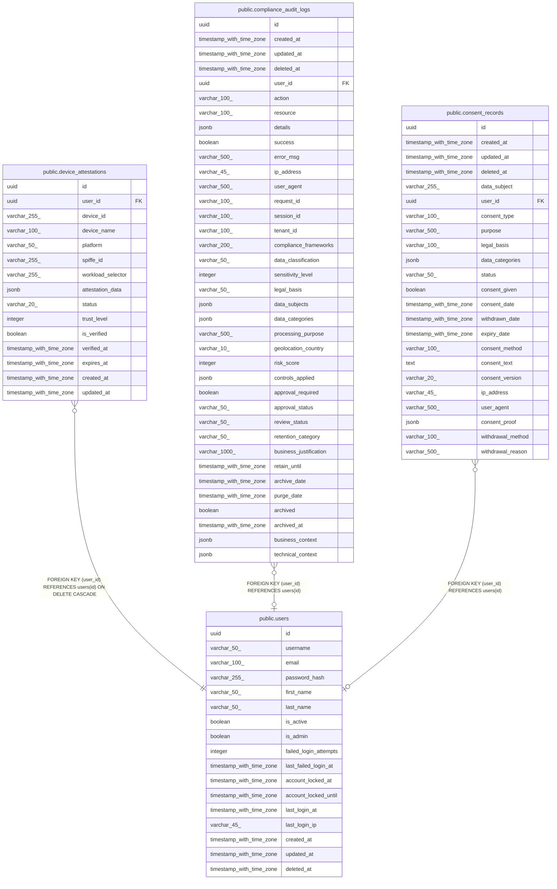

# public.users

## Description

## Columns

| Name | Type | Default | Nullable | Children | Parents | Comment |
| ---- | ---- | ------- | -------- | -------- | ------- | ------- |
| id | uuid | gen_random_uuid() | false | [public.device_attestations](public.device_attestations.md) [public.compliance_audit_logs](public.compliance_audit_logs.md) [public.consent_records](public.consent_records.md) |  |  |
| username | varchar(50) |  | false |  |  |  |
| email | varchar(100) |  | false |  |  |  |
| password_hash | varchar(255) |  | false |  |  |  |
| first_name | varchar(50) |  | true |  |  |  |
| last_name | varchar(50) |  | true |  |  |  |
| is_active | boolean | true | true |  |  |  |
| is_admin | boolean | false | true |  |  |  |
| failed_login_attempts | integer | 0 | true |  |  |  |
| last_failed_login_at | timestamp with time zone |  | true |  |  |  |
| account_locked_at | timestamp with time zone |  | true |  |  |  |
| account_locked_until | timestamp with time zone |  | true |  |  |  |
| last_login_at | timestamp with time zone |  | true |  |  |  |
| last_login_ip | varchar(45) |  | true |  |  |  |
| created_at | timestamp with time zone | CURRENT_TIMESTAMP | true |  |  |  |
| updated_at | timestamp with time zone | CURRENT_TIMESTAMP | true |  |  |  |
| deleted_at | timestamp with time zone |  | true |  |  |  |

## Constraints

| Name | Type | Definition |
| ---- | ---- | ---------- |
| users_pkey | PRIMARY KEY | PRIMARY KEY (id) |
| users_username_key | UNIQUE | UNIQUE (username) |
| users_email_key | UNIQUE | UNIQUE (email) |

## Indexes

| Name | Definition |
| ---- | ---------- |
| users_pkey | CREATE UNIQUE INDEX users_pkey ON public.users USING btree (id) |
| users_username_key | CREATE UNIQUE INDEX users_username_key ON public.users USING btree (username) |
| users_email_key | CREATE UNIQUE INDEX users_email_key ON public.users USING btree (email) |
| idx_users_username | CREATE INDEX idx_users_username ON public.users USING btree (username) |
| idx_users_email | CREATE INDEX idx_users_email ON public.users USING btree (email) |
| idx_users_active | CREATE INDEX idx_users_active ON public.users USING btree (is_active) |
| idx_users_email_active | CREATE INDEX idx_users_email_active ON public.users USING btree (email) WHERE (is_active = true) |
| idx_users_username_active | CREATE INDEX idx_users_username_active ON public.users USING btree (username) WHERE (is_active = true) |
| idx_users_failed_login_attempts | CREATE INDEX idx_users_failed_login_attempts ON public.users USING btree (failed_login_attempts) WHERE (failed_login_attempts > 0) |
| idx_users_account_locked | CREATE INDEX idx_users_account_locked ON public.users USING btree (account_locked_until) WHERE (account_locked_until IS NOT NULL) |
| idx_users_last_login | CREATE INDEX idx_users_last_login ON public.users USING btree (last_login_at DESC) |
| idx_users_deleted_at | CREATE INDEX idx_users_deleted_at ON public.users USING btree (deleted_at) |
| idx_users_account_locked_until | CREATE INDEX idx_users_account_locked_until ON public.users USING btree (account_locked_until) |

## Relations

---

> Generated by [tbls](https://github.com/k1LoW/tbls)
