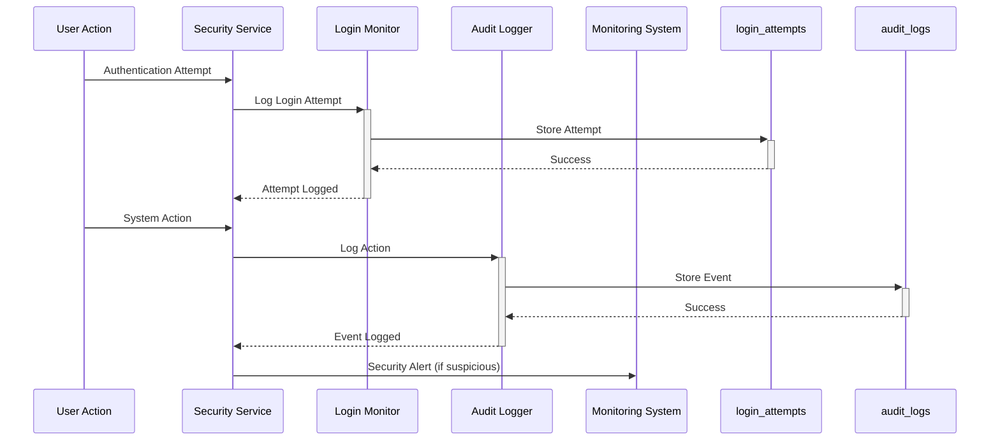
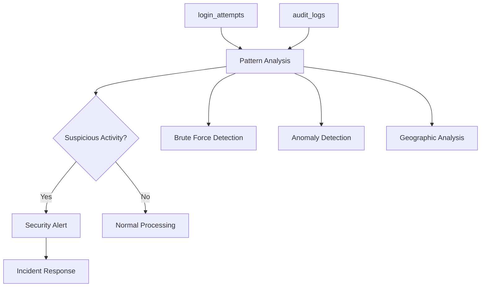

# Security & Monitoring Domain

## Overview
This domain provides comprehensive security monitoring, audit logging, and threat detection capabilities for the Zero Trust platform.

## Tables in this Domain

| Table | Purpose | Details |
|-------|---------|---------|
| [login_attempts](public.login_attempts.md) | Login attempt tracking | Brute force protection, suspicious activity detection |
| [audit_logs](public.audit_logs.md) | System audit trail | Complete activity logging, compliance tracking |

## Security Monitoring Flow

## Threat Detection

## Key Security Features

### Brute Force Protection
- **Failed Login Tracking**: Comprehensive tracking of all login attempts
- **Rate Limiting**: Built-in support for rate limiting and IP blocking
- **Suspicious Activity Detection**: Automatic flagging of unusual login patterns
- **Geographic Anomaly Detection**: IP-based location tracking for anomaly detection

### Comprehensive Audit Logging
- **Complete Activity Trail**: Every system action is logged with full context
- **Request Tracing**: Request ID linking for distributed tracing
- **Error Tracking**: Detailed error logging for security incident analysis
- **Compliance Integration**: Compliance tags for regulatory requirements

### Real-time Monitoring
- **Immediate Alerting**: Real-time security event notifications
- **Pattern Recognition**: Machine learning-ready data structure
- **Context Enrichment**: User agent, IP, and session context for every event
- **Risk Scoring**: Built-in risk assessment for security events

## Related Domains
- [Authentication & Authorization](auth-domain.md) - User authentication and sessions
- [Zero Trust & Device Security](zero-trust-domain.md) - Device attestation security
- [Compliance & Data Governance](compliance-domain.md) - Regulatory compliance logging