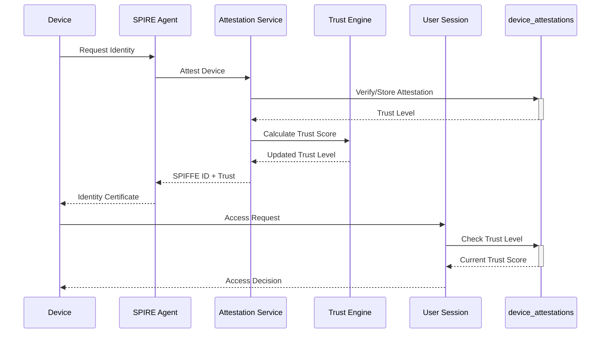
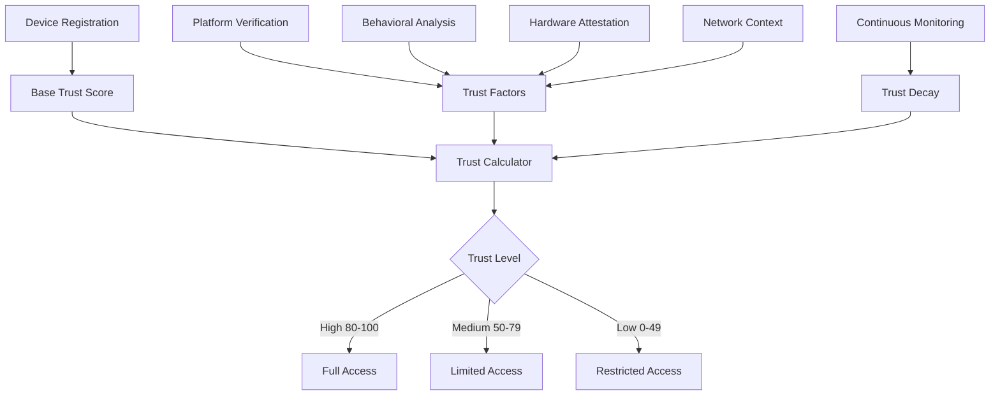
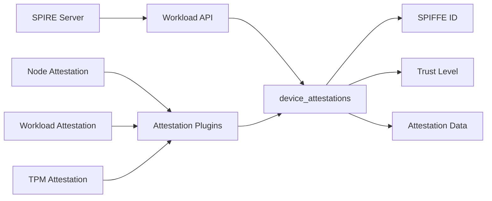

# Zero Trust & Device Security Domain

## Overview
This domain implements Zero Trust principles through device attestation, trust scoring, and continuous verification mechanisms integrated with SPIRE/SPIFFE identity framework.

## Tables in this Domain

| Table | Purpose | Details |
|-------|---------|---------|
| [device_attestations](public.device_attestations.md) | Device trust and attestation records | SPIRE integration, trust scoring, platform verification |

## Zero Trust Device Flow

## Trust Scoring Model

## SPIRE/SPIFFE Integration

## Key Features

### Device Identity & Attestation
- **SPIFFE/SPIRE Integration**: Native support for SPIFFE identity framework
- **Hardware Attestation**: TPM and hardware security module integration
- **Platform Verification**: Operating system and platform integrity checks
- **Continuous Verification**: Regular re-attestation and trust validation

### Trust Scoring System
- **Dynamic Trust Levels**: Numerical trust scoring (0-100)
- **Multi-factor Assessment**: Device, behavior, and context-based scoring
- **Continuous Monitoring**: Real-time trust level adjustments
- **Risk-based Decisions**: Access decisions based on current trust score

### Zero Trust Principles
- **Never Trust, Always Verify**: Every request requires verification
- **Least Privilege Access**: Minimum necessary access based on trust level
- **Continuous Verification**: Regular re-attestation and verification
- **Context-aware Security**: Security decisions based on full context

## Related Domains
- [Authentication & Authorization](auth-domain.md) - User authentication and sessions
- [Security & Monitoring](security-domain.md) - Security monitoring and audit
- [Compliance & Data Governance](compliance-domain.md) - Regulatory compliance tracking