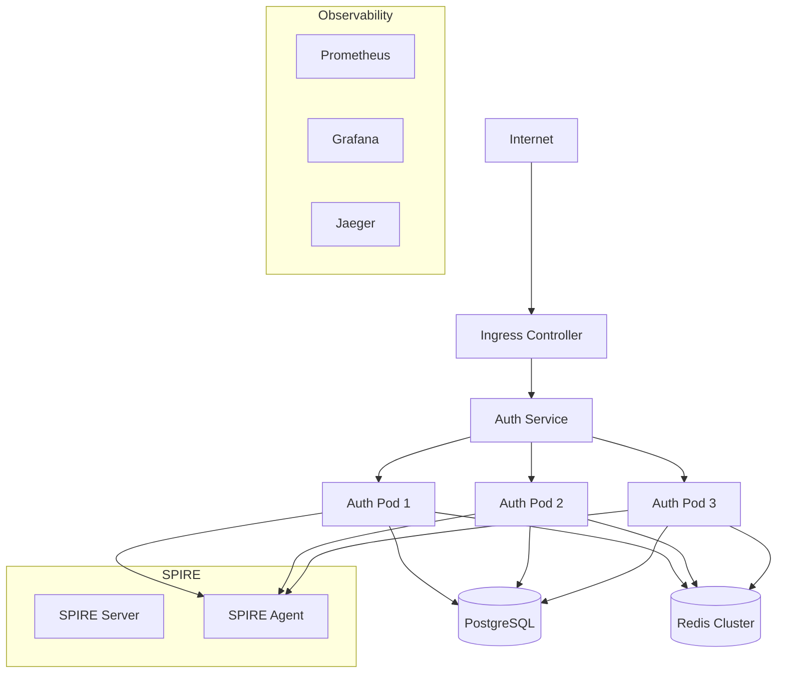

# Kubernetes Deployment Guide

This guide covers deploying the Zero Trust Auth MVP on Kubernetes for production environments with high availability, scalability, and security.

## 🚢 Overview

The Kubernetes deployment includes:

- **Application Pods**: Horizontally scalable auth service
- **Database**: PostgreSQL with persistent storage
- **Cache**: Redis cluster for session management
- **Observability**: Prometheus, Grafana, Jaeger
- **Security**: SPIRE for workload identity
- **Networking**: Ingress with TLS termination
- **Monitoring**: Health checks and auto-scaling

## 🏗️ Architecture



## 📁 Kubernetes Manifests

### Namespace

```yaml
# kubernetes/apps/zamaz/base/namespace.yaml
apiVersion: v1
kind: Namespace
metadata:
  name: mvp-auth
  labels:
    name: mvp-auth
    app.kubernetes.io/name: mvp-zero-trust-auth
    app.kubernetes.io/component: namespace
```

### ConfigMap

```yaml
# kubernetes/apps/zamaz/base/configmap.yaml
apiVersion: v1
kind: ConfigMap
metadata:
  name: mvp-auth-config
  namespace: mvp-auth
data:
  # Application configuration
  HTTP_HOST: "0.0.0.0"
  HTTP_PORT: "8080"
  HTTP_READ_TIMEOUT: "30s"
  HTTP_WRITE_TIMEOUT: "30s"
  
  # Database configuration
  DATABASE_HOST: "postgres-service"
  DATABASE_PORT: "5432"
  DATABASE_NAME: "mvp_db"
  DATABASE_USER: "mvp_user"
  DATABASE_SSL_MODE: "require"
  
  # Redis configuration
  REDIS_HOST: "redis-service"
  REDIS_PORT: "6379"
  REDIS_DATABASE: "0"
  
  # Observability configuration
  JAEGER_ENDPOINT: "http://jaeger-collector:14268/api/traces"
  PROMETHEUS_PORT: "9000"
  LOG_LEVEL: "info"
  LOG_FORMAT: "json"
  
  # Security configuration
  CORS_ALLOWED_ORIGINS: "https://auth.yourdomain.com"
  DISABLE_AUTH: "false"
  
  # Environment
  ENVIRONMENT: "production"
  SERVICE_NAME: "mvp-zero-trust-auth"
  SERVICE_VERSION: "1.0.0"
```

### Secrets

```yaml
# kubernetes/apps/zamaz/base/secrets.yaml
apiVersion: v1
kind: Secret
metadata:
  name: mvp-auth-secrets
  namespace: mvp-auth
type: Opaque
data:
  # Base64 encoded values (use proper secret management in production)
  jwt-secret: eW91ci1zdXBlci1zZWNyZXQtand0LWtleQ==
  database-password: bXZwX3Bhc3N3b3Jk
  redis-password: cmVkaXNfcGFzc3dvcmQ=

---
apiVersion: v1
kind: Secret
metadata:
  name: postgres-secrets
  namespace: mvp-auth
type: Opaque
data:
  postgres-password: bXZwX3Bhc3N3b3Jk
  postgres-user: bXZwX3VzZXI=
  postgres-db: bXZwX2Ri
```

### Deployment

```yaml
# kubernetes/apps/zamaz/base/deployment.yaml
apiVersion: apps/v1
kind: Deployment
metadata:
  name: mvp-auth
  namespace: mvp-auth
  labels:
    app: mvp-auth
    version: v1
spec:
  replicas: 3
  strategy:
    type: RollingUpdate
    rollingUpdate:
      maxSurge: 1
      maxUnavailable: 0
  selector:
    matchLabels:
      app: mvp-auth
  template:
    metadata:
      labels:
        app: mvp-auth
        version: v1
      annotations:
        prometheus.io/scrape: "true"
        prometheus.io/port: "9000"
        prometheus.io/path: "/metrics"
    spec:
      serviceAccountName: mvp-auth
      securityContext:
        runAsNonRoot: true
        runAsUser: 1001
        fsGroup: 1001
      containers:
      - name: mvp-auth
        image: mvp-auth:latest
        imagePullPolicy: Always
        ports:
        - containerPort: 8080
          name: http
          protocol: TCP
        - containerPort: 9000
          name: metrics
          protocol: TCP
        env:
        # Configuration from ConfigMap
        - name: HTTP_HOST
          valueFrom:
            configMapKeyRef:
              name: mvp-auth-config
              key: HTTP_HOST
        - name: HTTP_PORT
          valueFrom:
            configMapKeyRef:
              name: mvp-auth-config
              key: HTTP_PORT
        - name: DATABASE_HOST
          valueFrom:
            configMapKeyRef:
              name: mvp-auth-config
              key: DATABASE_HOST
        - name: DATABASE_PORT
          valueFrom:
            configMapKeyRef:
              name: mvp-auth-config
              key: DATABASE_PORT
        - name: DATABASE_NAME
          valueFrom:
            configMapKeyRef:
              name: mvp-auth-config
              key: DATABASE_NAME
        - name: DATABASE_USER
          valueFrom:
            configMapKeyRef:
              name: mvp-auth-config
              key: DATABASE_USER
        - name: REDIS_HOST
          valueFrom:
            configMapKeyRef:
              name: mvp-auth-config
              key: REDIS_HOST
        - name: REDIS_PORT
          valueFrom:
            configMapKeyRef:
              name: mvp-auth-config
              key: REDIS_PORT
        
        # Secrets
        - name: JWT_SECRET
          valueFrom:
            secretKeyRef:
              name: mvp-auth-secrets
              key: jwt-secret
        - name: DATABASE_PASSWORD
          valueFrom:
            secretKeyRef:
              name: mvp-auth-secrets
              key: database-password
        - name: REDIS_PASSWORD
          valueFrom:
            secretKeyRef:
              name: mvp-auth-secrets
              key: redis-password
        
        # Resource limits
        resources:
          requests:
            memory: "256Mi"
            cpu: "250m"
          limits:
            memory: "512Mi"
            cpu: "500m"
        
        # Health checks
        livenessProbe:
          httpGet:
            path: /health
            port: 8080
          initialDelaySeconds: 30
          periodSeconds: 10
          timeoutSeconds: 5
          failureThreshold: 3
        
        readinessProbe:
          httpGet:
            path: /health
            port: 8080
          initialDelaySeconds: 5
          periodSeconds: 5
          timeoutSeconds: 3
          failureThreshold: 3
        
        # Startup probe for slow starting containers
        startupProbe:
          httpGet:
            path: /health
            port: 8080
          initialDelaySeconds: 10
          periodSeconds: 5
          timeoutSeconds: 3
          failureThreshold: 6
        
        # Security context
        securityContext:
          allowPrivilegeEscalation: false
          runAsNonRoot: true
          runAsUser: 1001
          capabilities:
            drop:
              - ALL
          readOnlyRootFilesystem: true
        
        # Volume mounts
        volumeMounts:
        - name: tmp
          mountPath: /tmp
        - name: logs
          mountPath: /app/logs
      
      volumes:
      - name: tmp
        emptyDir: {}
      - name: logs
        emptyDir: {}
      
      # Pod disruption budget
      affinity:
        podAntiAffinity:
          preferredDuringSchedulingIgnoredDuringExecution:
          - weight: 100
            podAffinityTerm:
              labelSelector:
                matchExpressions:
                - key: app
                  operator: In
                  values:
                  - mvp-auth
              topologyKey: kubernetes.io/hostname
```

### Service

```yaml
# kubernetes/apps/zamaz/base/service.yaml
apiVersion: v1
kind: Service
metadata:
  name: mvp-auth-service
  namespace: mvp-auth
  labels:
    app: mvp-auth
spec:
  type: ClusterIP
  ports:
  - port: 8080
    targetPort: 8080
    protocol: TCP
    name: http
  - port: 9000
    targetPort: 9000
    protocol: TCP
    name: metrics
  selector:
    app: mvp-auth

---
apiVersion: v1
kind: Service
metadata:
  name: postgres-service
  namespace: mvp-auth
  labels:
    app: postgres
spec:
  type: ClusterIP
  ports:
  - port: 5432
    targetPort: 5432
    protocol: TCP
    name: postgres
  selector:
    app: postgres

---
apiVersion: v1
kind: Service
metadata:
  name: redis-service
  namespace: mvp-auth
  labels:
    app: redis
spec:
  type: ClusterIP
  ports:
  - port: 6379
    targetPort: 6379
    protocol: TCP
    name: redis
  selector:
    app: redis
```

### RBAC

```yaml
# kubernetes/apps/zamaz/base/rbac.yaml
apiVersion: v1
kind: ServiceAccount
metadata:
  name: mvp-auth
  namespace: mvp-auth

---
apiVersion: rbac.authorization.k8s.io/v1
kind: Role
metadata:
  namespace: mvp-auth
  name: mvp-auth-role
rules:
- apiGroups: [""]
  resources: ["pods", "services", "endpoints"]
  verbs: ["get", "list", "watch"]
- apiGroups: ["apps"]
  resources: ["deployments", "replicasets"]
  verbs: ["get", "list", "watch"]

---
apiVersion: rbac.authorization.k8s.io/v1
kind: RoleBinding
metadata:
  name: mvp-auth-rolebinding
  namespace: mvp-auth
subjects:
- kind: ServiceAccount
  name: mvp-auth
  namespace: mvp-auth
roleRef:
  kind: Role
  name: mvp-auth-role
  apiGroup: rbac.authorization.k8s.io
```

### PostgreSQL Deployment

```yaml
# kubernetes/apps/zamaz/base/postgres.yaml
apiVersion: apps/v1
kind: Deployment
metadata:
  name: postgres
  namespace: mvp-auth
  labels:
    app: postgres
spec:
  replicas: 1
  selector:
    matchLabels:
      app: postgres
  template:
    metadata:
      labels:
        app: postgres
    spec:
      containers:
      - name: postgres
        image: postgres:15-alpine
        ports:
        - containerPort: 5432
        env:
        - name: POSTGRES_DB
          valueFrom:
            secretKeyRef:
              name: postgres-secrets
              key: postgres-db
        - name: POSTGRES_USER
          valueFrom:
            secretKeyRef:
              name: postgres-secrets
              key: postgres-user
        - name: POSTGRES_PASSWORD
          valueFrom:
            secretKeyRef:
              name: postgres-secrets
              key: postgres-password
        - name: PGDATA
          value: /var/lib/postgresql/data/pgdata
        resources:
          requests:
            memory: "256Mi"
            cpu: "250m"
          limits:
            memory: "1Gi"
            cpu: "500m"
        volumeMounts:
        - name: postgres-storage
          mountPath: /var/lib/postgresql/data
        livenessProbe:
          exec:
            command:
            - pg_isready
            - -U
            - $(POSTGRES_USER)
            - -d
            - $(POSTGRES_DB)
          initialDelaySeconds: 30
          periodSeconds: 10
        readinessProbe:
          exec:
            command:
            - pg_isready
            - -U
            - $(POSTGRES_USER)
            - -d
            - $(POSTGRES_DB)
          initialDelaySeconds: 5
          periodSeconds: 5
      volumes:
      - name: postgres-storage
        persistentVolumeClaim:
          claimName: postgres-pvc

---
apiVersion: v1
kind: PersistentVolumeClaim
metadata:
  name: postgres-pvc
  namespace: mvp-auth
spec:
  accessModes:
    - ReadWriteOnce
  resources:
    requests:
      storage: 10Gi
  storageClassName: fast-ssd  # Use appropriate storage class
```

### Redis Deployment

```yaml
# kubernetes/apps/zamaz/base/redis.yaml
apiVersion: apps/v1
kind: Deployment
metadata:
  name: redis
  namespace: mvp-auth
  labels:
    app: redis
spec:
  replicas: 1
  selector:
    matchLabels:
      app: redis
  template:
    metadata:
      labels:
        app: redis
    spec:
      containers:
      - name: redis
        image: redis:7-alpine
        ports:
        - containerPort: 6379
        command:
        - redis-server
        - --requirepass
        - $(REDIS_PASSWORD)
        - --appendonly
        - "yes"
        env:
        - name: REDIS_PASSWORD
          valueFrom:
            secretKeyRef:
              name: mvp-auth-secrets
              key: redis-password
        resources:
          requests:
            memory: "128Mi"
            cpu: "100m"
          limits:
            memory: "256Mi"
            cpu: "200m"
        volumeMounts:
        - name: redis-storage
          mountPath: /data
        livenessProbe:
          exec:
            command:
            - redis-cli
            - ping
          initialDelaySeconds: 30
          periodSeconds: 10
        readinessProbe:
          exec:
            command:
            - redis-cli
            - ping
          initialDelaySeconds: 5
          periodSeconds: 5
      volumes:
      - name: redis-storage
        persistentVolumeClaim:
          claimName: redis-pvc

---
apiVersion: v1
kind: PersistentVolumeClaim
metadata:
  name: redis-pvc
  namespace: mvp-auth
spec:
  accessModes:
    - ReadWriteOnce
  resources:
    requests:
      storage: 5Gi
  storageClassName: fast-ssd
```

### Ingress

```yaml
# kubernetes/apps/zamaz/base/ingress.yaml
apiVersion: networking.k8s.io/v1
kind: Ingress
metadata:
  name: mvp-auth-ingress
  namespace: mvp-auth
  annotations:
    kubernetes.io/ingress.class: nginx
    cert-manager.io/cluster-issuer: letsencrypt-prod
    nginx.ingress.kubernetes.io/ssl-redirect: "true"
    nginx.ingress.kubernetes.io/force-ssl-redirect: "true"
    nginx.ingress.kubernetes.io/backend-protocol: "HTTP"
    nginx.ingress.kubernetes.io/proxy-body-size: "10m"
    nginx.ingress.kubernetes.io/rate-limit: "100"
    nginx.ingress.kubernetes.io/rate-limit-window: "1m"
spec:
  tls:
  - hosts:
    - auth.yourdomain.com
    secretName: mvp-auth-tls
  rules:
  - host: auth.yourdomain.com
    http:
      paths:
      - path: /
        pathType: Prefix
        backend:
          service:
            name: mvp-auth-service
            port:
              number: 8080
```

## 🔧 Kustomization

### Base Kustomization

```yaml
# kubernetes/apps/zamaz/base/kustomization.yaml
apiVersion: kustomize.config.k8s.io/v1beta1
kind: Kustomization

namespace: mvp-auth

resources:
- namespace.yaml
- configmap.yaml
- secrets.yaml
- rbac.yaml
- deployment.yaml
- service.yaml
- postgres.yaml
- redis.yaml
- ingress.yaml
- network-policy.yaml

commonLabels:
  app.kubernetes.io/name: mvp-zero-trust-auth
  app.kubernetes.io/instance: production
  app.kubernetes.io/version: "1.0.0"
  app.kubernetes.io/component: authentication
  app.kubernetes.io/part-of: zero-trust-platform

images:
- name: mvp-auth
  newTag: latest
```

### Production Overlay

```yaml
# kubernetes/apps/zamaz/overlays/production/kustomization.yaml
apiVersion: kustomize.config.k8s.io/v1beta1
kind: Kustomization

namespace: mvp-auth-prod

namePrefix: prod-

resources:
- ../../base

patchesStrategicMerge:
- deployment-patch.yaml
- configmap-patch.yaml

replicas:
- name: mvp-auth
  count: 5

images:
- name: mvp-auth
  newTag: v1.0.0

configMapGenerator:
- name: mvp-auth-config
  behavior: merge
  envs:
  - config.env

secretGenerator:
- name: mvp-auth-secrets
  behavior: replace
  envs:
  - secrets.env
```

### Production Patches

```yaml
# kubernetes/apps/zamaz/overlays/production/deployment-patch.yaml
apiVersion: apps/v1
kind: Deployment
metadata:
  name: mvp-auth
spec:
  template:
    spec:
      containers:
      - name: mvp-auth
        resources:
          requests:
            memory: "512Mi"
            cpu: "500m"
          limits:
            memory: "1Gi"
            cpu: "1000m"
        env:
        - name: ENVIRONMENT
          value: "production"
        - name: LOG_LEVEL
          value: "warn"
```

## 🚀 Deployment Commands

### Initial Deployment

```bash
# Create namespace
kubectl apply -f kubernetes/apps/zamaz/base/namespace.yaml

# Deploy base resources
kubectl apply -k kubernetes/apps/zamaz/base/

# Check deployment status
kubectl get pods -n mvp-auth
kubectl get services -n mvp-auth
kubectl get ingress -n mvp-auth
```

### Production Deployment

```bash
# Deploy production overlay
kubectl apply -k kubernetes/apps/zamaz/overlays/production/

# Check rollout status
kubectl rollout status deployment/prod-mvp-auth -n mvp-auth-prod

# Check pod status
kubectl get pods -n mvp-auth-prod -l app=mvp-auth

# Check logs
kubectl logs -n mvp-auth-prod -l app=mvp-auth --tail=100 -f
```

### Using Helm (Alternative)

```bash
# Install with Helm
helm install mvp-auth ./deployments/helm/mvp-auth \
  --namespace mvp-auth \
  --create-namespace \
  --values ./deployments/helm/mvp-auth/values-production.yaml

# Upgrade deployment
helm upgrade mvp-auth ./deployments/helm/mvp-auth \
  --namespace mvp-auth \
  --values ./deployments/helm/mvp-auth/values-production.yaml

# Check status
helm status mvp-auth -n mvp-auth
```

## 📊 Monitoring & Observability

### Prometheus ServiceMonitor

```yaml
# monitoring/servicemonitor.yaml
apiVersion: monitoring.coreos.com/v1
kind: ServiceMonitor
metadata:
  name: mvp-auth-metrics
  namespace: mvp-auth
  labels:
    app: mvp-auth
spec:
  selector:
    matchLabels:
      app: mvp-auth
  endpoints:
  - port: metrics
    interval: 30s
    path: /metrics
```

### HorizontalPodAutoscaler

```yaml
# kubernetes/apps/zamaz/overlays/production/hpa.yaml
apiVersion: autoscaling/v2
kind: HorizontalPodAutoscaler
metadata:
  name: mvp-auth-hpa
  namespace: mvp-auth
spec:
  scaleTargetRef:
    apiVersion: apps/v1
    kind: Deployment
    name: mvp-auth
  minReplicas: 3
  maxReplicas: 10
  metrics:
  - type: Resource
    resource:
      name: cpu
      target:
        type: Utilization
        averageUtilization: 70
  - type: Resource
    resource:
      name: memory
      target:
        type: Utilization
        averageUtilization: 80
  behavior:
    scaleDown:
      stabilizationWindowSeconds: 300
      policies:
      - type: Percent
        value: 50
        periodSeconds: 60
    scaleUp:
      stabilizationWindowSeconds: 60
      policies:
      - type: Percent
        value: 100
        periodSeconds: 60
```

### PodDisruptionBudget

```yaml
# kubernetes/apps/zamaz/overlays/production/pdb.yaml
apiVersion: policy/v1
kind: PodDisruptionBudget
metadata:
  name: mvp-auth-pdb
  namespace: mvp-auth
spec:
  minAvailable: 2
  selector:
    matchLabels:
      app: mvp-auth
```

## 🔒 Security

### Network Policies

```yaml
# kubernetes/apps/zamaz/base/network-policy.yaml
apiVersion: networking.k8s.io/v1
kind: NetworkPolicy
metadata:
  name: mvp-auth-network-policy
  namespace: mvp-auth
spec:
  podSelector:
    matchLabels:
      app: mvp-auth
  policyTypes:
  - Ingress
  - Egress
  ingress:
  - from:
    - namespaceSelector:
        matchLabels:
          name: ingress-nginx
    ports:
    - protocol: TCP
      port: 8080
  - from:
    - namespaceSelector:
        matchLabels:
          name: monitoring
    ports:
    - protocol: TCP
      port: 9000
  egress:
  - to:
    - podSelector:
        matchLabels:
          app: postgres
    ports:
    - protocol: TCP
      port: 5432
  - to:
    - podSelector:
        matchLabels:
          app: redis
    ports:
    - protocol: TCP
      port: 6379
  - to: []
    ports:
    - protocol: TCP
      port: 53
    - protocol: UDP
      port: 53
```

### Pod Security Standards

```yaml
# Add to namespace
apiVersion: v1
kind: Namespace
metadata:
  name: mvp-auth
  labels:
    pod-security.kubernetes.io/enforce: restricted
    pod-security.kubernetes.io/audit: restricted
    pod-security.kubernetes.io/warn: restricted
```

### Security Context

```yaml
# In deployment.yaml
securityContext:
  runAsNonRoot: true
  runAsUser: 1001
  runAsGroup: 1001
  fsGroup: 1001
  seccompProfile:
    type: RuntimeDefault
containers:
- name: mvp-auth
  securityContext:
    allowPrivilegeEscalation: false
    runAsNonRoot: true
    runAsUser: 1001
    capabilities:
      drop:
      - ALL
    readOnlyRootFilesystem: true
```

## 🧪 Testing

### Health Check Scripts

```bash
#!/bin/bash
# scripts/k8s-health-check.sh

NAMESPACE=${1:-mvp-auth}

echo "Checking MVP Auth deployment health in namespace: $NAMESPACE"

# Check deployment status
echo "=== Deployment Status ==="
kubectl get deployment mvp-auth -n $NAMESPACE

# Check pod status
echo "=== Pod Status ==="
kubectl get pods -n $NAMESPACE -l app=mvp-auth

# Check service endpoints
echo "=== Service Endpoints ==="
kubectl get endpoints mvp-auth-service -n $NAMESPACE

# Test health endpoint
echo "=== Health Check ==="
kubectl run test-pod --rm -it --restart=Never --image=curlimages/curl -- \
  curl -f http://mvp-auth-service.$NAMESPACE.svc.cluster.local:8080/health

# Check logs for errors
echo "=== Recent Logs ==="
kubectl logs -n $NAMESPACE -l app=mvp-auth --tail=10
```

### Load Testing

```bash
#!/bin/bash
# scripts/k8s-load-test.sh

NAMESPACE=${1:-mvp-auth}
SERVICE_URL="http://mvp-auth-service.$NAMESPACE.svc.cluster.local:8080"

kubectl run load-test --rm -it --restart=Never --image=loadimpact/k6 -- \
  run -e BASE_URL=$SERVICE_URL - <<EOF
import http from 'k6/http';
import { check } from 'k6';

export let options = {
  stages: [
    { duration: '2m', target: 100 },
    { duration: '5m', target: 100 },
    { duration: '2m', target: 200 },
    { duration: '5m', target: 200 },
    { duration: '2m', target: 0 },
  ],
};

export default function() {
  let response = http.get('${SERVICE_URL}/health');
  check(response, {
    'status is 200': (r) => r.status === 200,
    'response time < 500ms': (r) => r.timings.duration < 500,
  });
}
EOF
```

## 🚨 Troubleshooting

### Common Issues

#### 1. Pods Not Starting
```bash
# Check pod events
kubectl describe pod <pod-name> -n mvp-auth

# Check logs
kubectl logs <pod-name> -n mvp-auth

# Check resource availability
kubectl top nodes
kubectl top pods -n mvp-auth
```

#### 2. Service Discovery Issues
```bash
# Check service
kubectl get svc -n mvp-auth

# Check endpoints
kubectl get endpoints -n mvp-auth

# Test DNS resolution
kubectl run debug --rm -it --restart=Never --image=busybox -- \
  nslookup mvp-auth-service.mvp-auth.svc.cluster.local
```

#### 3. Database Connection Issues
```bash
# Check postgres pod
kubectl logs postgres-<pod-id> -n mvp-auth

# Test database connectivity
kubectl run pg-test --rm -it --restart=Never --image=postgres:15 -- \
  psql -h postgres-service.mvp-auth.svc.cluster.local -U mvp_user -d mvp_db
```

#### 4. Ingress Issues
```bash
# Check ingress status
kubectl get ingress -n mvp-auth

# Check ingress controller logs
kubectl logs -n ingress-nginx deployment/ingress-nginx-controller

# Test internal service
kubectl run curl-test --rm -it --restart=Never --image=curlimages/curl -- \
  curl -v http://mvp-auth-service.mvp-auth.svc.cluster.local:8080/health
```

### Debug Commands

```bash
# Get all resources in namespace
kubectl get all -n mvp-auth

# Describe deployment
kubectl describe deployment mvp-auth -n mvp-auth

# Check resource usage
kubectl top pods -n mvp-auth

# Get events
kubectl get events -n mvp-auth --sort-by='.lastTimestamp'

# Port forward for debugging
kubectl port-forward svc/mvp-auth-service 8080:8080 -n mvp-auth

# Execute commands in pod
kubectl exec -it <pod-name> -n mvp-auth -- /bin/sh
```

## 📚 Additional Resources

- [Kubernetes Documentation](https://kubernetes.io/docs/)
- [Kustomize Documentation](https://kustomize.io/)
- [Kubernetes Security Best Practices](https://kubernetes.io/docs/concepts/security/)
- [Production Checklist](docs/deployment/production.md)