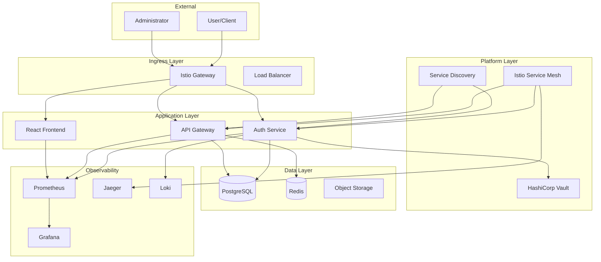

# Zamaz Zero Trust Platform

Welcome to the comprehensive documentation for the **Zamaz Zero Trust Authentication Platform** - a modern authentication system implementing Zero Trust principles with GitOps deployment model.


## :rocket: Quick Start

Get up and running with Zamaz in minutes:

=== "Development"

    ```bash
    # Clone and setup
    git clone https://github.com/zamaz/root-zamaz.git
    cd root-zamaz
    
    # Development setup
    make dev-setup
    make dev-up
    
    # GitOps local environment
    make dev-gitops
    ```

=== "Production"

    ```bash
    # Deploy to Kubernetes
    helm repo add zamaz https://charts.zamaz.io
    helm install zamaz zamaz/zamaz-platform
    
    # Or use GitOps
    kubectl apply -f deployments/argocd/
    ```

=== "Docker"

    ```bash
    # Run with Docker Compose
    docker-compose up -d
    
    # Access the platform
    open http://localhost:8080
    ```

## :sparkles: Key Features

<div class="grid cards" markdown>

-   :shield:{ .lg .middle } **Zero Trust Security**

    ---

    Comprehensive security model with identity verification, device attestation, and continuous authorization

    [:octicons-arrow-right-24: Security Architecture](architecture/security.md)

-   :gear:{ .lg .middle } **GitOps-First**

    ---

    Complete infrastructure and application lifecycle managed through Git with Argo CD and automated deployments

    [:octicons-arrow-right-24: GitOps Guide](deployment/gitops.md)

-   :chart_with_upwards_trend:{ .lg .middle } **Full Observability**

    ---

    Comprehensive monitoring, logging, and tracing with Prometheus, Grafana, and Jaeger integration

    [:octicons-arrow-right-24: Observability](architecture/observability.md)

-   :cloud:{ .lg .middle } **Service Mesh Ready**

    ---

    Built-in Istio service mesh integration with advanced traffic management and security policies

    [:octicons-arrow-right-24: Service Discovery](architecture/service-discovery.md)

</div>

## :building_construction: Architecture Overview



## :books: Documentation Sections

| Section | Description | Key Topics |
|---------|-------------|------------|
| **[Getting Started](getting-started/quick-start.md)** | Installation and initial setup | Quick start, configuration, first deployment |
| **[Architecture](architecture/overview.md)** | System design and components | Zero Trust, security, observability, service mesh |
| **[Development](development/README.md)** | Developer guides and tools | Setup, testing, contributing, SDK generation |
| **[Deployment](deployment/README.md)** | Production deployment guides | Kubernetes, Docker, GitOps, security |
| **[API Reference](api/README.md)** | Complete API documentation | Authentication, devices, OpenAPI specifications |
| **[Security](security/README.md)** | Security policies and procedures | Threat model, incident response, compliance |
| **[Operations](troubleshooting.md)** | Operational procedures | Troubleshooting, monitoring, maintenance |

## :rocket: What's New

!!! tip "Latest Updates"
    
    - **v1.0.0** - Full Zero Trust implementation with Istio service mesh
    - **GitOps Pipeline** - Complete CI/CD with Argo CD and automated deployments  
    - **Enhanced Security** - SPIRE integration for workload identity
    - **Observability Stack** - Comprehensive monitoring with Prometheus and Grafana

## :handshake: Community & Support

<div class="grid cards" markdown>

-   :material-github:{ .lg .middle } **GitHub**

    ---

    Contribute to the project, report issues, and collaborate with the community

    [:octicons-arrow-right-24: GitHub Repository](https://github.com/zamaz/root-zamaz)

-   :material-book-open-variant:{ .lg .middle } **Documentation**

    ---

    Comprehensive guides, API references, and best practices

    [:octicons-arrow-right-24: Developer Guide](development/README.md)

-   :material-security:{ .lg .middle } **Security**

    ---

    Security policies, vulnerability reporting, and compliance information

    [:octicons-arrow-right-24: Security Policy](security/README.md)

-   :material-docker:{ .lg .middle } **Container Registry**

    ---

    Pre-built Docker images and Helm charts for easy deployment

    [:octicons-arrow-right-24: Docker Hub](https://hub.docker.com/r/zamaz/root-zamaz)

</div>

## :gear: Quick Links

- [API Documentation](api/README.md) - Complete REST API reference
- [Helm Charts](deployment/kubernetes.md) - Kubernetes deployment with Helm
- [Security Guidelines](security/README.md) - Zero Trust security implementation
- [Troubleshooting](troubleshooting.md) - Common issues and solutions
- [Contributing](development/contributing.md) - How to contribute to the project

---

!!! info "Need Help?"
    
    - 📖 Check our [comprehensive documentation](development/README.md)
    - 🐛 Report issues on [GitHub Issues](https://github.com/zamaz/root-zamaz/issues)
    - 💬 Join our community discussions
    - 📧 Contact support at support@zamaz.io