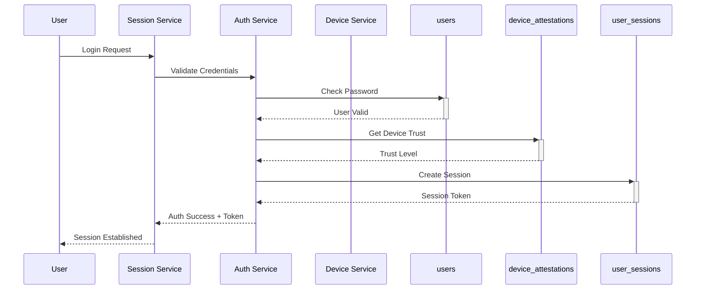
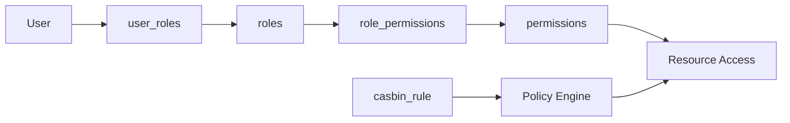

# Authentication & Authorization Domain

## Overview
This domain handles user authentication, role-based access control (RBAC), and session management for the Zero Trust platform.

## Tables in this Domain

| Table | Purpose | Details |
|-------|---------|---------|
| [users](public.users.md) | User accounts and authentication data | Account lockout, failed login tracking |
| [user_sessions](public.user_sessions.md) | Active session management | Device tracking, trust levels |
| [roles](public.roles.md) | User roles for RBAC | Hierarchical permissions |
| [permissions](public.permissions.md) | System permissions | Resource-action based |
| [user_roles](public.user_roles.md) | User-role associations | Many-to-many relationships |
| [role_permissions](public.role_permissions.md) | Role-permission associations | Fine-grained access control |
| [casbin_rule](public.casbin_rule.md) | Casbin authorization rules | Policy enforcement |

## Authentication Flow

## RBAC Authorization Flow

## Key Features

### Zero Trust Authentication
- **Device Trust Levels**: Session tracking includes device trust levels for zero trust decisions
- **Account Lockout Protection**: Automatic account locking after failed login attempts
- **Session Management**: Comprehensive session tracking with device and location context

### Role-Based Access Control (RBAC)
- **Hierarchical Roles**: Support for role inheritance and delegation
- **Resource-Action Permissions**: Fine-grained permissions based on resource and action
- **Dynamic Authorization**: Integration with Casbin for policy-based access control

### Security Features
- **Password Security**: Bcrypt hashed passwords with configurable complexity
- **Session Security**: Secure token-based sessions with expiration
- **Audit Integration**: All authentication events are logged for security monitoring

## Related Domains
- [Security & Monitoring](security-domain.md) - Login attempts and audit logging
- [Zero Trust & Device Security](zero-trust-domain.md) - Device attestation and trust
- [Compliance & Data Governance](compliance-domain.md) - GDPR and audit requirements