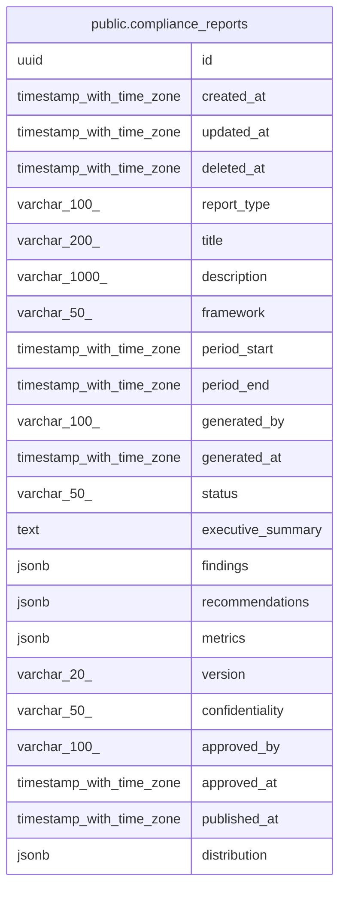

# public.compliance_reports

## Description

## Columns

| Name | Type | Default | Nullable | Children | Parents | Comment |
| ---- | ---- | ------- | -------- | -------- | ------- | ------- |
| id | uuid | gen_random_uuid() | false |  |  |  |
| created_at | timestamp with time zone | CURRENT_TIMESTAMP | true |  |  |  |
| updated_at | timestamp with time zone | CURRENT_TIMESTAMP | true |  |  |  |
| deleted_at | timestamp with time zone |  | true |  |  |  |
| report_type | varchar(100) |  | false |  |  |  |
| title | varchar(200) |  | false |  |  |  |
| description | varchar(1000) |  | true |  |  |  |
| framework | varchar(50) |  | true |  |  |  |
| period_start | timestamp with time zone |  | false |  |  |  |
| period_end | timestamp with time zone |  | false |  |  |  |
| generated_by | varchar(100) |  | true |  |  |  |
| generated_at | timestamp with time zone |  | false |  |  |  |
| status | varchar(50) | 'DRAFT'::character varying | true |  |  |  |
| executive_summary | text |  | true |  |  |  |
| findings | jsonb |  | true |  |  |  |
| recommendations | jsonb |  | true |  |  |  |
| metrics | jsonb |  | true |  |  |  |
| version | varchar(20) |  | true |  |  |  |
| confidentiality | varchar(50) | 'INTERNAL'::character varying | true |  |  |  |
| approved_by | varchar(100) |  | true |  |  |  |
| approved_at | timestamp with time zone |  | true |  |  |  |
| published_at | timestamp with time zone |  | true |  |  |  |
| distribution | jsonb |  | true |  |  |  |

## Constraints

| Name | Type | Definition |
| ---- | ---- | ---------- |
| compliance_reports_status_check | CHECK | CHECK (((status)::text = ANY ((ARRAY['DRAFT'::character varying, 'FINAL'::character varying, 'PUBLISHED'::character varying])::text[]))) |
| compliance_reports_pkey | PRIMARY KEY | PRIMARY KEY (id) |

## Indexes

| Name | Definition |
| ---- | ---------- |
| compliance_reports_pkey | CREATE UNIQUE INDEX compliance_reports_pkey ON public.compliance_reports USING btree (id) |
| idx_compliance_reports_report_type | CREATE INDEX idx_compliance_reports_report_type ON public.compliance_reports USING btree (report_type) |
| idx_compliance_reports_framework | CREATE INDEX idx_compliance_reports_framework ON public.compliance_reports USING btree (framework) |
| idx_compliance_reports_status | CREATE INDEX idx_compliance_reports_status ON public.compliance_reports USING btree (status) |
| idx_compliance_reports_period_start | CREATE INDEX idx_compliance_reports_period_start ON public.compliance_reports USING btree (period_start DESC) |
| idx_compliance_reports_generated_at | CREATE INDEX idx_compliance_reports_generated_at ON public.compliance_reports USING btree (generated_at DESC) |
| idx_compliance_reports_generated_by | CREATE INDEX idx_compliance_reports_generated_by ON public.compliance_reports USING btree (generated_by) |
| idx_compliance_reports_type_period | CREATE INDEX idx_compliance_reports_type_period ON public.compliance_reports USING btree (report_type, period_start DESC) |
| idx_compliance_reports_framework_period | CREATE INDEX idx_compliance_reports_framework_period ON public.compliance_reports USING btree (framework, period_start DESC) |

## Relations

---

> Generated by [tbls](https://github.com/k1LoW/tbls)
