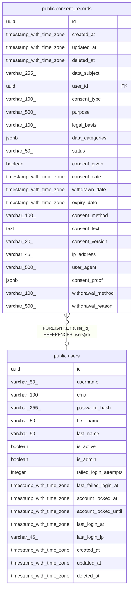

# public.consent_records

## Description

## Columns

| Name | Type | Default | Nullable | Children | Parents | Comment |
| ---- | ---- | ------- | -------- | -------- | ------- | ------- |
| id | uuid | gen_random_uuid() | false |  |  |  |
| created_at | timestamp with time zone | CURRENT_TIMESTAMP | true |  |  |  |
| updated_at | timestamp with time zone | CURRENT_TIMESTAMP | true |  |  |  |
| deleted_at | timestamp with time zone |  | true |  |  |  |
| data_subject | varchar(255) |  | false |  |  |  |
| user_id | uuid |  | true |  | [public.users](public.users.md) |  |
| consent_type | varchar(100) |  | false |  |  |  |
| purpose | varchar(500) |  | false |  |  |  |
| legal_basis | varchar(100) |  | true |  |  |  |
| data_categories | jsonb |  | true |  |  |  |
| status | varchar(50) |  | false |  |  |  |
| consent_given | boolean |  | false |  |  |  |
| consent_date | timestamp with time zone |  | false |  |  |  |
| withdrawn_date | timestamp with time zone |  | true |  |  |  |
| expiry_date | timestamp with time zone |  | true |  |  |  |
| consent_method | varchar(100) |  | true |  |  |  |
| consent_text | text |  | true |  |  |  |
| consent_version | varchar(20) |  | true |  |  |  |
| ip_address | varchar(45) |  | true |  |  |  |
| user_agent | varchar(500) |  | true |  |  |  |
| consent_proof | jsonb |  | true |  |  |  |
| withdrawal_method | varchar(100) |  | true |  |  |  |
| withdrawal_reason | varchar(500) |  | true |  |  |  |

## Constraints

| Name | Type | Definition |
| ---- | ---- | ---------- |
| consent_records_status_check | CHECK | CHECK (((status)::text = ANY ((ARRAY['GIVEN'::character varying, 'WITHDRAWN'::character varying, 'EXPIRED'::character varying])::text[]))) |
| consent_records_user_id_fkey | FOREIGN KEY | FOREIGN KEY (user_id) REFERENCES users(id) |
| consent_records_pkey | PRIMARY KEY | PRIMARY KEY (id) |

## Indexes

| Name | Definition |
| ---- | ---------- |
| consent_records_pkey | CREATE UNIQUE INDEX consent_records_pkey ON public.consent_records USING btree (id) |
| idx_consent_records_data_subject | CREATE INDEX idx_consent_records_data_subject ON public.consent_records USING btree (data_subject) |
| idx_consent_records_user_id | CREATE INDEX idx_consent_records_user_id ON public.consent_records USING btree (user_id) |
| idx_consent_records_consent_type | CREATE INDEX idx_consent_records_consent_type ON public.consent_records USING btree (consent_type) |
| idx_consent_records_status | CREATE INDEX idx_consent_records_status ON public.consent_records USING btree (status) |
| idx_consent_records_consent_given | CREATE INDEX idx_consent_records_consent_given ON public.consent_records USING btree (consent_given) |
| idx_consent_records_consent_date | CREATE INDEX idx_consent_records_consent_date ON public.consent_records USING btree (consent_date DESC) |
| idx_consent_records_withdrawn_date | CREATE INDEX idx_consent_records_withdrawn_date ON public.consent_records USING btree (withdrawn_date DESC) |
| idx_consent_records_expiry_date | CREATE INDEX idx_consent_records_expiry_date ON public.consent_records USING btree (expiry_date) |
| idx_consent_records_subject_type | CREATE INDEX idx_consent_records_subject_type ON public.consent_records USING btree (data_subject, consent_type) |
| idx_consent_records_status_date | CREATE INDEX idx_consent_records_status_date ON public.consent_records USING btree (status, consent_date DESC) |

## Relations

---

> Generated by [tbls](https://github.com/k1LoW/tbls)
