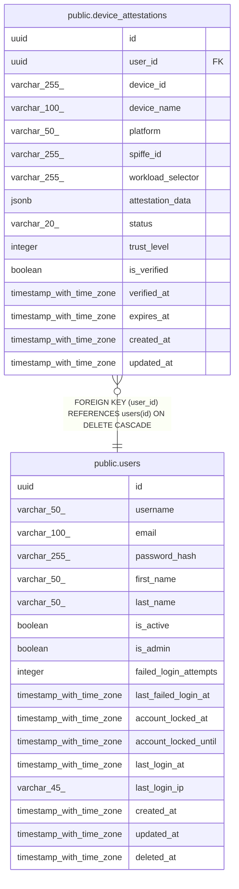

# public.device_attestations

## Description

## Columns

| Name | Type | Default | Nullable | Children | Parents | Comment |
| ---- | ---- | ------- | -------- | -------- | ------- | ------- |
| id | uuid | gen_random_uuid() | false |  |  |  |
| user_id | uuid |  | false |  | [public.users](public.users.md) |  |
| device_id | varchar(255) |  | false |  |  |  |
| device_name | varchar(100) |  | false |  |  |  |
| platform | varchar(50) |  | false |  |  |  |
| spiffe_id | varchar(255) |  | true |  |  |  |
| workload_selector | varchar(255) |  | true |  |  |  |
| attestation_data | jsonb |  | true |  |  |  |
| status | varchar(20) | 'pending'::character varying | true |  |  |  |
| trust_level | integer | 0 | true |  |  |  |
| is_verified | boolean | false | true |  |  |  |
| verified_at | timestamp with time zone |  | true |  |  |  |
| expires_at | timestamp with time zone |  | true |  |  |  |
| created_at | timestamp with time zone | CURRENT_TIMESTAMP | true |  |  |  |
| updated_at | timestamp with time zone | CURRENT_TIMESTAMP | true |  |  |  |

## Constraints

| Name | Type | Definition |
| ---- | ---- | ---------- |
| device_attestations_user_id_fkey | FOREIGN KEY | FOREIGN KEY (user_id) REFERENCES users(id) ON DELETE CASCADE |
| device_attestations_pkey | PRIMARY KEY | PRIMARY KEY (id) |
| device_attestations_device_id_key | UNIQUE | UNIQUE (device_id) |

## Indexes

| Name | Definition |
| ---- | ---------- |
| device_attestations_pkey | CREATE UNIQUE INDEX device_attestations_pkey ON public.device_attestations USING btree (id) |
| device_attestations_device_id_key | CREATE UNIQUE INDEX device_attestations_device_id_key ON public.device_attestations USING btree (device_id) |
| idx_device_attestations_user_id | CREATE INDEX idx_device_attestations_user_id ON public.device_attestations USING btree (user_id) |
| idx_device_attestations_device_id | CREATE INDEX idx_device_attestations_device_id ON public.device_attestations USING btree (device_id) |
| idx_device_attestations_status | CREATE INDEX idx_device_attestations_status ON public.device_attestations USING btree (status) |
| idx_device_attestations_user_status | CREATE INDEX idx_device_attestations_user_status ON public.device_attestations USING btree (user_id, is_verified, trust_level) |
| idx_device_attestations_device_verified | CREATE INDEX idx_device_attestations_device_verified ON public.device_attestations USING btree (device_id, is_verified) |
| idx_device_attestations_platform_trust | CREATE INDEX idx_device_attestations_platform_trust ON public.device_attestations USING btree (platform, trust_level) |
| idx_device_attestations_spiffe_id | CREATE INDEX idx_device_attestations_spiffe_id ON public.device_attestations USING btree (spiffe_id) |
| idx_device_attestations_verified_at | CREATE INDEX idx_device_attestations_verified_at ON public.device_attestations USING btree (verified_at DESC) WHERE (verified_at IS NOT NULL) |

## Relations

---

> Generated by [tbls](https://github.com/k1LoW/tbls)
