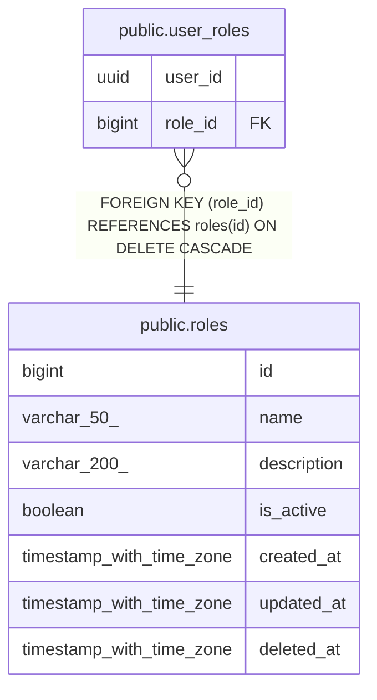

# public.user_roles

## Description

## Columns

| Name | Type | Default | Nullable | Children | Parents | Comment |
| ---- | ---- | ------- | -------- | -------- | ------- | ------- |
| user_id | uuid |  | false |  |  |  |
| role_id | bigint |  | false |  | [public.roles](public.roles.md) |  |

## Constraints

| Name | Type | Definition |
| ---- | ---- | ---------- |
| user_roles_role_id_fkey | FOREIGN KEY | FOREIGN KEY (role_id) REFERENCES roles(id) ON DELETE CASCADE |
| user_roles_pkey | PRIMARY KEY | PRIMARY KEY (user_id, role_id) |

## Indexes

| Name | Definition |
| ---- | ---------- |
| user_roles_pkey | CREATE UNIQUE INDEX user_roles_pkey ON public.user_roles USING btree (user_id, role_id) |
| idx_user_roles_user_id | CREATE INDEX idx_user_roles_user_id ON public.user_roles USING btree (user_id) |
| idx_user_roles_role_id | CREATE INDEX idx_user_roles_role_id ON public.user_roles USING btree (role_id) |
| idx_user_roles_user_id_opt | CREATE INDEX idx_user_roles_user_id_opt ON public.user_roles USING btree (user_id) |
| idx_user_roles_role_id_opt | CREATE INDEX idx_user_roles_role_id_opt ON public.user_roles USING btree (role_id) |

## Relations

---

> Generated by [tbls](https://github.com/k1LoW/tbls)
