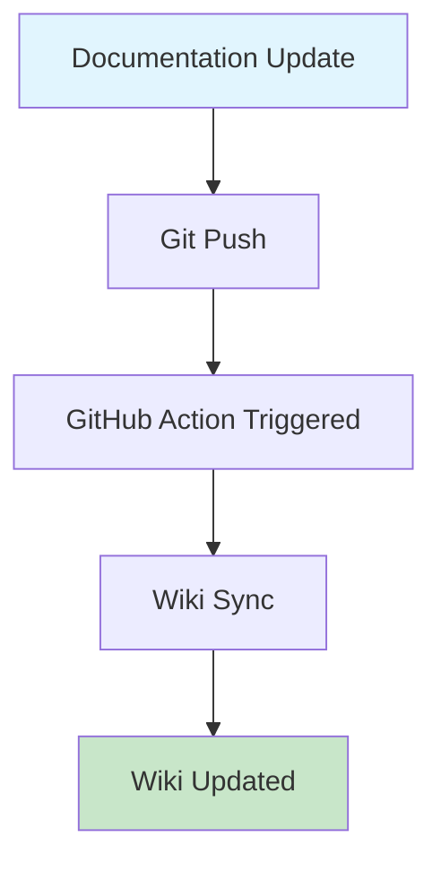

# Test Wiki Sync

This is a test file to trigger the GitHub Action wiki sync.

## Test Content

- Created on: 2025-06-20
- Purpose: Test automatic wiki synchronization
- Expected result: This file should appear in the GitHub Wiki

## Mermaid Test

Let's also test that Mermaid diagrams work:

## Success Criteria

✅ This page appears in the wiki  
✅ Mermaid diagram renders correctly  
✅ Links are converted to wiki format  
✅ Navigation is updated

---

*This file can be deleted after testing is complete.*