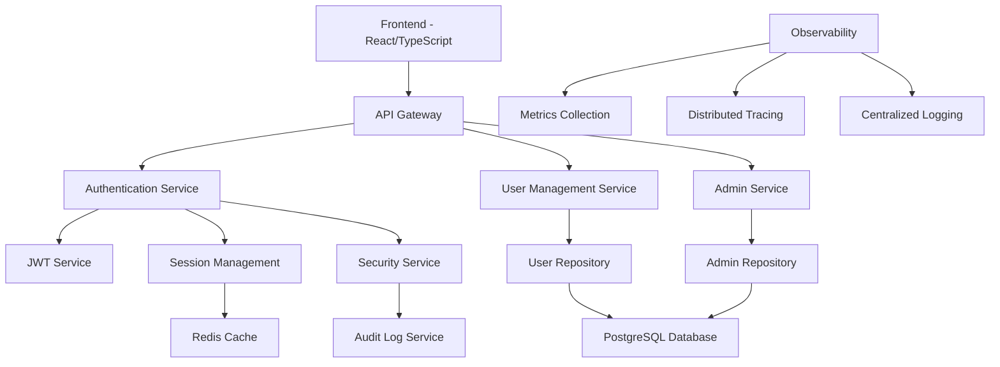

# 🏠 Zero Trust Authentication - Project Wiki

> **Comprehensive documentation for the MVP Zero Trust Authentication system**  
> **Last Updated**: 2025-06-21  
> **Status**: Production Ready

## 🚀 **Quick Navigation**

### **🏁 Getting Started**
- **📋 [Quality System Guide](Quality-System-Guide)** - Complete development workflow
- **⚡ [Quick Start Guide](Quick-Start-Guide)** - Get up and running in minutes
- **🏗️ [Architecture Overview](Architecture-Overview)** - System design and components
- **🔧 [Development Setup](Development-Setup)** - Environment configuration

### **📚 Development Guides**
- **🎨 [Code Standards](Code-Standards)** - Language-specific best practices
- **🧪 [Testing Strategy](Testing-Strategy)** - Comprehensive testing approach
- **🔒 [Security Guidelines](Security-Guidelines)** - Zero Trust security practices
- **📊 [Performance Guide](Performance-Guide)** - Optimization techniques

### **🛠️ Operations**
- **🚀 [Deployment Guide](Deployment-Guide)** - Production deployment
- **📈 [Monitoring & Observability](Monitoring-Observability)** - System monitoring
- **🔍 [Troubleshooting](Troubleshooting)** - Common issues and solutions
- **🔄 [CI/CD Pipeline](CICD-Pipeline)** - Automated workflows

### **📖 API Documentation**
- **🌐 [API Reference](API-Reference)** - Complete API documentation
- **🔑 [Authentication](Authentication)** - JWT and session management
- **👤 [User Management](User-Management)** - User operations
- **🛡️ [Security Features](Security-Features)** - Zero Trust implementation

## 🎯 **Project Overview**

The **Zero Trust Authentication MVP** is a comprehensive authentication and authorization system built with modern security principles. It provides:

- **🔐 Zero Trust Architecture** - Never trust, always verify
- **🚀 Modern Tech Stack** - Go, TypeScript, React, PostgreSQL
- **🧪 Comprehensive Testing** - Unit, integration, and E2E tests
- **🔒 Enterprise Security** - Advanced threat detection and prevention
- **📊 Observability** - Complete monitoring and logging
- **⚡ High Performance** - Optimized for scale and speed

## 🏗️ **System Architecture**



## 🔧 **Quality System**

Our **world-class quality pipeline** ensures code excellence:

### **🛡️ Quality Gates**
- **Pre-commit Hooks** - Instant feedback (< 10s)
- **Pull Request Checks** - Comprehensive validation (< 5min)
- **Merge Protection** - Quality standards enforced
- **Performance Monitoring** - Regression detection

### **🔍 Code Analysis**
- **40+ Go analyzers** via golangci-lint
- **Strict TypeScript** with comprehensive rules
- **Python type safety** with 100% annotation
- **Security scanning** for vulnerabilities
- **Performance profiling** and optimization

### **🧪 Testing Strategy**
```
E2E Tests (20%)     ← Playwright, Integration scenarios
Integration (30%)   ← API contracts, Service interactions  
Unit Tests (50%)    ← Go functions, React components
```

## 📊 **Key Metrics**

- **✅ 80%+ Test Coverage** across all components
- **✅ Zero High/Critical** security vulnerabilities
- **✅ < 200ms Response Time** for critical endpoints
- **✅ 99.9% Uptime** target with monitoring
- **✅ Sub-10s Quality Feedback** via automated tools

## 🤝 **Contributing**

### **Development Workflow**
1. **Setup**: `make install-tools && make pre-commit-install`
2. **Develop**: Follow [Code Standards](Code-Standards)
3. **Quality**: `make quality-fix && make quality-check`
4. **Test**: `make test-all`
5. **Submit**: Create PR with quality gates

### **Code Standards**
- **Go**: Error handling, context propagation, performance
- **TypeScript**: Strict typing, React patterns, security
- **Python**: Type hints, testing, documentation

## 🔗 **External Links**

- **🐙 [GitHub Repository](https://github.com/lsendel/root-zamaz)**
- **🏢 [Project Board](https://github.com/lsendel/root-zamaz/projects)**
- **🐛 [Issue Tracker](https://github.com/lsendel/root-zamaz/issues)**
- **📊 [CI/CD Dashboard](https://github.com/lsendel/root-zamaz/actions)**

---

## 📱 **Contact & Support**

- **💬 Discussions**: Use GitHub Discussions for questions
- **🐛 Issues**: Report bugs via GitHub Issues
- **📧 Security**: Report security issues privately
- **📚 Documentation**: Contribute to this wiki

**Welcome to the Zero Trust Authentication project! Let's build secure, scalable authentication together.** 🚀