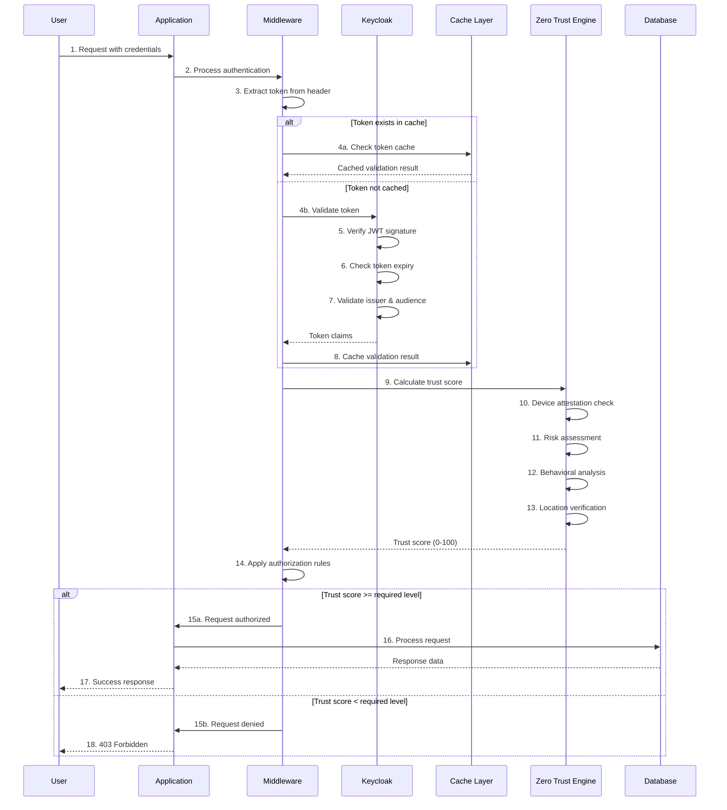

# 🔐 Zero Trust Identity Verification Workflow

## Overview

This document details the complete identity verification workflow in the Zero Trust authentication system, showing each step from initial request to final authorization.

## 🎯 Complete Identity Verification Flow



## 📋 Step-by-Step Workflow

### Step 1: Initial Request
```bash
# User makes authenticated request
curl -H "Authorization: Bearer eyJhbGc..." \
     http://localhost:8080/api/secure-resource
```

### Step 2: Token Extraction
```go
// Middleware extracts token from Authorization header
func (m *Middleware) extractToken(c *gin.Context) string {
    authHeader := c.GetHeader("Authorization")
    if authHeader == "" {
        return ""
    }
    
    // Remove "Bearer " prefix
    parts := strings.SplitN(authHeader, " ", 2)
    if len(parts) != 2 || parts[0] != "Bearer" {
        return ""
    }
    
    return parts[1]
}
```

### Step 3: Token Validation
```go
// Validate JWT token with Keycloak
func (c *keycloakClient) ValidateToken(ctx context.Context, token string) (*types.TokenClaims, error) {
    // Check cache first
    if cached, err := c.checkTokenCache(ctx, token); err == nil {
        c.metrics.recordCacheHit()
        return cached, nil
    }
    
    // Parse and validate JWT
    parsedToken, err := jwt.Parse(token, func(t *jwt.Token) (interface{}, error) {
        // Verify signing method
        if _, ok := t.Method.(*jwt.SigningMethodRSA256); !ok {
            return nil, fmt.Errorf("unexpected signing method: %v", t.Header["alg"])
        }
        
        // Get public key from Keycloak
        return c.getPublicKey(ctx)
    })
    
    if err != nil {
        return nil, &types.AuthError{
            Code: types.ErrCodeInvalidToken,
            Message: "token validation failed",
        }
    }
    
    // Extract claims
    claims := &types.TokenClaims{
        UserID:    getClaim(parsedToken, "sub"),
        Username:  getClaim(parsedToken, "preferred_username"),
        Email:     getClaim(parsedToken, "email"),
        Roles:     getRoles(parsedToken),
        ExpiresAt: getExpiry(parsedToken),
    }
    
    // Cache the result
    c.cacheTokenValidation(ctx, token, claims)
    
    return claims, nil
}
```

### Step 4: Zero Trust Verification
```go
// Calculate trust score based on multiple factors
func (e *TrustEngine) CalculateTrustScore(ctx context.Context, input *TrustCalculationInput) (*TrustScore, error) {
    score := &TrustScore{
        UserID:    input.UserID,
        Timestamp: time.Now(),
        Factors:   make(map[string]int),
    }
    
    totalScore := 0
    totalWeight := 0.0
    
    // 1. Identity Verification (base trust from successful authentication)
    if input.TokenValid {
        score.Factors["identity"] = 30
        totalScore += 30
        totalWeight += 1.0
    }
    
    // 2. Device Attestation
    if input.DeviceAttestation != nil {
        deviceScore := e.calculateDeviceScore(input.DeviceAttestation)
        score.Factors["device"] = deviceScore
        totalScore += deviceScore
        totalWeight += 1.5 // Higher weight for device trust
    }
    
    // 3. Behavioral Analysis
    behaviorScore := e.analyzeBehavior(ctx, input.UserID, input.SessionContext)
    score.Factors["behavior"] = behaviorScore
    totalScore += behaviorScore
    totalWeight += 1.0
    
    // 4. Location Verification
    if input.Location != nil {
        locationScore := e.verifyLocation(input.Location, input.UserID)
        score.Factors["location"] = locationScore
        totalScore += locationScore
        totalWeight += 0.8
    }
    
    // 5. Risk Assessment
    riskScore := e.assessRisk(ctx, input)
    score.Factors["risk"] = 100 - riskScore // Invert risk to trust
    totalScore += (100 - riskScore)
    totalWeight += 1.2
    
    // Calculate weighted average
    if totalWeight > 0 {
        score.Overall = int(float64(totalScore) / totalWeight)
    }
    
    // Apply trust decay if applicable
    score.Overall = e.applyTrustDecay(score.Overall, input.LastVerification)
    
    return score, nil
}
```

### Step 5: Authorization Decision
```go
// Make authorization decision based on trust level
func (m *Middleware) RequireTrustLevel(requiredLevel int) gin.HandlerFunc {
    return func(c *gin.Context) {
        user, exists := c.Get("user")
        if !exists {
            c.AbortWithStatus(http.StatusUnauthorized)
            return
        }
        
        authUser := user.(*types.AuthenticatedUser)
        
        // Calculate current trust score
        trustScore, err := m.calculateTrustScore(c, authUser)
        if err != nil {
            c.AbortWithStatus(http.StatusInternalServerError)
            return
        }
        
        // Check if trust level meets requirement
        if trustScore.Overall < requiredLevel {
            c.JSON(http.StatusForbidden, gin.H{
                "error": "Insufficient trust level",
                "required": requiredLevel,
                "current": trustScore.Overall,
                "factors": trustScore.Factors,
            })
            c.Abort()
            return
        }
        
        // Add trust score to context for logging
        c.Set("trust_score", trustScore)
        c.Next()
    }
}
```

## 🔍 Practical Example

### 1. Login Flow
```go
// User login endpoint
func LoginHandler(c *gin.Context) {
    var credentials struct {
        Username string `json:"username"`
        Password string `json:"password"`
    }
    
    if err := c.ShouldBindJSON(&credentials); err != nil {
        c.JSON(400, gin.H{"error": "Invalid request"})
        return
    }
    
    // Authenticate with Keycloak
    token, err := keycloakClient.Login(c.Request.Context(), 
        credentials.Username, 
        credentials.Password,
    )
    if err != nil {
        c.JSON(401, gin.H{"error": "Invalid credentials"})
        return
    }
    
    // Initial device registration (if new device)
    deviceInfo := extractDeviceInfo(c.Request)
    if err := registerDevice(c.Request.Context(), token.UserID, deviceInfo); err != nil {
        log.Printf("Device registration failed: %v", err)
    }
    
    c.JSON(200, gin.H{
        "access_token": token.AccessToken,
        "refresh_token": token.RefreshToken,
        "expires_in": token.ExpiresIn,
    })
}
```

### 2. Protected Resource Access
```go
// Protected endpoint with trust level requirement
r.GET("/api/sensitive-data", 
    middleware.RequireAuth(),           // Basic authentication
    middleware.RequireTrustLevel(75),   // High trust required
    func(c *gin.Context) {
        user := c.MustGet("user").(*types.AuthenticatedUser)
        trustScore := c.MustGet("trust_score").(*types.TrustScore)
        
        // Log access for audit
        log.Printf("User %s accessed sensitive data with trust score %d",
            user.Username, trustScore.Overall)
        
        // Return sensitive data
        c.JSON(200, gin.H{
            "data": "Sensitive information",
            "accessed_by": user.Username,
            "trust_level": trustScore.Overall,
        })
    },
)
```

### 3. Continuous Verification
```go
// Background continuous verification
func (e *TrustEngine) StartContinuousVerification(userID string) {
    ticker := time.NewTicker(5 * time.Minute)
    defer ticker.Stop()
    
    for {
        select {
        case <-ticker.C:
            // Re-evaluate trust score
            currentScore, err := e.getCurrentTrustScore(context.Background(), userID)
            if err != nil {
                log.Printf("Failed to get trust score: %v", err)
                continue
            }
            
            // Check for anomalies
            if anomaly := e.detectAnomalies(userID); anomaly != nil {
                currentScore.Overall -= anomaly.Severity
                log.Printf("Anomaly detected for user %s: %v", userID, anomaly)
            }
            
            // Revoke access if trust drops too low
            if currentScore.Overall < 25 {
                e.revokeUserSessions(userID)
                log.Printf("Revoked sessions for user %s due to low trust score", userID)
            }
            
        case <-e.shutdown:
            return
        }
    }
}
```

## 📊 Trust Score Factors

| Factor | Weight | Max Score | Description |
|--------|--------|-----------|-------------|
| Identity | 1.0 | 30 | Successful authentication |
| Device | 1.5 | 25 | Device attestation result |
| Behavior | 1.0 | 20 | Normal usage patterns |
| Location | 0.8 | 15 | Known/trusted location |
| Risk | 1.2 | 10 | Low risk assessment |

## 🛡️ Security Features

1. **Token Validation**
   - JWT signature verification
   - Expiry checking
   - Issuer validation
   - Audience verification

2. **Caching Strategy**
   - Token validation results cached
   - User info cached with TTL
   - Cache invalidation on logout

3. **Trust Decay**
   - Trust scores decrease over time
   - Requires periodic re-verification
   - Configurable decay rates

4. **Audit Logging**
   - All authentication attempts logged
   - Trust score calculations recorded
   - Access decisions tracked

## 🚀 Implementation in impl-zamaz

To see this workflow in action:

```bash
# 1. Get authentication token
curl -X POST http://localhost:8082/realms/zerotrust-test/protocol/openid-connect/token \
  -H "Content-Type: application/x-www-form-urlencoded" \
  -d "grant_type=password" \
  -d "client_id=zerotrust-client" \
  -d "client_secret=zerotrust-secret-12345" \
  -d "username=testuser" \
  -d "password=testpass"

# 2. Use token to access protected resource
curl -H "Authorization: Bearer <token>" \
     http://localhost:8080/api/secure-resource

# 3. Check trust score
curl -H "Authorization: Bearer <token>" \
     http://localhost:8080/api/trust-score
```

This workflow ensures that every request goes through comprehensive identity verification, trust evaluation, and authorization checks - the essence of Zero Trust security!