# Architecture Overview

## System Architecture

The Go Keycloak Zero Trust library follows a modular, layered architecture designed for scalability, security, and maintainability.

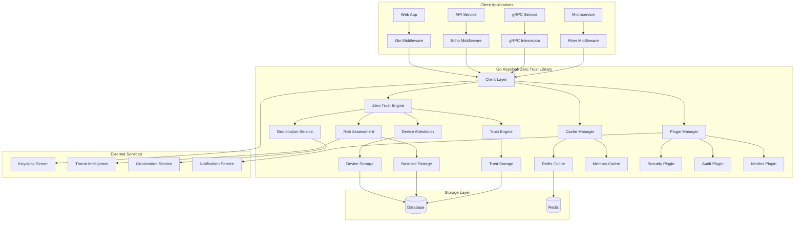

## Core Components

### 1. Client Layer

The client layer provides the main interface for interacting with Keycloak and manages authentication workflows.

**Key Responsibilities:**
- Token validation and refresh
- User management operations
- Connection pooling and circuit breaking
- Caching strategy implementation
- Metrics collection

**Components:**
- `KeycloakClient`: Main client interface
- `HTTPClient`: Optimized HTTP client with pooling
- `TokenValidator`: JWT token validation logic
- `UserManager`: User operations and management

### 2. Zero Trust Engine

The Zero Trust Engine implements the core security policies and orchestrates various security checks.

**Key Responsibilities:**
- Coordinating device attestation
- Managing risk assessment workflows
- Trust score calculation and decay
- Policy enforcement
- Continuous verification

**Components:**
- `DeviceAttestationService`: Device verification
- `RiskAssessmentEngine`: Risk evaluation
- `TrustEngine`: Trust score management
- `GeolocationService`: Location-based security
- `PolicyEngine`: Security policy enforcement

### 3. Middleware Layer

Framework-specific middleware implementations that integrate Zero Trust features seamlessly.

**Key Features:**
- Automatic token extraction and validation
- Trust level enforcement
- Risk-based access control
- Device verification requirements
- Role-based authorization

**Supported Frameworks:**
- Gin (HTTP framework)
- Echo (High-performance HTTP framework)
- Fiber (Express-inspired framework)
- gRPC (RPC framework)
- Standard HTTP library

### 4. Plugin System

Extensible plugin architecture for custom business logic and integrations.

**Plugin Types:**
- **Hook Plugins**: Execute at specific lifecycle events
- **Service Plugins**: Provide additional services
- **Integration Plugins**: Connect to external systems
- **Security Plugins**: Add custom security checks

**Event Hooks:**
- Pre-authentication
- Post-authentication
- Risk assessment
- Token validation
- Device attestation

### 5. Configuration Management

Advanced configuration system supporting multiple sources and environments.

**Features:**
- Environment variable mapping
- File-based configuration (YAML, JSON)
- Configuration validation
- Hot reloading and watching
- Secret management integration
- Environment-specific transformations

## Security Architecture

### Zero Trust Principles Implementation

#### 1. Never Trust, Always Verify

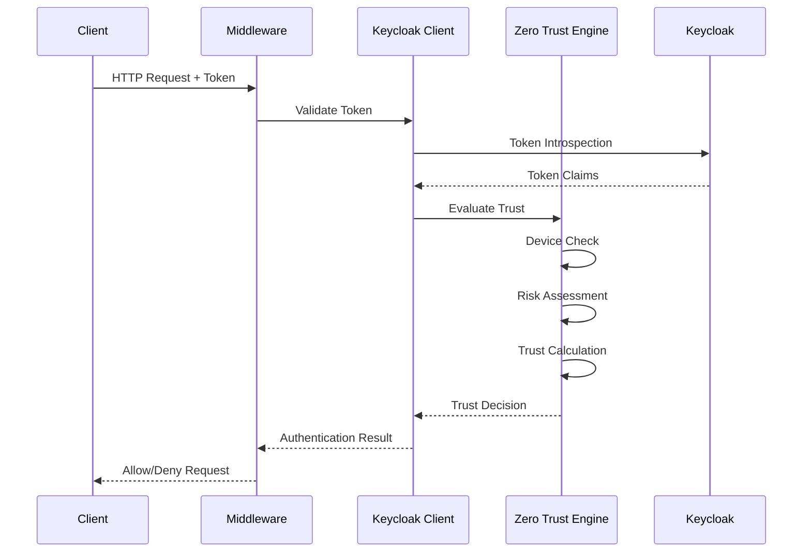

#### 2. Least Privilege Access

The library implements granular access control through:
- **Trust Levels**: 0-100 scale for fine-grained permissions
- **Role-Based Access**: Traditional role checking
- **Risk-Based Access**: Dynamic access based on risk score
- **Device-Based Access**: Device verification requirements
- **Context-Aware Access**: Location and time-based restrictions

#### 3. Assume Breach

Built-in security measures assuming potential compromise:
- **Token Blacklisting**: Immediate token revocation
- **Session Monitoring**: Continuous session validation
- **Anomaly Detection**: Behavioral analysis
- **Incident Response**: Automated security responses
- **Audit Logging**: Comprehensive security event logging

### Device Attestation Architecture

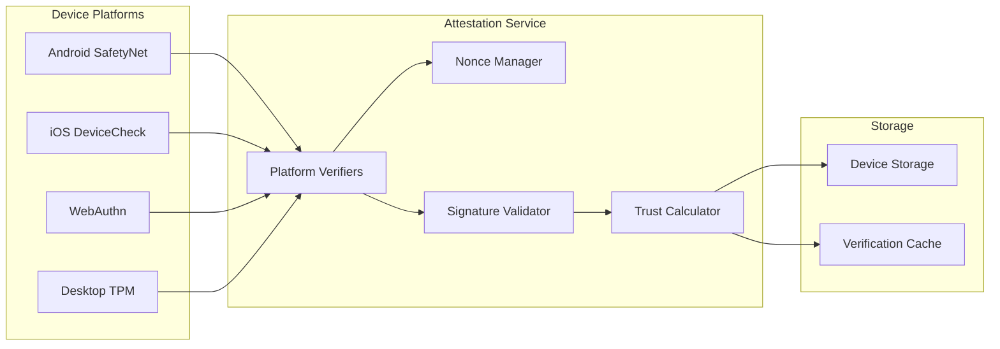

**Platform-Specific Implementation:**

1. **Android SafetyNet**
   - CTS Profile Match verification
   - Basic Integrity checking
   - Hardware attestation support
   - Play Protect status validation

2. **iOS DeviceCheck**
   - Device token validation
   - App Attest framework support
   - Hardware key attestation
   - Jailbreak detection

3. **WebAuthn**
   - FIDO2 authenticator support
   - Platform authenticator binding
   - Biometric verification
   - Hardware security key support

4. **Desktop Platforms**
   - TPM-based attestation
   - Hardware fingerprinting
   - OS integrity checking
   - Certificate-based verification

### Risk Assessment Architecture

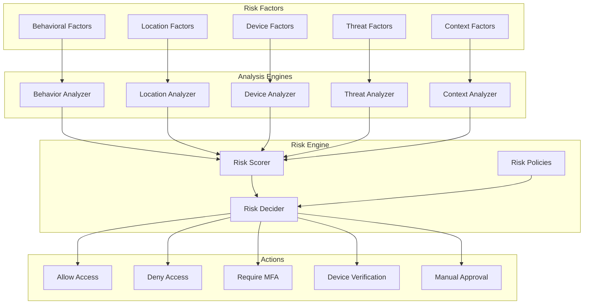

**Risk Factors:**

1. **Behavioral Factors**
   - Login time patterns
   - Access patterns
   - Session duration
   - API usage patterns
   - Navigation patterns

2. **Location Factors**
   - Geographic location
   - VPN/Proxy detection
   - Location velocity
   - Known locations
   - Geofencing rules

3. **Device Factors**
   - Device fingerprint
   - Device reputation
   - Security posture
   - Compliance status
   - Previous incidents

4. **Threat Factors**
   - IP reputation
   - Known attack patterns
   - Threat intelligence feeds
   - Blocklist matches
   - Security incidents

## Data Flow Architecture

### Authentication Flow

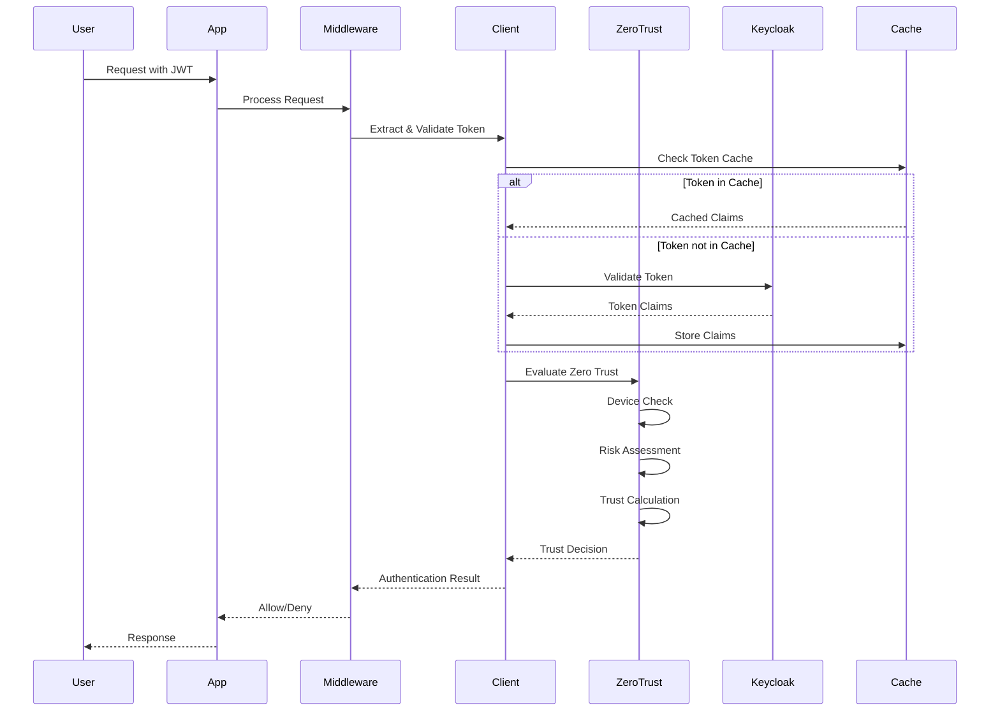

### Device Attestation Flow

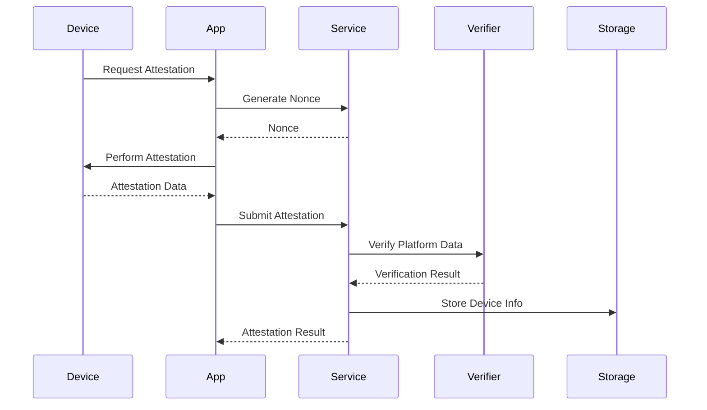

### Risk Assessment Flow

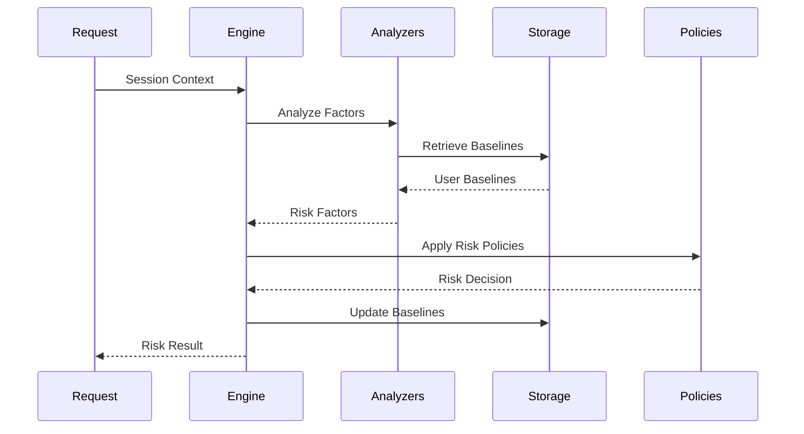

## Performance Architecture

### Caching Strategy

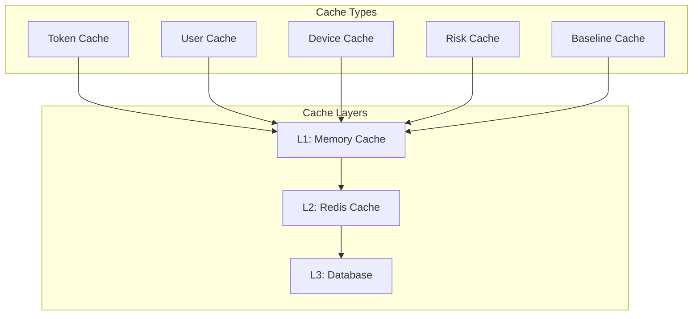

**Cache Strategy:**
- **L1 (Memory)**: Hot data, sub-millisecond access
- **L2 (Redis)**: Shared cache, millisecond access
- **L3 (Database)**: Persistent storage, when cache misses

**Cache Policies:**
- **Token Cache**: 15-minute TTL, LRU eviction
- **User Cache**: 1-hour TTL, size-based eviction
- **Device Cache**: 24-hour TTL, manual invalidation
- **Risk Cache**: 1-hour TTL, risk-based eviction

### Connection Management

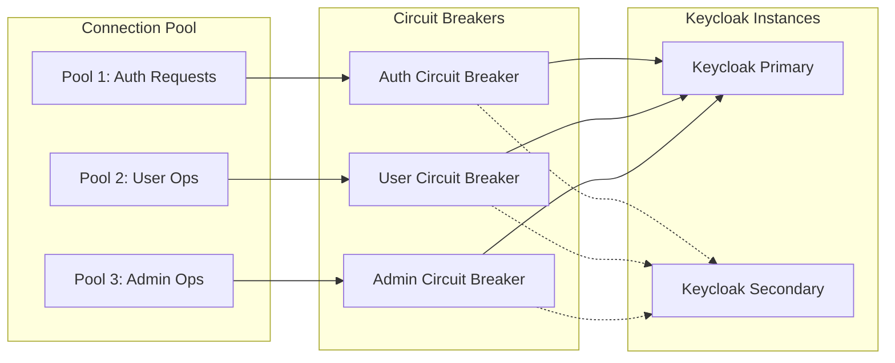

**Features:**
- **Connection Pooling**: Reuse HTTP connections
- **Circuit Breakers**: Fail fast on service issues
- **Load Balancing**: Distribute load across instances
- **Health Checking**: Monitor service health
- **Retry Logic**: Intelligent retry with backoff

### Horizontal Scaling

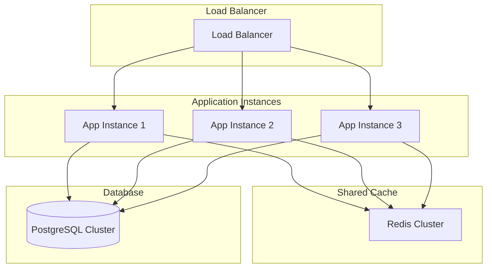

**Scaling Considerations:**
- **Stateless Design**: No server-side session state
- **Shared Cache**: Redis for cross-instance caching
- **Database Clustering**: PostgreSQL for persistence
- **Configuration Sync**: Centralized configuration
- **Metrics Aggregation**: Consolidated monitoring

## Deployment Architecture

### Container Architecture

```dockerfile
# Multi-stage build for optimal image size
FROM golang:1.21-alpine AS builder
WORKDIR /app
COPY go.mod go.sum ./
RUN go mod download
COPY . .
RUN CGO_ENABLED=0 GOOS=linux go build -o main ./cmd/server

FROM alpine:latest
RUN apk --no-cache add ca-certificates
WORKDIR /root/
COPY --from=builder /app/main .
COPY --from=builder /app/configs ./configs
CMD ["./main"]
```

### Kubernetes Deployment

```yaml
apiVersion: apps/v1
kind: Deployment
metadata:
  name: keycloak-zerotrust-app
spec:
  replicas: 3
  selector:
    matchLabels:
      app: keycloak-zerotrust-app
  template:
    metadata:
      labels:
        app: keycloak-zerotrust-app
    spec:
      containers:
      - name: app
        image: yourorg/keycloak-zerotrust:latest
        ports:
        - containerPort: 8080
        env:
        - name: ZEROTRUST_KEYCLOAK_BASE_URL
          value: "https://keycloak.company.com"
        - name: ZEROTRUST_CACHE_TYPE
          value: "redis"
        - name: ZEROTRUST_CACHE_REDIS_HOST
          value: "redis-service"
        resources:
          requests:
            memory: "128Mi"
            cpu: "100m"
          limits:
            memory: "512Mi"
            cpu: "500m"
        livenessProbe:
          httpGet:
            path: /health
            port: 8080
          initialDelaySeconds: 30
          periodSeconds: 10
        readinessProbe:
          httpGet:
            path: /ready
            port: 8080
          initialDelaySeconds: 5
          periodSeconds: 5
```

### Monitoring Architecture

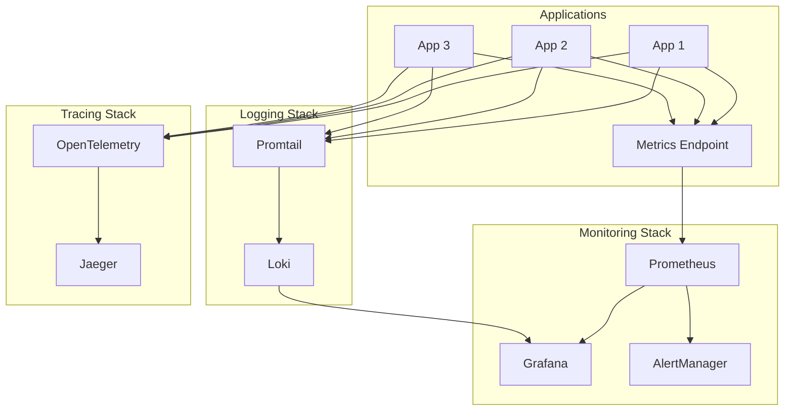

## Security Considerations

### Threat Model

1. **Threat Actors**
   - External attackers
   - Malicious insiders
   - Compromised accounts
   - Nation-state actors

2. **Attack Vectors**
   - Token theft/replay
   - Device compromise
   - Man-in-the-middle
   - Social engineering
   - Insider threats

3. **Assets**
   - Authentication tokens
   - User credentials
   - Device identities
   - Session data
   - Configuration secrets

### Security Controls

1. **Preventive Controls**
   - Strong authentication
   - Device attestation
   - Encryption in transit/rest
   - Input validation
   - Rate limiting

2. **Detective Controls**
   - Anomaly detection
   - Risk assessment
   - Audit logging
   - Monitoring/alerting
   - Threat intelligence

3. **Responsive Controls**
   - Automatic token revocation
   - Session termination
   - Account lockout
   - Incident response
   - Forensic logging

### Compliance Features

1. **GDPR Compliance**
   - Data minimization
   - Consent management
   - Right to be forgotten
   - Data portability
   - Privacy by design

2. **SOC 2 Type II**
   - Security controls
   - Availability monitoring
   - Processing integrity
   - Confidentiality measures
   - Privacy controls

3. **NIST Framework**
   - Identify assets
   - Protect systems
   - Detect threats
   - Respond to incidents
   - Recover from attacks

## Extensibility and Integration

### Plugin Development

```go
// Example security plugin
type CustomSecurityPlugin struct {
    config map[string]interface{}
}

func (p *CustomSecurityPlugin) ExecuteHook(ctx context.Context, hookType plugins.HookType, data map[string]interface{}) error {
    switch hookType {
    case plugins.HookPostAuth:
        return p.handlePostAuth(ctx, data)
    case plugins.HookRiskAssessment:
        return p.handleRiskAssessment(ctx, data)
    default:
        return nil
    }
}
```

### External Integrations

1. **SIEM Systems**
   - Splunk
   - QRadar
   - ArcSight
   - Elastic Security

2. **Threat Intelligence**
   - VirusTotal
   - ThreatConnect
   - Recorded Future
   - IBM X-Force

3. **Identity Providers**
   - Active Directory
   - LDAP
   - SAML providers
   - OAuth providers

4. **Notification Systems**
   - Slack
   - Microsoft Teams
   - PagerDuty
   - Email/SMS

This architecture provides a solid foundation for enterprise-grade Zero Trust authentication while maintaining flexibility, performance, and security.